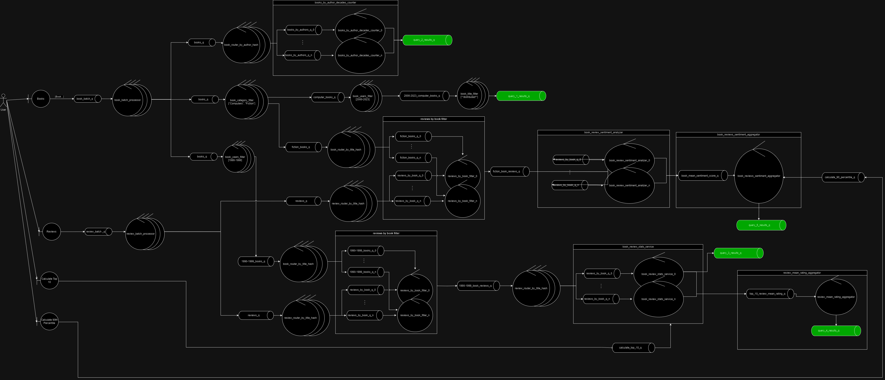
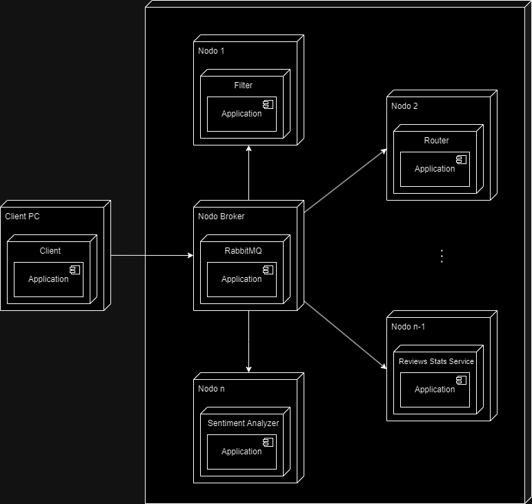
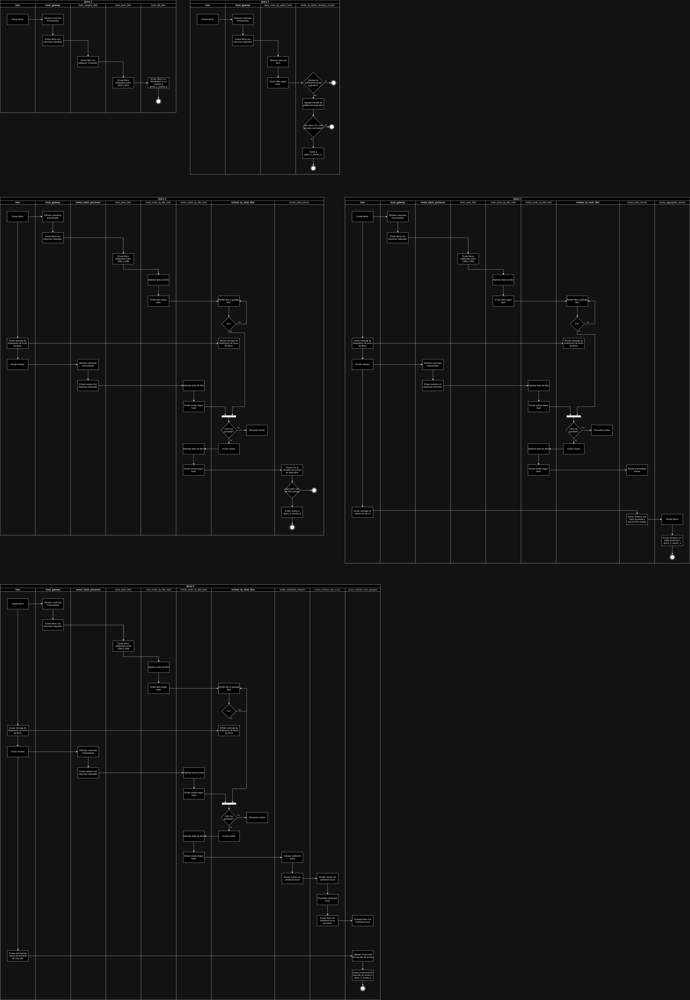
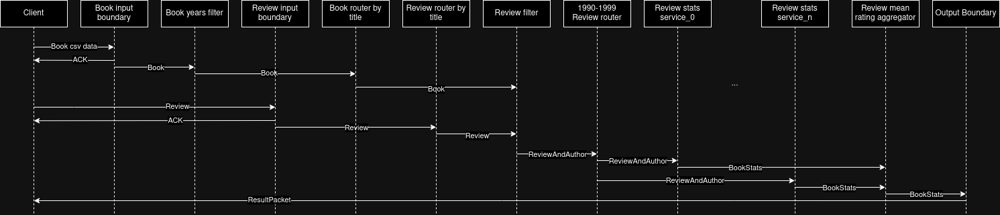
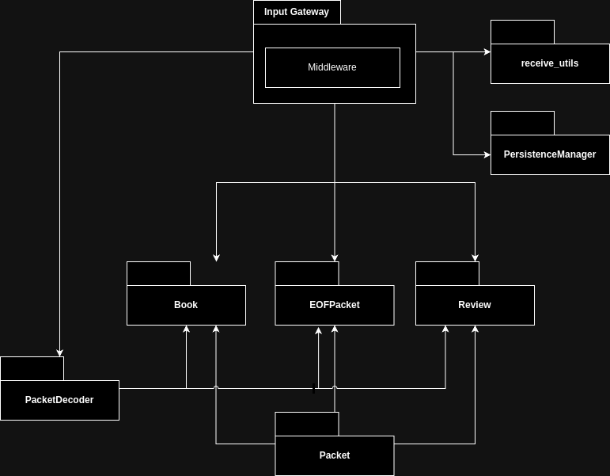
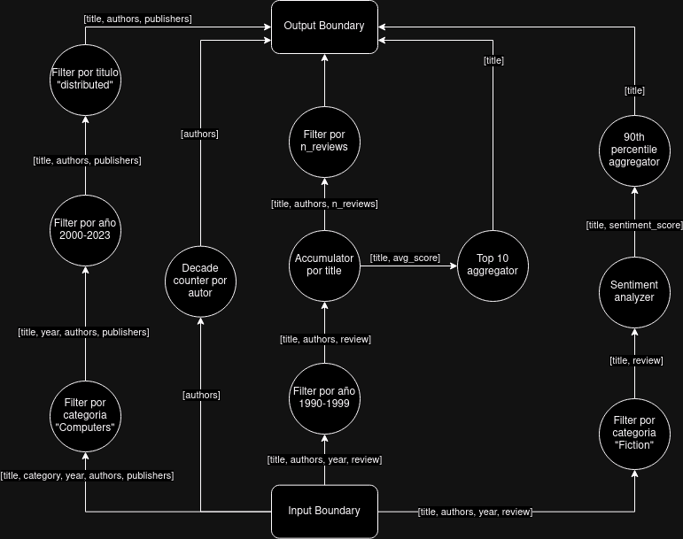

TP 1 y 2 - Sistemas Distribuídos FIUBA 2024 1c

| Nombre           | Padrón | Email                |
| ---------------- | ------ | -------------------- |
| Manuel Reberendo | 100930 | mreberendo@fi.uba.ar |
| Manuel Sanchez   | 107951 | msanchezf@fi.uba.ar  |

# Parte 1
## Scope

El objetivo de este sistema es procesar 5 queries sobre un dataset de libros y reviews. Las queries son las siguientes:

- Título, autores y editoriales de los libros de categoría "Computers" entre
  2000 y 2023 que contengan 'distributed' en su título.
- Autores con títulos publicados en al menos 10 décadas distintas
- Títulos y autores de libros publicados en los 90' con al menos 500 reseñas.
- 10 libros con mejor rating promedio entre aquellos publicados en los 90’
  con al menos 500 reseñas.
- Títulos en categoría "Fiction" cuyo sentimiento de reseña promedio esté en
  el percentil 90 más alto

El sistema debe soportar el incremento de los volumenes de computo, con tal de poder escalar el poder de procesamiento.

## Vista Fisica

### Servicios

- Book_filter
  - Toma `books` de una cola de entrada, los filtra leyendo el campo y valor (o rango)
    configurados, y los deposita en una cola de salida.
- Review_filter
  - Toma `books` de una cola de entrada, luego toma `reviews` de otra cola de entrada
    y las filtra dependiendo de si corresponden a un `book` recibido anteriormente.
    Por último deposita las `reviews` filtradas en una cola de salida.
- Router
  - Recibe elementos (`books` o `reviews`) de una cola de entrada,
    les aplica un hash sobre un campo configurable y los deposita en
    una cola de salida que depende del hash obtenido.
- Client
  - Lee csv con books y reviews y los envia al Boundary. Al finalizar, recibe del boundary los resultados y los almacena en archivos csv (1 por cada query)
- Input_gateway
  - Recibe tanto `books` como `reviews` de un cliente en formato csv, los parsea, eliminar campos que no sean necesarios, y deposita cada item en exchange de salida (separado por tipo de item).
  - Soporta hasta N clientes conectados en simultaneo, haciendo uso de un ThreadPool.
- Output_gateway
  - Espera los resultados de las queries y los envia al cliente.
- Books_by_author_decades_counter
  - Recibe `books` de una cola de entrada y almacena por cada autor las decadas en las que publicó un libro.
    Al llegar a 10 decadas distintas se envia a una cola de salida el nombre del autor.
- Book_review_sentiment_analyzer
  - Recibe `reviews` de una cola de entrada y calcula su `score` producto de un "análisis de sentimiento"
    realizado sobre el texto de la `review`. Deposita en una cola de salida el título del `book` al
    que pertenece la `review` y su score calculado.
- Book_review_sentiment_aggregator
  - Recibe de una cola de entrada titulos y scores de sentimiento y almacena la suma y cantidad de scores recibidos por cada titulo.
  - Recibe por otra cola de entrada un mensaje indicando que debe depositar en una
    cola de salida el percentil 90 más alto del promedio de score de los titulos almacenados
- Book_review_stats_service
  - Recibe `reviews` de una cola de entrada y almacena la cantidad y suma (de puntajes) de las reviews por cada `book`.
  - Recibe por otra cola de entrada un mensaje indicando que debe depositar en una cola de salida el top 10 (hasta el momento)
    de los `books` almacenados con mayor promedio de puntaje
- Review_mean_rating_aggregator
  - Recibe el top 10 de `books` con mejor promedio de reseñas de cada instancia de `Book_review_stats_service` en una cola de entrada.
    - Al recibir una cantidad de mensajes igual a la cantidad de instancias de ese servicio, calcula el top 10 global y lo deposita en una cola de salida.

### Diagrama de Robustez

[Link al diagrama](https://viewer.diagrams.net/?page-id=pvgHEc-C2KMQIe-LH_zm&highlight=0000ff&edit=_blank&layers=1&nav=1#G1wfcmCg63otTVOHnEUja5Xv4oczVIh9BT)

En este diagrama se pueden ver los distintos servicios mencionados en la seccion anterior, pero en forma mas concreta. Un detalle importante a notar son la existencia de servicios de routeo, los cuales hashean una clave de los mensajes recibidos para poder distribuirlos en distintas colas de salida. Esto permite que los servicios puedan escalar horizontalmente, ya que se pueden agregar mas instancias de un servicio sin que esto afecte el funcionamiento del sistema.

Imponemos una precondicion de que el cliente debe enviar primero todos los libros, de forma que el sistema los procese y guarde en sus filtros. Luego de esto, el cliente puede enviar las reviews.

### Diagrama de Despliegue

[Link al diagrama](https://viewer.diagrams.net/?page-id=8r_P_Zw1fpBbOP0c5zG2&highlight=0000ff&edit=_blank&layers=1&nav=1&page-id=8r_P_Zw1fpBbOP0c5zG2#G1wfcmCg63otTVOHnEUja5Xv4oczVIh9BT)

La topologia de despliegue del sistema es en forma de estrella. El nodo que aloja el servicio de RabbitMQ es quien se encuentra en el centro. Los demas nodos se comunican a traves de colas de mensajes provistas por dicho servicio. De esta forma, nunca se encuentran comunicados directamente entre si, sino que siempre lo hacen a traves de RabbitMQ.

## Vista de Procesos

### Diagrama de Actividades

[Link al diagrama](https://viewer.diagrams.net/?page-id=YzJNP-XYQnWjph2-Tj47&highlight=0000ff&edit=_blank&layers=1&nav=1&page-id=YzJNP-XYQnWjph2-Tj47#G1wfcmCg63otTVOHnEUja5Xv4oczVIh9BT)

En este diagrama se pueden ver las distintas actividades que realiza el sistema para procesar las queries. Las distintas queries son independientes entre si, por lo que el procesamiento puede ser realizado en paralelo y puede ser visto como 5 actividades totalmente distintas.

### Diagrama de Secuencia

[Link al diagrama](https://viewer.diagrams.net/?page-id=78cztUaxTj71S7lKw_Nt&highlight=0000ff&edit=_blank&layers=1&nav=1&page-id=78cztUaxTj71S7lKw_Nt#G1wfcmCg63otTVOHnEUja5Xv4oczVIh9BT)

En este diagrama de secuencia se puede visualizar el flujo de mensajes entre los distintos servicios con el fin de procesar, en este caso, la query 4. Notese un detalle importante, que es que el servicio de reviews filter debe esperar a que todos los libros hayan sido procesados para poder empezar a filtrar las reviews. Esto se debe a que, para saber que reviews corresponden a que libros, primero se llegan los libros, se guardan en el filtro, y luego las reviews son filtradas.

Otro aspecto intersante es que el servicio de Reviews_mean_rating_aggregator debe esperar a que todos los servicios de Review_stats_service hayan terminado y enviado su top 10 local, antes de proceder a calcular el top 10 global.

## Vista de Desarrollo

### Diagrama de Paquetes

[Link al diagrama](https://viewer.diagrams.net/?page-id=hVfBI8x4F1AI7FTGm5cZ&highlight=0000ff&edit=_blank&layers=1&nav=1&page-id=hVfBI8x4F1AI7FTGm5cZ#G1wfcmCg63otTVOHnEUja5Xv4oczVIh9BT)

En este diagrama se refleja la estructura de paquetes del sistema. El input boundary es el servicio que se encarga de recibir los mensajes del cliente y enviarlos a las colas correspondientes. Dentro del mismo y al igual que en todos los servicios, se hace uso del middleware, una capa de abstraccion para trabajar sobre RabbitMQ con mayor facilidad. 

Asimismo, dicho servicio hace uso de Book, EOFPacket y Review, subclases de Packet, que representan los distintos tipos de mensajes que se pueden recibir. Por otra parte, esta el PacketDispatcher, que se encarga de parsear los mensajes recibidos y convertilos en objetos de las clases mencionadas anteriormente.

Ademas, un boundary puede ser de tipo BookBoundary o ReviewBoundary, segun del tipo de mensaje que recibe. De esta manera, al recibir un mensaje, el boundary lo parsea y lo envia a la cola correspondiente, con el formato correspondiente.

Finalmente, el input boundary utiliza funciones auxiliares de recepcion de mensajes por sockets, con el fin de evitar problemas de short-read. Dichas funciones se encuentran en un modulo llamado receive_utils

## DAG

[Link al diagrama](https://viewer.diagrams.net/?page-id=9488BZJgpK-lBa-DFY4Z&highlight=0000ff&edit=_blank&layers=1&nav=1&page-id=9488BZJgpK-lBa-DFY4Z#G1wfcmCg63otTVOHnEUja5Xv4oczVIh9BT)

En el DAG se pueden observar aquellos datos que son necesarios para procesar cada una de las queries. Las queries se pueden interpretar como los distintos caminos desde el input boundary hasta el output boundary. Algunas queries, como la 3 y la 4 comparten parte de su camino, hasta bifurcarse. De esta forma, se optimiza el flujo de informacion, y no se repiten calculos innecesarios.

# Parte 2:
## Multiples Clientes
Para soportar que múltiples clientes se conecten en simultaneo al sistema (Sin esperar a que cada uno termine de enviar sus datos y recibir sus resultados para que se conecte el próximo) se realizaron las siguientes modificaciones:
- El servicio de `Input` ahora asigna un `client_id` a cada cliente al momento de conectarse.
- Este `client_id` se agrega a todos los paquetes que se generen a partir de datos enviados por ese cliente
- Todos los servicios con estado ahora guardarán el estado de cada cliente por separado, usando el `client_id` para diferenciarlos
- El servicio de `Output` recibe el `client_id` al conectarse un nuevo cliente, y en base a eso le envia los resultados que le correspondan
- En algunos servicios se implementó el uso de Threads para poder soportar la nueva simultaneidad de clientes:
  - En `Review Filter` ahora hay un thread recibiendo libros y otro recibiendo reviews en simultaneo.
  - En `Input` y `Output` se crearon threads para manejar la conexión de los clientes.

## Tolerancia a fallas
Para soportar la tolerancia a fallas se implementaron las siguientes modificaciones:
### Uso de ACKs en rabbitMQ
- Se implementó el uso de ACKs en RabbitMQ para garantizar que los mensajes no se pierdan en caso de que un servicio falle mientras los está procesando.
- Rabbit garantiza que los mensajes se volverán a enviar si no se recibe un ACK en un tiempo determinado, y permite además controlar la cantidad de mensajes máxima que puede tener para cada cola esperando sus ACKs.
### Persistencia y recuperación de estado
- Se implementó la persistencia de estado en los servicios que lo requieren, guardando el estado en archivos que se leerán al iniciar el servicio.
  - Se intenta siempre mantener el estado también en memoria para agilizar el procesamiento, de modo que la lectura del archivo solo se haga al iniciar el servicio y tener que recuperar el estado en memoria.
- Para esto, se agregó la clase `PersistenceManager` que sirve como una interfaz de almacenamiento clave - valor, que pueden usar los servicios para guardar y recuperar su estado.
    - Los métodos soportados son:
      - `get`, que recupera el valor asociado a una clave, leyendo del archivo correspondiente.
      - `put`, que internamente guarda en un archivo el valor asociado a una clave, sobreescribiendo el valor anterior si ya existía.
      - `append`, que internamente agrega el valor asociado a una clave en una nueva linea al final del archivo correspondiente de existir, o como primer valor si no existe.
      - `get_keys`, que dado un prefijo, devuelve todas las claves que empiezan con ese prefijo.
      - `delete_keys`, que dado un prefijo, borra todas las claves que empiezan con ese prefijo (Borrando también los archivos asociados).
    - El persistence manager no puede utilizar directamente la clave como nombre del archivo asociado, ya que las claves pueden contener caracteres no permitidos en nombres de archivos o pueden exceder el limite permitido de caracteres. Por lo tanto, se genera un `uuid` asociado a esa clave que será el nombre del archivo.
        - Hacer esto requiere que además se guarde un indice de claves -> nombres de archivos, que a su vez debe ser persistido.
        - Estos índices pueden crecer mucho en tamaño si un servicio maneja muchas claves, por eso se soporta un parámetro adicional `secondary_key` que permite agrupar todas las claves relacionadas en un solo archivo índice.
- El gran problema de esta solución es que no se puede garantizar que el estado guardado sea consistente, ya que si un servicio falla mientras está guardando el estado, el archivo puede quedar corrupto.
  - Para resolver esto, se implementaron los siguientes mecanismos:
    - Al hacer una escritura con `put`, en realidad primero se escribe sobre un archivo temporal, y luego se renombra a su nombre final. De esta forma, si la escritura falla, el archivo final no se sobreescribe y se mantiene el estado anterior.
    - Al hacer tanto un `put` como un `append`, se guarda al comienzo de cada linea la longitud de los datos contenidos en esa linea. De esta forma, si la escritura falla, se puede detectar al momento de leer que la linea está corrupta y se descarta.
### Recuperación de servicios caídos: *Docktor* y *Health Checks*
- `Docktor`
  - Se implementó un servicio llamado `Docktor` que se encarga de monitorear el estado de los servicios y reiniciarlos en caso de que fallen.
    - Es necesario que haya multiples instancias de `Docktor`para que si uno falla pueda ser también reiniciado (Siempre debe haber al menos 1 `Docktor` activo).
      - Para evitar solapamientos entre `Docktors`, se garantiza que cada se encarga de monitorear una parte del total de servicios. Esto se hace con un mecanismo similar al de los `Routers`, es decir, se hashea el nombre del servicio y se realiza módulo con la cantidad de instancias de `Docktor`, y si el resultado coincide con el id de la instancia, entonces se encarga de monitorear ese servicio.
        - Para garantizar que siempre se puedan recuperar todos los `Docktor`entre si, se organizan en forma de anillo, donde cada instancia se encarga de monitorerar a la siguiente en el anillo en vez de realizar el hash.
    - La interfaz con el servicio de Docker, siendo que los `Docktor` corren también en contenedores se hace gracias a *Docker in Docker*, que consiste en montar el socket de Docker del host en cada contenedor de `Docktor`.
- `Health Checks`
  - Todos los servicios tienen ahora un Thread con una instancia de una nueva clase `HealthCheck` que se encarga de recibir conexiones TCP en un puerto determinado para comprobar que el servicio está funcionando.
  - Los `Docktor` se conectan a este puerto para comprobar que el servicio está funcionando, y si no lo logran (con un timeout determinado), reinician el servicio.

### Evitar procesamiento de mensajes duplicados
- Por el diseño del sistema, puede suceder que se generen mensajes duplicados en las colas de RabbitMQ, ya que los servicios pueden fallar en medio del procesamiento de un mensaje, habiendo ya encolado emensajes en colas de salida, pero no haber enviado el ACK correspondiente a la cola de entrada.
- En principio, esto no nos importa en los servicios que no tienen estado, pero si en los que sí lo tienen, ya que si un mensaje duplicado llega a un servicio con estado, puede alterar el estado del servicio y producir resultados incorrectos.
- La solución para este problema involucra dos partes:
  - Que el `Middleware` de los servicios interesados en evitar mensajes duplicados guarde el `id` de los paquetes que procesa, y que solo lo procese si no fue marcado como procesado antes.
    - Esto debe además ser persistido en disco, ya que si un servicio falla y se reinicia, no debe volver a procesar mensajes que ya procesó antes, por eso el middleware ahora recibe una instancia opcional de `PersistenceManager`.
  - Hay servicios que actualizan su estado como parte del procesamiento de un paquete y para los que procesar dos veces el mismo paquete no da igual que procesarlo solo una vez, y además persisten a disco este cambio.
    - Pero el `Middleware` solo lo marca como procesado al finalizar el procesamiento, por lo tanto una falla justo antes de marcarse como procesado el paquete pero después de actualizar el estado del servicio provocaría que el paquete vuelva a ser procesado, y que a raíz de esto el servicio vuelva a cambiar su estado incorrectamente. 
    - Es por eso que estos servicios deben persistír el id del paquete que generó el último cambio en ese estado, y si vuelven a recibirlo pueden detectarlo y simplemente evitar actualizar el estado otra vez.

