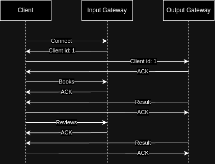

TP 1 y 2 - Sistemas Distribuídos FIUBA 2024 1c

| Nombre           | Padrón | Email                |
| ---------------- | ------ | -------------------- |
| Manuel Reberendo | 100930 | mreberendo@fi.uba.ar |
| Manuel Sanchez   | 107951 | msanchezf@fi.uba.ar  |

# Parte 1

## Scope

El objetivo de este sistema es procesar 5 queries sobre un dataset de libros y reviews. Las queries son las siguientes:

- Título, autores y editoriales de los libros de categoría "Computers" entre
  2000 y 2023 que contengan 'distributed' en su título.
- Autores con títulos publicados en al menos 10 décadas distintas
- Títulos y autores de libros publicados en los 90' con al menos 500 reseñas.
- 10 libros con mejor rating promedio entre aquellos publicados en los 90’
  con al menos 500 reseñas.
- Títulos en categoría "Fiction" cuyo sentimiento de reseña promedio esté en
  el percentil 90 más alto

El sistema debe soportar el incremento de los volumenes de computo, con tal de poder escalar el poder de procesamiento. Ademas, debe ser tolerante a fallas, de forma que si un servicio falla, el sistema pueda seguir funcionando sin problemas.

## Vista Fisica

### Servicios

- Book_filter
  - Toma `books` de una cola de entrada, los filtra leyendo el campo y valor (o rango)
    configurados, y los deposita en una cola de salida.
- Review_filter
  - Toma `books` y `reviews` de distintas colas de entrada. Filtra las reviews
    dependiendo de si corresponden a un `book` recibido anteriormente y las deposita
    en una cola de salida. Si se recibe una review antes que el libro al que pertenece, y no se terminaron de procesar todos los libros, se reencola la review (esto se detalla mas abajo en la seccion de [Reencolado](#reencolado)).
  - Las reviews que pasan el filtro son depositadas en colas de salida configurables.
- Router
  - Recibe elementos (`books` o `reviews`) de una cola de entrada,
    les aplica un hash sobre un campo configurable y los deposita en
    una cola de salida que depende del hash obtenido.
- Client
  - Lee csv con books y reviews y los envia al Input Gateway. Al mismo tiempo, recibe en forma de _streaming_ los resultados de las queries del Output Gateway.
- Input_gateway
  - Recibe tanto `books` como `reviews` de un cliente en formato csv, los parsea, eliminar campos que no sean necesarios, y deposita cada item en exchange de salida (separado por tipo de item).
  - Soporta hasta N clientes conectados en simultaneo, haciendo uso de un ThreadPool.
  - Si se cae, se invalidan las queries que estaban siendo procesadas y se limpia el sistema.
- Output_gateway
  - Espera los resultados de las queries y los envia al cliente.
- Books_by_author_decades_counter
  - Recibe `books` de una cola de entrada y almacena por cada autor las decadas en las que publicó un libro.
    Al llegar a 10 decadas distintas se envia a una cola de salida el nombre del autor.
- Book_review_sentiment_analyzer
  - Recibe `reviews` de una cola de entrada y calcula su `score` producto de un "análisis de sentimiento"
    realizado sobre el texto de la `review`. Deposita en una cola de salida el título del `book` al
    que pertenece la `review` y su score calculado.
- Book_review_sentiment_aggregator
  - Recibe de una cola de entrada titulos y scores de sentimiento y almacena la suma y cantidad de scores recibidos por cada titulo.
  - Recibe por otra cola de entrada un mensaje indicando que debe depositar en una
    cola de salida el percentil 90 más alto del promedio de score de los titulos almacenados
- Book_review_stats_service
  - Recibe `reviews` de una cola de entrada y almacena la cantidad y suma (de puntajes) de las reviews por cada `book`.
  - Recibe por otra cola de entrada un mensaje indicando que debe depositar en una cola de salida el top 10 (hasta el momento)
    de los `books` almacenados con mayor promedio de puntaje
- Review_mean_rating_aggregator
  - Recibe el top 10 de `books` con mejor promedio de reseñas de cada instancia de `Book_review_stats_service` en una cola de entrada.
    - Al recibir una cantidad de mensajes igual a la cantidad de instancias de ese servicio, calcula el top 10 global y lo deposita en una cola de salida.
- Docktor
  - Monitorea el estado de los servicios y los reinicia en caso de que fallen.
  - Puede haber multiples instancias de Docktor, y cada una se encarga de monitorear una parte de los servicios. Ademas, los docktors forman un anillo, de forma que si uno falla, otro pueda reiniciarlo.
  - El sistema puede volverse a levantar siempre y cuando haya al menos un Docktor activo.

### Diagrama de Robustez


[Link al diagrama](https://viewer.diagrams.net/?tags=%7B%7D&lightbox=1&highlight=0000ff&edit=_blank&layers=1&nav=1&title=Diagramas%20TP2.drawio#R%3Cmxfile%20pages%3D%226%22%3E%3Cdiagram%20id%3D%22wmY85btqOfV7DXdwXDVh%22%20name%3D%22Diagrama%20de%20robustez%22%3E7V1Zd6o%2BEP80fbSHRUEftXazm93b%2B%2BJBRcUFFHHrp7%2BgoAITpAo0CdzzX64RCWRmfrNmcsZfjJbXujTuPWhteXjGMV1daZ%2Fx1TOOY81%2FzYGx1JVdA9YVr8qPM8jYozOlLU9dFxqaNjSUsXuwpamq3DJcY5Kuawv3ZR1t6H%2BM15Y0lH2jn0rb6G1Gi5y4G7%2BRlW7PmYgVSptvRpJzsf3g057U1hZ7Q%2FzlGSeccfxSOuMrZ9aY%2Bx%2F%2BQtc04%2BBlzsWj5YU8tFbWWdfNvFfH32D77rqsGhHdk3vtXv2Izb7%2B3W389NodtnnfyRXsFTJWzrLLbZMK9kdVU83%2FVXRtprZl6zbmjSuabvS0rqZKw3tNG5uDrDnYlw1jZbOMNDM0c6hnjIb2t5tJrDsjX88emmozvWVfZTwVq%2FzDzeelWHwo9%2BUreZjncg7jSXpXtn86lQrXFZG9uHtp5ac825%2FUuneb68Kt1W7FrmVtJBv6yvysy0PJUObuB5ZsDu5ur%2FsVScxrbapES0SBViLydBIxaE3m0nBmP%2B%2F7VNZ9lDWxbGz9dTYalluGpptTz2XdUEzcvJea8rCuTRVD0VTzkqZmGNpo74LyUOlaXxgWxf2ktS6Tl8HEPYEY9p15G5RXm4%2BFog1Bix3GO5f09uBdYHChntBZdVaDYkWvSRfTfnU85HMfAPV8lOuaEjh2aUip6XzHJEkBrughgTP9HglYDqABy%2BJNBO4wEcy7mOaKhYd7gnShqYaumU9TWfQUQ34dS2v0WphG0xFyguaPCEgnnAuuP3kf5Ur8Oe%2F6A9LxnNn%2Fgw0ygmvHU09W1kszLgVkzfvIqqjjmdHoSoa8kFbU0JhqIhYI1nssVwit%2BApYU0HAFyELeCm%2BAknCJVJP1qgUH1FkLfrIqsvT2dCYYqf6TqUyLWSUuNXqq94UH68nH6NaR6sb92XHfsEy6oIOibmjLmjDjL6oS9Ca7MniizxX5MXUR9w9yatYRJXMd4hG9KJyIvJu86ZQ8ls3Ande8AueYwb9PY1AQeNJEzQuEzTUmuwJWkXTBjSIGUeemKGD7R4oXJsl5NNIZMmjEQiFrI8W%2B1C4Q73L3ehfIWOQ6ZvWxA87acwKD%2BV%2F1WW%2B8fo6vM1xtVeiUgdiqeQSrDzjFyzcUwcgEfBIHaD5A58ICq7hSXDt8EgdxElW2lMH4Nr5UwdN05hsdJShIesNc6ah%2BV6VtjI3%2F9q1%2FtpcNVqSIXc1fbX92ny4vSuAH7W00Xhm3nCK%2BgUlnEQLq%2BTu%2Be%2FX6R0%2FKs6%2BFi9zVf55mGFdGwM%2BcN5vIqFlgD4TKWhNXDC%2BEcmOKV4u8gqTmeZ8kZuu6VU2LyiNlxsht7%2FeAoPlhDrAsY8SkPBvJkNI%2F9QU88G2UpFz84cDCKNl16rEPO8MtUWrJ%2BnGeVvRTXOu0ZYMCYERkl210zJZSbbqfabm94ravZc7hs2x9siLLaV8PmF%2Fq8B6zELeX9TDOuGofTBx%2FDRM%2BS6Z6kiTGvrqy%2F79%2BsO39cF0T%2B2P1eX%2Bl9XV%2Fqe6rCvmklmMsR6M0FkDwlho6aQPiZTLgtSo306eCmXh4%2BJKrV19D4h21rbSRpCzBhIBD2cNzR%2BZs3YUWfFw1uIkK%2B3OGrh2CGfNRElLa9nWlWnBqGeQHdeUWoPuWsXmWtrQqne2zDlFVQxFGoIm3b6Dt7kt0sOLYfbm6sD0Ub6paUv0NP3AhH%2FvtcYiUrTIzLKV%2B75daHqLac6%2FP1ZySXx%2BwjrlCT4wUFuABgP6bMWgNYnNa90gqOW1%2BnAg81RDeqqcSJynCvIaYCql21NFSyR96DNbMEyHUZfyxY2Ra3SX1e9HMXb02cLOtMFkyHMYeUoFD%2FKQFyMDN58GlyT8rakCCgYAFtNv6eVTfOVe2LfHweXz6PGxmzu5%2BJUksIAiKjGBhZqBxe%2FBgmeJAwuQz5KpmcbATAmKW%2B4jD1oaU4I8qUmxnMQRlBqu4uxqdf3xXLqulK%2Fm5Zf6T02Zh0mxyGq7bDWU2XFIW5r21gzCuglvjdclwySeuh7hGN6Cd59qcXNYWApHE75yak6hOtTQhPvNo%2BweqK4pa%2FXuKDQm79E7jGfj44aj7Z%2F9gl1%2BOzFX9Ey8EZFjJ7a5dbv%2BSdZaQ7alP9WxMY%2Bg2qW23JKsvkvJR8oPVkjF8Ewt82IrqsVgH9WOKidk2s4u1mdLfltvHeH2owRGiVqQzZM2984ZtuhR8HxyGj4oDHPQ26S04h3tWWfoF4B%2BamrRb9ukgSj0AyNjOG8QPqktG6X%2BqSoMcyvlbdAdjAztU%2BbF3NXgQCY2ph1XexqtxG8HNhpNFBN0Wv89S3fXN%2F96E13tfTzoTz1Wew69j1xIik0icUF4tug2w7Z7m6JxQZyJTcfV6vCwvevYut%2F0uNdAv8y21NCBVduoPOaZw8%2FC8nb8MdJp8k6xRhSzrJFiQwNCHMggGYwhYD%2BZyfqqwTU2PUmyYH0AQG2r%2BrypPfKKCkAmS01RQVCMZl%2FNoUWRPmsIfNdk6tJw5YhCujliclNdFOej4WxUbNaeuMtR%2F%2Bk%2BV8LYyVm07uZ57TNX%2BZ7dcuOrjzuNnUPWK%2FhilFYqBq1JDNbEdhtdo7lp95KZE0iOQeT%2BCdxMBzJZaqyJoAYT%2B7CDFkX6YAeEWJI207FsqXAuCG7JJLD7CUgI7jAhEggpo3kk21B3FFnx2FAXJ1lp31CHtkxR3U%2F%2BIFFG0Ya6lSzpDY6xcB273OAhMkQ4FcdwPPYZyFhwhWrgIKlZP1ugoNUcSAUBX62MWbN%2BooQLj2b9cZI1lcaWv1n%2F4VZzhmIM5fB95trK1NCV5syQ2863TZ0QfZv0CQG48k6vOO4%2Bt6XJzaT9fFleTHJ99hHrAiDwgcPGxosnUh3TIFXQmsQQG7f8jIZlajeyKPkRyoj8MDlYcCYEggZWLb5BeeGSwoZIqr62XsW2tsg5fJTIqi%2FW%2FTb5QixVX55ZtmsWcdVXhLOQV%2FWFlq0Yq77YrOoLQR1AAYnkKyCQyXDuPRWUvdq3WtGWXEqsVpE0IgohiZiYeZHw3vhqp84%2FXlx8XQ5%2B7j7qH7XxVE1ob%2FxxRHwbD8qjx8853yo1C9d37XK9soT8R%2FDFKK2tClqTmFqr7LUuX%2Beu2FKJsf5TylT4YRXubQZXclIO5GhwkOWAyDOdlVZhm8GhBZM%2BEAIBl6RKK2%2Fb8hKQPsI98QcSAfLekg%2Fjo%2FkjS%2FwdRVY8qqziJCvtiT%2B0jfrLxN%2FaBAud9%2FPZajhm%2FWLhK1oYZ9KXK%2BqLVuefbrnV3feXyr0LWJ84BVITcL3BF6PUawtakxi8tq3UZ7m%2BsPrHuyOGQD8NZLJkgnQY%2BGlB5vDBYFFibSSS5Yja983NA6Nos5dVZ3Ap1uuliYi17qgN7uqt2t31Q%2F2p1vhXW3IdFdxNCb4YpbojaE2SPK2wo7QMRctaK4dQJt6gn0Be2g6UMJJDPAKBtd0gEfAI8aD5IwvxHEVWPEI8cZKV9hAP2iiJ%2FRhxv27%2B45BOLHxENaOkpkl92IQa2u6lz8YHY2E4l2aALCz6iVjRR5WXzwp%2Fdd27ri7qH4P%2BO0etoxawJjE4ajbmZyG%2BsPaHN8RHi1dWJA0nILBHyg59OAFiIkmu9aZPjegWJgLda5AQeLjXaB7J3OujyIqHex0nWWl3r9GmpIus%2B2YR5F%2FvTjReb6HGuS4iFm6hhR1Al4kwLUp%2BESJIBTxUKJpBMhV6FFnxUKFxkpV2FYouuQIjFFAdYfiY9FoB29o2%2FI8IUMuxcCAtLPZyf%2F%2F6LDcmfPOtsfy4%2FmGmgwnW53fzk6f6v578oH4p%2FcvBdP6gl%2B6gkpOrr1n54YlvVuriD99d5D5u%2B3xykczfzLGbyXcCpmNN2BZHUfQYEsSegBlExRhjr7o8V%2BTFtlxmg3ZZLPawpvVWyBSh8BHesViQ5QCTKN1ZPLRg0hfYBVUEzodXgMoaICL4YpQ26ApaE0CTIDvi%2FrpU%2F5AucXfIzXQJUpewrECcMgG5LjUnIYHKJO%2FHIbRs0odDIOYSHd8UBSDf7jwTpvFNkAp4xDfRDJLFN48iKx7xzTjJSnt8Ex2jORTfdBz6g2bd7w862Nh1OJ4E7w%2FOxnzmgze6i%2B25D7EIIdVSRtS5D17LhGU5SkwTaE85JuKTHfxwPFnxOPghTrKm0jTxH%2FwQoPhPy8baVsip%2BVj4B5gq7OzgiM3My%2Fc7bSDcTFrGQ%2F42%2F669v3dWOTaZVMXZUQEhpqb89NVq7etLXnU%2BBf7qqf4CJWXBN6M0MB20JnFvL9mWSzaYLLsZRpl5t5qQl96EQSOhkPRSMb72%2Fr4XkDY%2F7eLR1ofV3odootGgoAFZMXCFSikCn%2FiyYgjw2d%2FgnKXDQoNPkRLwSaaMLCrw6c9GY%2BfZJL0VLRzxmS2EWpMAW2hD8h3csIcruzLD5yTsEQvE7bGFsQfnc%2FZAaQDS56k3WNCpoCgQImuNdgxCFMnbhQ%2FKUZjIu9ou67q22AFGW5r21njBupnAGq9LhklEdT3CMbxFOx%2FfuAEnLHpEExIrADRyxhKua8%2FnBbfF661r36DlqQfshZi44JmY2IJ6kMfDpCEyHk%2BGx4tc%2Fm94vMjkaebxUDkZO5vi6eIWJpvi2pZ%2B8AdHd4LbuSs47qCLypYQOH8fEidBT3XypkQHk2LUsDBGlhQLaWBJR%2B4y4%2BAPjANB5M6ZIsx1cdsH0NzRHnCNm4nApqZXZ1CHrP3IEjo3TV9kCWYJIWOJECzBpYklUnP0StAmmYMswaeJJZJp1Uk6S1DaHxhmCZz3h4NPzDF%2BMsIXUppaClyV%2BE9zy1LS4bgHlXAC2%2BwRmHDaCiwZ5TBRIhCgSMALN25oWhCIQyJQdE0qsoK8CBCIZfKUQBBZ5cBRVeTBaxG24CZdZhG65Cb6zjmgYZTBUmhYYh1nhHRYwvnkHPiJhcyiQa9KsuCR2TTHgQd5B2bDTJcVOZ1hU%2BTEMvwfVTmxDEt1mRMH1TllbP5HbM4Wi3%2FE5qxQpJrNQ1VKRV88tZKlX%2FxqZ40wwb%2Bhuk6qJFLWyiXAgieHI5E1eingSNMjTgVLhmgrmtkCMdkCQPncju3%2BoHaPZUq0GL7%2F5JcP%2Bfub%2Bb65ubpj%2B8Nmw5ATOosEgxKMoKO5DgepmROFDdM4E8gSANplLIHIL6aEJVLTej2oi%2BRhlqC0UgtkiWQ6ABDPEgKdLFGvSGq7f%2F24GIxX4xel%2Ff7w0c7hnGcq37zxT%2B%2Fqz1vzq7dYaF%2F9sjCEWuiBL0apXAetSRJJpiyzFMAzzp1FX7WMSFxmCWS01JiZgZHYfexBy2NKsCc1ZmZgKDStLFGYL6tFufb9KZbk5fL%2BctT%2BErE%2BKxUkDlD3dvdavXsVy%2F3713L%2BpckWniVtfnI3ZkyJGLQmMXbGzCyKwxyDsihEjqHCoEjNNuSgHhgHlUeafJnU7EIOat2TVo4AtS4HaCIPi2BzLg%2FHOG3St52LyTuWB6QCHkfLoRkkAtpRfiwPuHaQmUcXWWk%2FlgftqYQ9MdB%2FvF9wZc3UpJupAFUj%2FE8kUzmvfnaHQePY0i0WJqSFy6pvt%2FViTXkUGo3c5erywxBeHhPKJx1nXoEPDCQPwOso7egRtCbRdpTeQcS0penyvpOfbfNH2R%2FbQ9%2FJdfJBDksma3AcTATZugdhgtKgLviuyfjlEWJ9WCJSGtQNWhN8zMJuV5e7kqFhbRhGhe%2F5ELEBoo1EVRjmVsrboDsYGdqnzIu5q0EuuIfcDiMud6MRxve2HzbxPYEpJRfhQ8ONG5aEzqqzGhQrek26mPar4yGf%2B8glVoQUSRl23jFLnIqHvPf8gtNKsJ2Jy7ourfbuOrbuNz3uNZAvw3MeQRVtA%2BuYZw4%2FC8tzMUzjBZ2TZlmjxIYGhBTQB8ngaS7PZCbrq0bBVJPT2dDIHJwALHIUYIF8BwesNQyx%2BQjfDAXcyokDqIBRigIkQ4hEUQLWIppDshTFUWTFI%2FMUJ1lpT1GgC7RdZN0VGwOuou2NTg3JmIZ3ME3UtbYaO51x8PEpY2EnWvjlZ3J1X9d%2FuI%2FJ%2B2fr6%2B354lYuxnhOvL%2BTEtKaQ%2B5yP%2FUZNnztYdeA9rih%2BDjVxqY3ms4yPHFF%2BKAg4BxOBx8YiMSC14knUh7TSGzQmqQKzdCny2Zo9ms0I7DTJSgIYQqQssYdsQRtd%2FNumYopueeMqWuHf2am6JmZ2JYdIJf7I46gP%2BPKpulzpSWn4hRMLu9Elpw%2BWkAnzrVHA3oxWONb0vXs5wxbPHPXtPNniaW8gjy3g%2FYfpZl4tK17FCDQd%2BKoT%2FxNbYAIbJIn%2F6k5LysoJH9Q9CktuATfNZnjskjnCEpr66TxE1%2B5KLxV3kaXTfWz1630e9GU4G7y0XyWjw6vd7z56F2vbnKcapChkgkRYgAxQbbVPsSgxS4lEJOaNh1B7ndaOaLdvhkOcpU3SdMfF6J8K78OclinEYb%2FjKq0vL8f1qd1Qbmq5hdf15AbCb4YpUQMWpPTLAdDGzdYZnMwXmY3HGM3EBiMB9kpsxs8AIMWupQADIF2Q1RnJIa1JNLEI2iFe2hXkR3eHMmSmu0PgtVKkfOoFTLDoOAuoAhDHPksxBGep0oUmCogQ6XGVAmC3H01hBY7%2BtQQ%2BK7B3SgS3miY5xNkkSDEpW2jobdwhHMAjsSNhmzRi852jWq0Ow190%2FD2HqB07AEExSO482RcaBHRMfDHwURQ7olsmEhIWr2bnJlCPg5p9U7DsxRK6%2FpaXbPse%2BSVzlNYlvmD1patu%2F4H%3C%2Fdiagram%3E%3Cdiagram%20id%3D%22hVfBI8x4F1AI7FTGm5cZ%22%20name%3D%22Diagrama%20de%20paquetes%22%3E5VrfV5swGP1r%2BqgHCL%2F6OKtWz%2FSsm9vcfNlJ4WsbpYQTgi376xdKEGiQOW2l7XyxuXwh4d4vN19oe2gwXw4ZjmbX1IegZ2j%2BsodOe4b4c03xL0PSHHFcIwemjPg5pJfADfkNEtQkmhAf4logpzTgJKqDHg1D8HgNw4zRRT1sQoP6qBGeggLceDhQ0Vvi81mOupZW4hdAprNiZF2TV%2Ba4CJZAPMM%2BXVQgdNZDA0Ypzz%2FNlwMIMvIKXvJ%2B589cfZoYg5C%2FpMPH3%2F3h%2FU%2F9s%2B19dRZ36NI%2B8ZOjguaYp8UTgy8IkE3K%2BIxOaYiDsxI9YTQJfchuq4lWGXNFaSRAXYD3wHkq1cQJpwKa8Xkgr6pTl08T04R5ch7h%2BBsnYyei2vKODtgQBwk%2FksnDMZsCb3kulMdlz1IZQBIzBDoHzlIRwCDAnDzWxcYyZ6ZPcU9dR5SIKRvaspDbyrvI7Lb6Wv0W%2BURlr1KcD4zhtBIWZQHx8%2BMgzaiPY65pvT4vC7XFiw%2F5DIpWhZMSWuXPv%2BSSfpi5ZG46lyoytLLcNutH0ZAjXYZRkmk%2FxBwWOFVEEMYTZR8z7wMmKJvQkBeqZBRyPC68TfhXDjyZGpLAiMaEExoKKIAJr4swzlW8GhdAgMcQXIYXgFdDrjBh0RyTsNIOAhzFZLyaSDYMAy9hsaDwC8S53hm6mBEONxFeibkQ20yb6o%2FAOCxbdSr2psKp5RpBhRcuSp83NLm%2BZ1WPR9qWtEWKttfE9wOhKgNF1gr9L2OoNZ3%2BTluFFt3RVFqKLfGtllp3VHuNazqZxMAVpjdhX9Z%2B2Zet2ldjnNOVfTWzbO89y3uwSdiKkYyw9yDXzWv3BnczW8O27NxwjuvW4SLV0HWrwbncbfm5o8hw9un8P1TCNt9RiWbbcfbLdtwX2s7Gzzlvynf3Gds5BY9mSX24OX%2BkG%2FVq0rG7Nh%2Fd6CLl75N5VAyBmbfpA9puVTjNvCOF9zez%2BnfhuuDd3a3KUjEfcZwEMeyvhJMgPmDzsdZPssjqeLttt56Qhnvy6kffqQxXXw%2BcUPpwwIlt1vO6%2BzLSVBT4Ao8EFgetwc7V8mYXhY1gkKU%2Fsv7HjlW0f1Yvni7l3fNWWm2NgBHx9Kt3n9q7vJDo7GTQrJnbsWbINmuiHWtG%2FzXCbbLOajjk7VZ92yxlXzHBnmHjeeY34TgubaczrY23r88ty7xbrxA%2FnY8Gd7fIneD%2B%2FMEx0qtb%2FL2hnBYcxSTmEHpwjUM8PegD%2FXpNbVrvuO01CtLJcb5cVdUlpbUsKct6bk1ttFxvy9mtryDRLH%2B3kX%2F%2FVP76BZ39AQ%3D%3D%3C%2Fdiagram%3E%3Cdiagram%20name%3D%22Diagrama%20de%20actividades%22%20id%3D%22fzVXNwEnJfyjUNVAV0PV%22%3E7V1Zk5vIlv419WgHyc6jXV5uTNgz3dfR0XPnRUFJlISNhAzIVepfP5mITATJkgiSzJRxdNsS2s9%2BvjzLg%2FG4f%2F2c%2BMfd13gTRA%2B6tnl9MD486LqumR78B105X64AAJzLlW0Sbopr5YVv4T9BcVErrp7CTZBWnpjFcZSFx%2BrFdXw4BOuscs1Pkvil%2BrTnOKp%2B6tHfBtSFb2s%2Foq%2F%2BHW6y3eWqqzvl9X8F4XaHPxnYxS%2Fe%2B%2FjJxS9Jd%2F4mfrm6ZHx8MB6TOM4ut%2Favj0GEqIfp8l8%2F%2Fu%2F7%2Ft%2Bf%2F%2F57%2F%2Fj1459%2FvbP%2BNMI3lzf7NOQl5CckwSGb9q31y1v%2F8qNTQa8%2FT0FyhpeKD02zM6Zk%2BhLuI%2F8A771f78Jo88U%2Fxyf0fdLMX%2F%2FA994nQQqF4A%2F8ZUHt0lcfyZYGr8KXJVkhMDq6sMv2UfEKxl9cfMlfQZIFr1f8LijwOYj3QZb%2FHPwoZmYhzm5x96UUDaBpxcXdlVzYZnHRL%2BRxS967pDm8UZB9AAsMigV%2FpUHSRf0JCKczE%2B6MLQFFKL2RTjovOpkUnT4efoU%2BpJQWhU9JnFIkS%2BLTYRNsCnF72YVZ8O3or9GjL9DaVQl3jMNDln9n6z38D%2F6Kx%2Br%2FFnzLR%2FzIW93qeLDrMaf9QdD8yFvN7Xiw9kWqD%2FY91vamTtcLnfZXgtaXgS6qgQ6qgS6qgaZvAv9j1gODWQ%2BKR7EZKNTCbrAfWAMqasFLKyxKK57i%2BMdq62fBi3%2BWxoq81kyGNFbFpuhH0SzYwICiuBsn2S7exgc%2F%2BlhefV81NOVzvsTxsaDo9yDLzgW1%2FVMW30TvgtlpfErWQcfzitgGMngbdL2fe3ke%2BoGd3EuCyM%2FCX9WIanJWOLSBj8J9eMhN%2FDqOTvsD%2FEz4JihQDFI%2FCf3F5i82f7DNxyZTWZvv9kdCKJ2qak0SbE7rcINu2%2F4eKcLhKT0Sqi0qtKjQfCoEmvKuWXXIU8nv4%2B%2FW5%2FdNRr%2FvSOX3MVJU4YUdISwhPfqHClPsnycEt7x%2Fjg%2FZm5dCUN7Bp5ialtNTgwIJH8ntFLpeWKzylfDWFv2bh8lrGCZv4%2BS8eg6jDCXdl4%2BFP%2BPyyZenyhZFm9JF0QBQLKy6pNIjXSj%2B8Gg8vPvgP6BvhDnzGO%2BPpwsXCK9qhO9xRlV9ZCQ%2FET9m%2BhveW%2B%2Fqj2VaFXYYmmjjBmhYby6NOgd%2BkqqlTrZ86kRjgnSEdzw9ReHa3%2BR3IEmSAP6r5%2BClds5v6sY8CnSDAasQ3Gyg%2BMwKQ4OLdxAOuIzhALbessQDNKYlghlIpc7%2Fi14PQ%2Bzi7n%2BKt8vvfHit3DsP0xpWJmLm9HPRmJqLxUv%2FQCleqbwuqGqv4dS08vJNi1eVsvAuSRAgSZ5WZI6tn%2BPUzLJhaTXRurxjKWjkN46QvSY8cB7PmYVZFKjlOV35PGcDiNiCjZRs2IRploRPMPbcXPMGOlVE7RP86xDvn3L%2FiiLWn%2BiEdAVWSZCeoixd%2FZzHy9pDuSOfl3VVsuPBa5hdvQze%2Bw9%2BR3i7fBG6M9D2Y172G39WJB948xh%2FUNN4Ejvjt7j8JMr4T2afWXCbKAqPaVCVgnTnH9HjwWHzLYM5KLLbYRQ9xhFMRtHLYNaG%2FuSWNIl%2FBE2PcFNVt5pBWiatqkaDphq8NJWUvAjS1Iqelmo7U8RlsCqdXDiaToMwuJiHTgTvsZgH6E3Ii2s2aA7wuIUg2CLNXNDDTr2BwRrw6jZ%2BOlLROIcIu8NKYlYDorPi8LotlwFZSqyWs8LJzwqJPVT2vF2XBJC6ISFBd%2F4IkhASIkgGhkvM5s5mNXeTx0stCFX1fMZxKuLk1it5OacsOg0pEau6Dw6p%2Fx0BCxv013MI5SH8x1%2BH6HzsvXHADwTwBZdL%2BMpijxd7LMgeO8KLN%2FQOlC8JfoXBy6IZi2bMrxme8JN%2Fna4NnLMefHAKf2tBOM%2BkVK3SMIyp90VpGCvsjdIMuU6D8fdeysIX68%2FX%2BmPTqWyeijV3KQxflEhVJRJfGW7Q%2BP0lp1g9%2Bdl6tzomMXQzaSwRoj%2ByLphjMGUohfBj1vcHU6wIv2HJFUw1IPxLMLX4gcn9ADGi6qbSWHU7QaYlnFrUSGY1Aprwqj9DqRZ77HqnO%2BTHAIYsIQCNnf9GvUGDY%2Bpbm4N4xtQs%2Fd%2BN3UHA87SHS3cQvOlRxOZRt0zk7X7a6wy1EGJWi4bho36LJtfcEOzy7pQdvKslqD6bemVkSz%2FPVPURJo1azuWQIM%2BhK1o9nYvmm52f7lRxTLf23nB0TCaNnEmsiCarIpqs9eCmKZddpLG3f0EBD%2FJAAQr8KUJt%2BWU10SzhgDlY0HvCAfFtTWZf2SyiarA9IVN2sTAq0rmpJ2VmOjeVYXJ3FAX2r7KrKCeaSuQrlEIFsOj1%2BwrWhj1TshiaRgUk8BU3jJnqtGESoGFmR%2FJ%2BMTVCvMXklAbi3YVSWTqzhSmmIPRbGEuuOi6LztJVtDA9URIwhNcvWHQ%2BraSF6aO0JRwHtIQYFN5zaVhRQJPPvJmxY2LMYjzNp5bne93Pr46V6QfL3JpwcW4mspSqp2E%2FTGNtIbMmn3MxzgKYYi3Aw6A5Cfm9W7sBmVnJmgEZcqFlliWWlaj4gJ81709cWYfF2TMdS%2BimWzW1QK83bnI%2BmLBssRIxTLmnFghc%2FtQfB8zU1Ytc9VvDcy1LA66mu65dFQ%2BNcQ7dZOLRVEihviu2WetacEIni%2F2mgZVedHgYBpwi9Dc%2FN1SrhAUwNNkZ9rzwr0WDM%2F8O1uFTiLLU1q74uNIQX8ULljLlpb5y%2BB6Dse0q4nvh8RsrMIuEL3BhsXbC2qwIhz35eKbmyKY%2BVBFQ0sI5lMEU6QplBllTNFoRS2AhPNvE34SQg3iu4iHOPWLbEEZuCmzXad3gDd0GBQbcFFiXIo7kOO6UXTNZYSB7cuyAUTOp4jjOeJ9N433fwkbx%2BOI%2FBVGVpTBq2h7g7TVkD8J73iMtCdd%2B9K54YB9uNhfpQTMd%2Faf8%2FTQqGhrgUIkw1%2FWRLPgtPuXheoduk55COXTwWNTRXKww8U1dlePn5zTgw76O0iB8FjPGzs4V5khwrGXT1T%2F%2FTR8Sqg%2FQcDCWrABNwfs3MN4GrlEVAHMaTaxjeoZmMkU65TvNoLR0adKXoozv%2BYTyze3JTzb%2BBsrFJ1p9d%2FH%2B6ZQKVF2rdk6q41z7SnW9Bs31uGkuDZR9CNK1n2Ty28E6dAJ0xxRtCJWaoj%2B51RM16H7ulKwLIMNVxWdijK6u1mSDRzHHcD2SvrjYEQOjYK0Cw2IJnKzh9OzqVbMlaw7rQQEnlR1aKFI35biUo61QpP58y%2BkoFJlK7R0aiWmJcuXI97DajM%2F3UNRp41YKXF3zMEXQ%2BaZ6UIi3n%2FIPJB0xQE7pqR2hrprdQPApKRhqIOou37G6DQTwxj0fAKfnBfX9FmAWE6QY5IS1bBITZFp21VpMk%2Fe%2BcauGjdyfwQjRENSn8CBn6mq3xNw90Hy9BnO6oFBkx1ma%2BVm6SoPkVwj5oEqtgVXjYVOrWePxCr9aA0epVjOHtRHEYS20xOSWpFDHoeGgb6d9nsGeDiir9aOL6c78DRqyeKnxKCdu5Xc34XoXz5rzOnfYwOA01UyprxnTC3xLhlg7WAI2ZvFMIJGjVIvbYP71W7bJW1BGqRP%2B3g3hAooK2sOFNKcsCgqAfnxtDArwCUQWBgdkAPc%2BsYW5HSkNJAkULp%2FZEihMHewNN4%2F1cwq7wRzOek7hMlTBCN8tOpzOtJUyaELPul3U1RkIraDZYp0Tg5M%2FWcwWnfDTDaPl4mvj9sXX3GS8Xq7gCD9PcOm0%2Bx6MSW1RcblcVZgtEdy2xaUGhLlZA%2Fd695ocR65Vxe5v3Vplijs5G8c1OnPHC6bpPth7WDCta1QPYlPO7jU1z5SvnZ4PdNo%2Bw4Zpl32Q68AxU7rGzw0rlSG7rEdrHmuG7OlSWRCPzpCXDdNLF9fILi5X%2Bc1dHgv0IGcPyIgN0%2BzmTmc1d3xm0ki%2BYRqTZ9kwvdjju7DH4rtqvV5MbNGMRTPm1wzxa7G8jpa2mrNZ%2B9H6aqxjBqMQXcOnEYviLIozo%2BJIcCTgiZ4wNqgaeMywOPbAnvXIzJPryMyjS8rywUBbPwte%2FDPFZ2FIXEsvgwTInKfU%2BCzM8H6JZp2j58mF7XsNc8mXzbCLJ5%2FckxPTqS5YR58p0Pv3lr2wixJJrERAOMJCuq2u1KjofHjys%2FVudUxi6GfSWKJzTUJL6aIpoMlxgsBIc8L83ngKaKzYP9DkqgYm33wJqRZvwNUblKZUXViRaG8n4r6EVYsiSa1IEmwYAxpL6bE0oQAOvyaseZJrtR7QhHQR53jkOfCTVOi48uHRtS1jdE3jvXTKfzw9ReHa3%2BR3EHyODr2Ah%2BQ2n9QEb3oUtXm0qpYSN1WvqiFBfKAUXsxu1Tzm9GbyadQjGaJU8%2FBghvAuIaM2idUnC3PuHQZaU2n0PG5JnmXKw92TK6F7wjUVaqgikbx%2B8Aew9jcBoMtlHfE3l2rdaanzUwUGpvh0B3O%2BNTZ7ELDudHpKix%2BRCUDT8sm5xiGp7DOAJqPTUAomIMLH4DRYN9cBIFlIDWikQAKnQdR%2BsuXwEoBkoCOjF7clmwOtgQR%2BQ6nUfYilYS32AkCuai%2FyzVW3NH0z1sTvLSGsV97SyD%2FPjnzavS8BvSEEvXUJKM8QVKeT5GUL6HLsO%2FuxLzEb6jYsAjExlYR7QAnd%2B%2BM3nbX9BOiTnyk3nwoIXwVKaKLeLtAb1Fi6ZaBAlwOV4bgNdIh%2BMudXuqhVvXMvBAU6jRFJvZ6hlOhlJWhFVAXvBB0f9MiQXOs0tHSXW0H5GE1WUGpZDFolrRSbQW9QYOlWgxIRFL8b9AZySrgcFOBBu2oMGZje%2BhmA0aaNNVi13Vxz7wclP1TKBaG32Cbpyx8MMZmYfCtCh6gj65JyXoo7eEtoTa97t4TWnj%2FLllBg0CCN1GtCie4se0IbqUODPpLn9G3mfTA7ScCC9c3w3hpXf6x2Lo605qKnMXFZzsrFNOuTN1a3xFR1OBbvO%2B0LqgZveq0beXuYkR%2F6fEk3vRIRmH836A0BotsScItaDgoMhyKT%2BqmWy7pVklS4Cw7Y6n00JuhWNa%2F7%2BVVN6%2B%2FaqYsXb%2FjfkKPrijPcydytRar%2FhSUYtC03ajJi12WEOzSg1tIL5s48Zlbrk7N6nKfA2IUaOjpq8iczM5lLL%2FAYHWmYCQS7fZ2n32ewuNLlDbpJrWmqb2DgbXLN39sLa8zajFtcuMsEDOzeGp5rWRpwNd11q%2BAO0BhTy%2BkkhKGuSkGnTMoZGFgv2VwWDCL%2BpjqL%2BxL6GWdK1iZnChmoU%2FShppmfpas0SH6FkL6qVP9bNWhNhgZUk0afyhNM9OWPCfyoTWdlFJfDS3Pq8TkytMaYTU14Ey2nJ%2FVrCEupz0DeB9%2FRDFfMTXwsPXqB%2FdLXsfR1TK7I1NYQ8SWOpkvJ%2Fu%2BUb06%2F%2BaPt8Kl%2B%2BkQm%2FUx9%2BkR9EpYyvqc95n3CgsSz9QeylmRQkqU1cGSuQNbfbpNgC39mfFAunHUkDGcttSawY9nr1y%2BsNQz6JdeWJvLN22sk6X5hLhkFUXSVAxHLoIilpjybzPI8E1hZ7yortyTOhU5adAXa0KTOh%2F%2F%2FPAXJeWWukiA9RVm6%2BqmKekkwAN9qQrXq%2BhZF4TENqjRLd%2F4RPR4cNt8yP0OPtnXSplkS%2FwjG9NgOJ7VbxUJK2b6ePNFAaYMfpWng6U8kuPASTfKrWGe9C6PNF%2F8cn9BXhJHP%2Bge%2Bd6mtDP7A9AO1S199nC1NEDCBoSyghn80OBPXauCBx6%2Fzx6LxqL9SNE%2BFa6xZ8r6feANjS69%2BojQhrRqW89XHjy%2Fw2AKPDYTHrMGJl2yr%2BIBFYxozLmIdYk1aegYlsC6YO6okrszTo23m6dG2ZMCQTWMJy%2BqwxQfw8AGD51RL5wOw8i77WBc1UlaNJFjIagsZ715bCALjgl2cCJzufkNMd%2Bs%2BWJ4xnRxjxFhpbjOPXLaZh7vbklWt4W%2FeOHIZkQ79uwmih7ZBDYsfWvwQqyLd7Ick2PRm9y3be8jnZT88Gg%2Fv35VDs3uiOC4HD6PJLcH%2BHFut6fzYPTOc8zEPQsPptjSuQnTJ16CKrzH9YgPYidM8BnZOfmw7kp2eWHY%2B8Gg0GMI55hYRZ6ZiP7tuhufuBsKfN3%2BulV5lWZtg7W%2BCdLWGsiZsl8ENCRfLiuDG40x%2BCZdDI7YtI3wk8aOYFP3q6zDXyzishrec5VTfDHW5e6t6zzCryaHRxt%2BOzY5c%2FtVRbRoakaEppqFZtlcdyYvrQ8YWpYHGd51DxWjw6gPyVP5D0TBUbFovVsEEr2GaBRfC%2ByRHnGOIEfHiN2fbHmP6Ry5y0B4l6s6Gk7p%2B0m7iiW%2FC6s4cGti4E9fB3IHhSpZpOzT48S5vi7iAse1Gp2JrBmJNs5kXCYbmOnTpmpgB%2FdNLPZZlBqnXGaWeLLrQK3xUISxWqrmMD5cl635xaYxB7qmyRIYm2BQDLIy6nStvNHZGcD0qxut4ZlAxl4YY8PaJLAwOyEflrRroAu6uRw4szb9evA7z20rExTar4%2BIYF2OjfW9xMfBqtHZFx8WuUqORhvgOZkjFlezIwu3oBysbvfTrRq9x56%2BzmRZX%2FImre6cZd63Ty2ug9MyGpb3Ri57%2Bfh%2BNXtXwxDAbyjnKOeuV1niDo8CL6fVyufV6IcJyI5YcE56Zicw8p8NlHjjnSYYSuXRyu%2FTfLcV6Y4v1hg8%2Bka73AucSosfR37KGHN65tWqJ3ehhU8Zg9FhBwpEQhludVYgRcBwe1x0b74UGHo1qENu6Dw6p%2Fz14KBD45xDKRPiPvw7z2k%2FjgB8I4Asul%2FCVxSovVlmUVZZgVA%2B2Je07phfdWHRDgG5IMGfHo9HGNoez9qP1KYrx3WOQoOOQEH0GCnwKlN2PsqVZZ9EmAdpUjjMUqE6Cp%2BjP2KswIOrXmaP%2ByXekjGQnjU3POVBlAGQ3cqAKTwjPU6vQC%2FOcQa6ZC708yZZ9eDQEvUxUWbw6B69OLKjCqB7DvLllosqiRlKrkQQTVTz63KgYvv7kZ%2Bvd6pjE0NWksUwnoSNnmnAMq8jnqRJWsQ6q0zXWQwJdsmWY5JsvYdXiDzj7g7ETtsRDj0R7O2H5JbBaFElqRQKa8BJKXVOrZNhlnpUxoEhKri5sXWsaOTfP%2BMBz4Cfp6jmMxA2xGB5hswyxmD3CptFfOvEvGiE3%2BR0EqOedJ%2FmqgHyzI7xJD7zhMX6rFLmpFnWKn36ma2phx%2ByWzWMdx0WkUBrLptaEtOEs4V1y5tRMnVHv2uI8bknXmmqq5x5tm4VZFIicbDvcR7ky%2BiilOo2J6PWjQLjLu99A4iZUWQwk%2FuaNo22h2F%2FV0Nw0MOHG6AAr%2FVTRgfhhnYTzPbNRT%2BVYVCUpLX5wBfw4ES6jOB5Q2mkATUKvAZQCDIj0MXgN1h5jHUgWVgMaMJDAaxC9HwCPddoyGeAy0JHXX0yOEL8xPa2BBI5DqQR%2BiKVhLf7SgVzFX%2BSbq25peqImYAgveSCsV97S9NHaEg8VgqZMuCdEHRaI5sOicxhDMXCd2njbNIuieQwCvxhUp9Pkch19a69jXGlzrBqqpZRiOQEefAJc2g11OxxJsKBAn%2FmNrSpDudkfwOFAtD%2BA0yc%2FW24%2BGAA1Kw0oieF9MoBp0hWtD7KpaCATlsJCgLaJvwkhF%2FE0pkOce8a20U381NiuU7vBK7oNagz4qbEcsMwtes1BP5kTLH1yKIdRP6mTO87jIaDroQRE6iGmpURPMMTUcvBItdF8rLDxTV2h%2BU0tJaLalRCOsbezBT0yZNc6jS2JmabNebkUH6PJikqVuzUcMpsUC4E5jT66ddnCpUw9cc%2BcM70JaRsGDj%2BfUA66PfnJxt%2FMsmzjBgW2apCNjrc0Xymw16C%2FHj%2F9pdGxD0G69pNMAXtYh1SAjhe1CDSIdKWhxNMHprd%2BeHYq70DQ8956VW2y587U8E9tRM9w7cOZWKWrq7MAzIPVCQHM5hXALF0FhCEGYsG6BYZFFjiFw0nb1atmTOHwjqH%2BaIST5r5LEjSlgzyhSGTaIxFas3G1JhVytL%2FEcrSavF2%2Bx8QWgMZqpN7zRjRokj1vjm2aFaIXkenYjRZ25U3fONU34BheGjT2I3dq32rjB7MTAO2tBmz8x9GqTHCgb9Dt8o%2FZztSRJl708CZHdPzEbK91XRZ7PdRYV55PKmRaX6BrnS%2FgZdtpmOhTeJA1sWyPhnuQdJdftGZTlFI%2FEyIn%2Fww1R3LEU%2FVWFxN0q5vX%2FfyqtvU31tTlizc8b9xtaxTzSA59csEbaQhcERy4FRAeN5CRnZ06KzvxRBNp2Cka4dK5GnaGslPRIRpldXWzDt%2Fr9aIx3mAY%2Fjw1lHx6odCY9Rmf2HAXCui63xqea1kacDXddaspHdCcuUWEbhW7C9dMTpQZeC%2FZiAxTCAfk0VrAPALAlKxXyWyqU5qrGzBFQ%2Bf38K%2BVD%2Fl%2B%2FkelOmyrVnMmQy%2BgSdcUCY6xZpthTgS5X1lNZjNr2vO4WKoajYzQmc2n0ijVY74jIj9uJHqKbq%2FjJKCkisvRo9lWcdZ59Ch5b4vZ1EV3MXrIrrYb3DRXN2RWgX58bTSrdEPSZeReA%2F%2BImb18aIuZXZoulqaL6bW0Xn9oi%2B8jNu8U7iPmpt%2FZWZLhQ6Yc62KlSTLIRhUGVvIZfzX4SK%2Feqgi6zgCmi2Vu6B4dn9IMduJaixPHDaplcgQznAzdT36F63bXrUri5EiYOFl0CZ7E5p9IeL%2F5x0adwWZMjjGPZAmN8pVVkf3x7Sz5yejOCwkiH8z3Kzr%2FkcA334RCU7%2FRpHXE15laHQsZyXCOVgnWjhc2LCsYl6zshqxstAK5wtc16ZboKr4Z4Ut2l64zu3S5VjCStqW7Ccz3gX9Y%2Bdsk2G79LE6UD809GUNzGi%2F9TPpg%2Br3o4joX1znQdRIzpbTrVArQJDRncH%2FMR%2B2YuNK4PxrQ%2FJ%2BnLDigU28tQK%2Fv3MN%2BmY6VmzV6OhaXJGy0Ikiwxpu0Rt%2BdImCSMSiCZMg%2B%2FuZNefFQPdB8%2BP%2FPU5CcV9YKXjlFWbr6qYp%2BAEe4fmDh6NSPKAqPaVClWbrzj%2Bjx4LD5lvkZerRt8FOaJfGPYMxIqOGkxgNmMKmbtg8bDZQ2%2BFFaiOGRu36d5KgM2ezkxTgj2WmoxM7pOYc3NojoCG%2FhHLybxChnJ499hqZ%2B9zXeoC7bj%2F8P%3C%2Fdiagram%3E%3Cdiagram%20name%3D%22Diagrama%20de%20despliegue%22%20id%3D%22qISDsl9JHH23oGVsnZ6s%22%3E7Z1bc5s4FMc%2FTR6TQQhs8xgnvcxsu5ttZnfbpw6xiU1LLJfIufTTr2QkbBAXYbCg7pnpbowEAs7560j8OMAZvnp4eRf76%2BVHMg%2BiM9uav5zh6zPbRg522B9e8pqUjCd2UrCIw7lYaVdwG%2F4MRKElSjfhPHjMrEgJiWi4zhbOyGoVzGimzI9j8pxd7Z5E2b2u%2FUWgFNzO%2FEgt%2FS%2Bc02VSOrHHu%2FL3QbhYyj2jkZfUPPhyZXEmj0t%2FTp73ivCbM3wVE0KTXw8vV0HEjSftsvz2x%2FnT5Xr6cfr86edNiL5ev%2FtynjT2tskm6SnEwYp227Tw5ZMfbYS9xLnSV2lAdtpr%2FnO2uWN%2Fps%2FLkAa3a3%2FGy56ZZljZkj5EbAmxn3dks5oH8w93aYE%2F%2B76IeelfGxqFq0CUz%2F34%2B1%2BsmZByYVkXlpsttLelfM3HRFNMUHh6H4Xr96IFTasI6z0FMQ1e9jQhrPQuIA8BjV%2FZKqLWdoXDheIdsfi8Jx9PlC33pDPGotAXkl2kTe%2Fcwn4IzzTwEq73EjfxuqVF0k7o38lmrUpLYTtrKYxVU6FRganSws5N5Sim%2BpPMCSuZxuR7ECt240YIWbS4jMLFihVRwgXti6UouKdcgdkusC%2FIeRgzg4WEr%2F1INvysp%2FdkRW%2FFLqya7vHI1b5afNju6Not6WBrEq7o1lTulP1jxrvK%2Fueyc7kqqBm7pVXILd7M3dYVb4e2%2FxsVbzhxKyr53soOlO%2BN77ewbiT2W1452W2JeMWFiwttwytRvob9044kuKTfqP2jP%2F27iv4%2F%2BXd3If34d0Ppz5gtWH9pLP72Ytf0hnOQN3CRNyxRGAeRT8On7MyhyEViHze8W%2B7CoZzyiGjo5nxM7u8fA6p4OD3Qw50%2B6nZ8KLNs4%2FEhNzzIQXPfH1aBP%2FKG66xzjBU7Xa7XEesDWw3nTRYn8hVBvGbe0yxCX9huRWVV3bi8UoltSc2FNamozB1ItrKurqzRcdWG4%2FItUelmqMpqqMJqqMpqrUeEUUlPqY5BRjU%2F6TY2lJ1x49gwQdlgqYYGpyBS20eykldvJQgHEA5qOsekpHOUD5Cq6m2DqpcTFpA9yN6I7CVDVGQ%2FVlWPjyV6BKIH0ZsXvRrrTYpeA%2FQegBCL53xNRkAJV4dDEJFKW6%2BiMNhe6N9cKVb7NQCirlttbf%2F16CCV8UoHnRbhQocBx5NEXEgFm%2B0CGO4qgg0NciGVBgLlgqlOi6lO2vcGjLmQynbbxQe3q%2FgwLNCFNHgghAQICXXdY9y0G%2FSNuoDwgu6N6n4IrCsdrUD1oHqTqu8VdsnL2sHBrpGcEgsrobGljopmYYo0jZowp9rspFBXKpIhoy5bZZGfmOEa5zEOHnWlMgTUdW6rfLNV%2BJKbnx7qkhfTgLpgptPNTMc%2BLKvUrOo7TveU53xqqMvWQIIQEiAk1HUP%2FSTPYaAuGxAv6N6o7geBugDwgur7UH2vqEteAA8OdeUfDS26VjTLUrBKBQXpQorJTop0YX3n9egdlUO%2BDaMTJF2pDIF0neOOH2zHnYWvoZEurDJBIF0w0Wkx0cGHJZeaVX3HSZ%2B4s6TPYZEurEEEISRASKjrHvp5nsMgXRgIL%2BjeqO6HQLow8F1QfR%2Bq75d0afDdQZAud2Kpo6Lhl6BZiq0E6lIvFU8LdXna3uvROyqIvGWnFT4kz5hervzo9efpgS9Hv2edPPhyVNrZKphJ254e%2BHJURAjgC%2BY9LeY9ad8bMPhyOk4Bled8auDL0QCEEBIgJNR1D%2F2sz2GALweAL%2BjeqO6HAL4cwL2g%2Bj5U3yv4cjp%2Bg2tn4Cv%2FNKPTf46Xo0JCCb7keZ8q%2BnL0X0jX49vpLcU%2FZ%2FYoosJwGfeMfmyIrDhPzH7JVkBo%2FbK1iqxnvxb876fgKQyeH9kqt9Sn279B%2FBQyU4o9sCNOdpKs31AOw%2Bdrh7HPk%2BRrropYW8VMadvT42uuSiKBr8H0qsX0Ku17A%2BZrbseJp25nk6ph8TVXg0NCSICQUNc99HNNh8HXXODKoHujuh8CX3OBKoPq%2B1B9r3zNHdeInMR0SRZk5UcfCEcCW2l%2FCyh9FV%2B79TeUZIUfvIT0M9%2F8wvE8sfyFLZ8z4W0%2FdMoLrl%2FEDrYLr3sLN0EcspPjuGFbpml4SbjIJp4FVesJUwbzzKdzVfe0vPzPZ8Y5kgfIJqgfLwIqttq5UWnIxrmGnFxDySkrDXWGEyaKRLjtJOfbCeTNrnTaWkQde90x43QnR4WVi7gSp1%2FGsf%2B6t5oYOxrvZ%2Bf6pMVuhaCRhBqs5pf8u9VsaUX4546nc%2F9xuRUCyjqYl9%2F4lPXz1bbEtjCHgpR%2FqVZ%2Bq9pWlNRMFrXu3gu60lNFl%2BAtVTEaexeTUbYT23qdWKstS09knX1w04KAcGhASPOjTflKvfGz7yvRR9sP%2BSt2mJ%2FlIM4XvuwvbAf7iZsucmPw%2Byxi%2BcgjvnB1YumK9WQ4604TraZmo4LoCq6rvkVh3nX%2Fbt57q69XDxEZ%2FXN5vX5%2F%2B3z%2F49yqHyj3AKs2N9U1bDlf9bLRCHnCbkZuihaaSr1XJe5ZX5PZd0pi9ksdbn6le9c1XizXT0%2B3rgsPyFa8lLqnkWv6vo98iDN%2Bg9vIhefd7C7RgUGsicX7v4lceLTwchJAiE0Q4iE9AtfHIKOa17hDdKTYUGKJvm8gFx4r3FGAcHCUcOBWD5Cq6m2Dqoc8dVC9SdUbvnlceGjwUhLQfA%2BaVyO9Qc03eyVJf5DLkVSkR8hlKbZSKNev%2FXKSQ7Tt1V%2FUGHaTCiN%2FI8xl1bvjJDmXnAj3AbpKbD5Q0oXgdSQw4zn2jCfpjgNiXUjjMYBjxYcSWwySdsmPxsNFEISEjkOCUz1Mqro3ybsQYF7QvVHdD4F4IcC8oPo%2BVN8r80IaoNdMCnQu0%2B1wamYmBdobOUracn5E1k2BLmgLe7m2ukurLdaBp7rdVAr0gZ7PZltW5eLVZlviTnKlmz7z4I2tjM%2BRIEZdPfNQnPhm%2Fc6OtkuuP4%2Fr6ImbdXTu4Zam6x9JGNWJ9UcSxi5Z%2B2JijTIJ2xcWwpmk7V0K9%2Bv%2BUnHG9hG1ZmmKLXmsre%2BoMrY8A%2BIpmDUYFc%2FIds9Ks%2F1%2FOeGU3Eg6cpTKCcf1aqJU9fpHEhruV2jlIhu7eipLHyY%2B2z1InD42vGtI7yFis2Jtktts5rkU2xmqHPSfMKoVxCQjCNFSH5LQVUTbca9EEmwxJvwlgbuAEvvr5UcyD%2Fga%2FwM%3D%3C%2Fdiagram%3E%3Cdiagram%20name%3D%22Diagrama%20de%20secuencia%22%20id%3D%22_1bwjWJM4CsJb1Tufrr9%22%3E7V3dc5s4EP9r%2FBiPQHyIxzhJe51Lr2nSm5u5l45iKzYNBh%2FIdtK%2F%2FiQDBiEQtgMEO%2B6Di9diQezHb3dZKQN4NX%2F5HOLF7GswId5AB5OXAbwe6LpmIZv9xymvMcXRQUyYhu4kGZQRHtzfJCGmw5buhETCQBoEHnUXInEc%2BD4ZU4GGwzBYi8OeAk%2B86gJPiUR4GGNPpv7jTugspiITZPQ%2FiDudpVfWQPLLHKeDE0I0w5NgnSPBmwG8CoOAxkfzlyvi8YeXPpffX%2FBfmjZH95f6fPp97C%2FXv7yLmNmnfU7ZTiEkPj2Y9W24iKA1%2BhutngFGj9%2Funn58vUinRl%2FT50Um7PElX4n3GKxvMsIoDJb%2BhHCGgH0LQjoLpoGPvdsgWDCixoi%2FCKWviRrgJQ0YaUbnXvLrhiM7XpGQukxIjDRehqsty%2Fh2%2BD0UpFcz9WRcFCzDMVHMV080EIdTQhXj7K18mWGQYE5o%2BMrOC4mHqbsSbw4nGjrdjktOvQxD%2FJobsAhcn0Y5znecwAakxpYqZWJqFhQkyg5ijum33K1lpI3U99CAZBIr7C2TaY2C4JkbZLTiZo8pLtWRW%2FxIPFG42HOnPjseM1mRkBFSKV8mP8zdySTWIxK5v%2FHjhh8Xe%2FJkGHNzNDCvt4qQOIVkZGaKnDF5qVSRalWXRZpwAUPN0ISnn6jKfiKXZHqBxDOCp6eIaZ4o1n0FCeBKN2%2FWo9nLPV49P4%2B%2F%2Fvt9ejbllkxZkNO%2BQrEk67onK5es38%2BkSkynysryoqpWOYVJ6ciAgk2lwn2rUWlWKdtGjUyldDl5Xnkuf0hFebJgYcEPl3Pv1n0inutzIS1I6LJb4JK89hLyXUYbrWcuJQ8LvFH8NQvIRG1ggqKYnRIm3ydhsPiR6j%2FYDPA8vIjcTA1CwowyYo%2F6nutHSg2WlF%2F6ahtzxRoTUkaJaIjdjdgJjuiaROxw5JO887ge2EybrP%2BWPPQZZW5mSxrAy9zvouvJBulXhUEVDLYepvzUxOvkzwXCgNTViSNspU3s5qYqdd8Qkdy0ku%2FrLATdBpqzXPgJU9t7iycq1Vz4TvAwC0L3N9fbZgHirbGZ5FOYPIZAhwg4ZvIpxmJWQTAxPiVM8mF3gS%2FUnaHh5P6p2cZwJrHdN5TUbVB6naq7lMYbHYSeRkXoeQrRJlS6hwswNMwiiDUTcOqolGv70GieUvzZvHsBztAsmJgzdBzb0hxg8M8Cy139i6N2W%2BqLVHibplRCjn4vr%2F48Dfs26%2Bxbg5pRGqQeTUKplUrqbNCVBu1sbE0zdGTyT%2Bcwg0aMS8Jh82nsc5HmDLpUJeT0510NuslcVh3PM3vWrHJkPVSP2kdkW5LWF3%2Bx5Nf%2BjClZ41dJcues9UNnrZrVu7QVnUFIAUIQgqGuZWABC4hkH5i0mpYztB01r4YyVcNgUyi%2FVKvJpyM5x9NJPlFdcGpalqgpzeSeWiH57Cz3TF82y2%2BxXgkOmfaBJ9fjgjoD3hnwcqago94BnqZOuzJIaxT2eoxxvDArYJxY4bA3FY7sZ%2FMwxLOQhHg1nBvCP6hL%2BLe5sK283Z3OaqlhQE4C3%2FudZpPYqdUlgroDS1Huze80y%2FsPOgBPQ%2BlxjizG7qq5p6QQKwax6MDY2yh0AdlFqGnI8Wio%2FIar7ksrTtCuGV8xj3adkyk5p5tvn34%2B%2FLg%2FEe9k1HindruYOndN1jkYKjqHITMsaBhIt01kicK2nAN9Do9%2BULHQvJvbaUzUcrXydBLyWI8VZgubri5vM%2FLOTBVVyA8we9yk3uCRT5m6lGeXHzcP72MebID%2B5cHO2fVLNVmkZa5fDK4ObU%2Fint9Us2rZ8ety7e6k8kmnzvXbpojiDbn%2Bi%2B7CtPTmciJk3svjvmvirtjhlB%2BmUi0HhHj4Y5iOTinshnI8zsDRL%2BAw9d4BR6r2Jf7k%2FBagl0pk9a9bWocVSnTpTy6XLKyQleioopNd1tck%2BWBtOc2or5gCdAik7VvRcgpNzAiqK1Q148UKVZeNO%2Bmjz2mf5jiAxRK8fRzIQHr2aP3yaHb%2FGml0dX927z1W4%2FmUxTunQVUpzT60lIaAM7QcNa%2B2M6qqVYdq8Dq61EpXN2F3kFp1vshCl6ukWzSIKOboCCISrtwx%2BXlGhZ6hAupft4mu7q%2F8eKiANBUqIHAgKji6hAoSr7ZRQe54PE1UUHc%2FniIqwOoSKpgT7PO5sZn5U34302lIppiWiPsMD%2B%2FbfV%2FssOgBPsAj70bcoc4BK5bqvr0XWuoo3O46tf8iT5FPS6vGKy7TasdO2s4p%2BK5o6dE7PH4m8sYaR4lJsK5EZloV67bfukCkOwySK6bflvS83KzPgAO1%2FgGOuhm194DTAo4YQkZiNgQpGjRZSoKyfUmQmm%2FL2QmUGzd5%2B9BDXNM4CQyoa908wbxE3b55dJ3ltbFkO53lhuEMDdE8bdjB5iE29zxGdpFuHYJc6TyZzUOguh302HYPKZ%2Bj3A86HA4l%2BbFnR9sTHfcQSUTHWbOoLXhmAZ0X8ODQDzbh5pPreQVSawEXKPRZbhdV5wIuWBZvtRZuHXmX5Q4%2BOV0QUdvHACu2s2x509%2FipgtI3Hpt7xPaSdMNucR4avGZulGTOWUL2LARLwwLUNqeF06Vf5f3hb4kx3N%2B%2Fr75OTDF1uwe5OeGfuyA0REOyLE2LLht7dDMHViGmlNTK0RB8fVnsjlBu0gjFxJPDGliG%2BoEadJOwvZ3C7SVfuHIUv3mjb%2BwFvrQ5Tq6VsOo5Q0A5aTu3ZdXN7kJYEX95jQ2tC%2BdsTr%2F%2B%2BhmK5nboZs61BTaUDeFtvKNL%2BXM7hgLbdXafax1NvY1%2B%2BNS8fDsT3TBm%2F8B%3C%2Fdiagram%3E%3Cdiagram%20name%3D%22DAG%22%20id%3D%22dgXo_cWQHUJUPm6OB-Gk%22%3E7V1tk5s2EP41fLwbkHgxH2NfkmYmmbZz7bTpl4wO67BSjFwQZzu%2FvpKRwBgu4DO2sexMcrEWWS%2Fo0T6r3YUz4GS%2B%2BpigxewLneLIAGaYkKkBHwwALP6PCxYoxBWBqPFIfiihKaUZmeK0UpFRGjGyqAoDGsc4YBUZShK6rFZ7plF9GI8BinBN%2BheZslkuHTlmKf8Fk3CmOrJMeWWOVGUpSGdoSpdbIvjeAK4B4AoZcGwIWfUvnCSUstZqqvJ8NcGRuLPqvn755y7%2B4ytJLPf7v59Gbvzn75PgLh%2FMh55bLe5SgmN28t6BvMFsrVYNT%2FkiyiJN2IyGNEbR%2B1I6TmgWT7FolfczLut8pnTBhRYXfseMrSUAUcYoF83YPJJX%2BUST9d%2Fi%2B%2FeOKn6VzW0KD6tKaS1LKUMJeyeAyAVBhNKUBEr8gURl81NVKaYxziXyurm5aWLKYp47OG1ZAVkvpVkS4J%2FUs%2BXWQkmIf9oe7ALl3VX9iOkc87vCywmOECMv1WkguUnDot5esOF1JXL6BRrMR%2FeCokyO13DGjDCOKDARw844jJI0Lyyyp4ikM8zLzkMjQj%2BjJ64KK6hCEQljAQy%2BijjhghecMMLV0Tt5YU6m0xzAOCU%2F0NOmPQGIBSUx29w2Zyw6VBCRelDWLNWRaBiv9gMPOHCtZXfmPQRAbtp1ZQSdwbDPIMqh%2FCbuUdnpnbXTA31%2BTjna9wFbBXLFVM8NVLsG1F8ztsjE3D8ihpdoXQNkqRAFDpczwvDjAm10xJLzdhWmb4eQ1Q%2BEoIKxXEoAZXlZkrSl6sy2CNo1B61hnCFRWXHtFSo7Ngcpk6%2BVhMChiumSSMhtIiHFPLowjdMX0wB%2FBCuaQlmLJ6KaVbXXgnk8TZnH28dEWmOU5J8S%2FELw8jX43vRfi%2F47dLtckv4b1RF2BswMZu2hd0Vr7x9Du1wcOY76Icc78962XeccdGi5mtKf2rZbCP0U63zw8jzvXmHows9eyhswDONDEz%2BiBTvyWK4SroTHLLAPkWnoSbR6UkfmvWV553Ql6sdgDU5u4EZ8McdT8sI%2FhuIj1yACVXylqfjJkZtFdNOT%2B19G88opS8hTxrhyLISqpadENaQkfDpbzddBHkVkkeJ2gkTpIo%2F6PZOVUMvnZ0yvSphgZNbYUom2yVLJhqrB7HOQZU%2Bk91bOPTpZul3J0j8VWfZj7iuzeK0MQWE0msWfnf7z6cs2Ll%2BhOi1cX55TtWd9uzfWt1WnyqMKb7R%2FEErrYYUdjkfGBBpjS7A84Hv2jv8HNeZpW6X4XDhPe%2Bc91FbotWTbVwgWrwjb4mVeKvzw%2FHP5JVEovtNC9h1thqNzu9%2BV281rOgg3ePMr5BgghkMqxntlVHmoW7908o4s4N9OyD1ith6F2KFKCVqCNi2rw%2B%2BEzhf8OCxAW56HteVPV3l7L5s%2F1R4eBn96bQR6bBYDoCOLHWrpH1U5cWtABGKK9qRCf1NrdYUn9wOwqxsCeM4blN8WvvNRX7LmVOuod%2B5S%2Ft1eqNsa%2BVXnNrhR90EArMddHnCApngDgSyunHe5Vk50ImigHk2RWHLMxtDtJZJ0gyPietPGgNORo8HJvMhDwEg9J%2F4nIVfNMobAoU%2FpbFGS79s3EjoIiQ0BgdYIa%2Bl9bY6X1r7P18nkR1Xfv8aYK9yxvV1VvnCea8j9PwPxHZ3AurpKIbgmAmtNrX8Jv6UBTbA%2BtHVoTthWpqvjVQOGp3WCFiZ4ZQwqn1k%2Fimtz61eMrfhbbm696gK4VkO%2Bsx48mbdtCHqw7n5%2FFwTZPONToKXBJMGmr01j%2B1rYNOrB3TPbNIUOsIz9PO7NIesiSt0Ysj624oBaeOlr7OnshJig2gF6Jo7BRm95rtd0sfDy3d9PHvjIPalJp53RprTGFt7%2B4NoTmCIjxURhmOAQaeYTdxT9aEaqN4d4zTweEh0OASJ1f%2FiOy7E8lmm04XetaKhHmids8inr5xmEXtedfKhdcVFbucEtXPG2GNoFtGBvL4gxfdetaIS703oG9TMj637qTumRH0jACI37SI6sPlJ%2Fds5xlVGpolF6PAIIr%2BNNLMpgaOecq3oVZturWFJ%2B98mc%2F9AsJgX7e%2FuK6Tm3xPweMal26hYmHxUKxXy5Vln%2FwAf4LwbOK47C9WXzin3e97DsBADOnXFvd32ByqB9%2BSfJuPd2nHnqhUNXnHFv13262sUQ7J7UqXhUzrk9Ktcr%2FOovk%2FFNTk18VXEi0ESEudhLbGHg3AyH%2Bjjcpm7LL5pQsCp%2Ffwd8%2Fz8%3D%3C%2Fdiagram%3E%3Cdiagram%20id%3D%22vMAK1esrIsPmyYn5EPAP%22%20name%3D%22Protocolo%20Cliente%20-%20Gateways%22%3E7Vpde5s2FP41vkwe8Q2XtuM2bbO1a7an3dUexchGm4yYECbOr58AARZfrhPiZKlvbHg5OpI47zl6JXtizDf37xmMgl%2Boj8hEB%2F79xLia6LrneuIzA3YFYBkSWDPsF5BWA7f4AUkQSDTBPooVQ04p4ThSwSUNQ7TkCgYZo6lqtqJE7TWCa9QCbpeQtNFv2OdBgbq6U%2BPXCK%2BDsmfNlvPbwNJYziQOoE%2FTPchYTIw5o5QXV5v7OSLZuyvfS9HuXc%2FTamAMhfxHGoR%2Fgu931%2FOHzyb5dj39Y7v4%2BDG8MOXY%2BK6cMPLF%2FOUtInc0XdTAjNEk9FHmEIg7ynhA1zSE5IbSSICaAP9GnO9kHGHCqYACviHyae5RXG8R41i8ZQEtE7atXBbDycbQO0sJxTRhSzQwtZItkK0RH7DTq1gIDiO6QZztRDuGCOR4q44DSjatKzvZdMoY3O0ZRBSHPN7z%2FCUDhIHMC82WrJBpYZtK8MRF4bG82xtaDeUB7g72J2Nnwd%2F%2Bepcu5ttfVx%2Bc79qNVb6RLSSJnNZcZk0XCW7gHSJq9CDB61BcL0UwEBNAGcapfLDBvl8QBcX4Ad7l%2FrK4yvchnFuziXVVRTpzgO4nHZksG9f5s8%2BBfi63Aym9X4BLAIDk%2B3HBbUXvoqxOZRO6WsWINyI4SszOCXphvESCVgtQmaBuo7o27RsJ7RonSGirndAEo3xYWbup%2BNY6%2BfOac7s%2FDXpzG1xqrmcr718bJdFN0OX0%2BbPebgV2Ruk%2F8bkWvMhiXdFU0sCxh2uB5jbswQlqgdeizFe0xSh9KdIElOEHGvLH0%2BapYW7FxfUuXQ0Ypinku%2BXawFIrNsgVQvXYUN0XFJYehxYC07s8ynHB%2BZbj0USf3iLGdP7pf1pJBlYA0%2FD0UWr%2BMEscdxSWmKDJkgOOe1hSO37%2BRUkzfxYmOeOoB0%2FoEqu%2F3tijMck1j%2FF8WioNLfcdwrVBpjiAUXaZbMgNXiGCw4xFEWJYDCGTqVdEwl9qbJYGmKPbCOaSI2UwUjm0zJYl0YTJe5%2FR6PdSeYDcgBAYxbjWuAwJlsWCCl8z8VuiNOFZ1%2FPq7KmQw4wLJOYM4pxyCMY8RbG4nIVoPxuuJo7gq%2F1vkh0Bzeq8qaBcwlfP1VyqjfR5w6jHQZUy3U1lGu23BYpBmbuqhTMo%2BH887xpS2yr3U2l96qZJHQWCvRM3Q2%2FsxffzUuHtsfVOfzOl7Yl1LJM05bFmuR0ep3h5qpdGhTzQyTMLJ6O3Rr21zXXPpqpaEA3H05TAlKnxVF6dbD%2FtvmnlMkJ6N7SoOUp2H1DSw50897YInClxDCVc%2FQSUONDJeJToP1tSGPEhjJJs8O8hRyncndXpT6tOdfDq5KnzpgtY%2FavdaNvxjp2yM86Z3%2FBG%2F0Anr%2BFkp70fF5UkId0%2FDJ%2Fp1Eun0XZFQ3R6Tac73XRqb53OdHoEndxxZPiBY8hHyfBTHha22fQ54WdhdhZmub6yTyjMxG39f72C3vWfHo3Ffw%3D%3D%3C%2Fdiagram%3E%3C%2Fmxfile%3E#%7B%22pageId%22%3A%22wmY85btqOfV7DXdwXDVh%22%7D)

En este diagrama se pueden ver los distintos servicios mencionados en la seccion anterior, pero en forma mas concreta. Un detalle importante a notar son la existencia de servicios de routeo, los cuales hashean una clave de los mensajes recibidos para poder distribuirlos en distintas colas de salida. Esto permite que los servicios puedan escalar horizontalmente, ya que se pueden agregar mas instancias de un servicio sin que esto afecte el funcionamiento del sistema.

Imponemos una precondicion de que el cliente debe enviar primero todos los libros, de forma que el sistema los procese y guarde en sus filtros. Luego de esto, el cliente puede enviar las reviews.

Asimismo, decidimos no incluir en el diagrama a los Docktors, ya que estos no son parte del flujo de procesamiento de las queries, sino que son servicios que se encargan de monitorear el estado de los demas servicios y reiniciarlos en caso de que fallen. Ademas, haria que el diagrama sea mas complejo y dificil de entender ya que los docktors se comunican con todos los servicios.

### Diagrama de Despliegue


[Link al diagrama](https://viewer.diagrams.net/?tags=%7B%7D&lightbox=1&highlight=0000ff&edit=_blank&layers=1&nav=1&title=Diagramas%20TP2.drawio#R%3Cmxfile%20pages%3D%226%22%3E%3Cdiagram%20id%3D%22wmY85btqOfV7DXdwXDVh%22%20name%3D%22Diagrama%20de%20robustez%22%3E7V1Zd6o%2BEP80fbSHRUEftXazm93b%2B%2BJBRcUFFHHrp7%2BgoAITpAo0CdzzX64RCWRmfrNmcsZfjJbXujTuPWhteXjGMV1daZ%2Fx1TOOY81%2FzYGx1JVdA9YVr8qPM8jYozOlLU9dFxqaNjSUsXuwpamq3DJcY5Kuawv3ZR1t6H%2BM15Y0lH2jn0rb6G1Gi5y4G7%2BRlW7PmYgVSptvRpJzsf3g057U1hZ7Q%2FzlGSeccfxSOuMrZ9aY%2Bx%2F%2BQtc04%2BBlzsWj5YU8tFbWWdfNvFfH32D77rqsGhHdk3vtXv2Izb7%2B3W389NodtnnfyRXsFTJWzrLLbZMK9kdVU83%2FVXRtprZl6zbmjSuabvS0rqZKw3tNG5uDrDnYlw1jZbOMNDM0c6hnjIb2t5tJrDsjX88emmozvWVfZTwVq%2FzDzeelWHwo9%2BUreZjncg7jSXpXtn86lQrXFZG9uHtp5ac825%2FUuneb68Kt1W7FrmVtJBv6yvysy0PJUObuB5ZsDu5ur%2FsVScxrbapES0SBViLydBIxaE3m0nBmP%2B%2F7VNZ9lDWxbGz9dTYalluGpptTz2XdUEzcvJea8rCuTRVD0VTzkqZmGNpo74LyUOlaXxgWxf2ktS6Tl8HEPYEY9p15G5RXm4%2BFog1Bix3GO5f09uBdYHChntBZdVaDYkWvSRfTfnU85HMfAPV8lOuaEjh2aUip6XzHJEkBrughgTP9HglYDqABy%2BJNBO4wEcy7mOaKhYd7gnShqYaumU9TWfQUQ34dS2v0WphG0xFyguaPCEgnnAuuP3kf5Ur8Oe%2F6A9LxnNn%2Fgw0ygmvHU09W1kszLgVkzfvIqqjjmdHoSoa8kFbU0JhqIhYI1nssVwit%2BApYU0HAFyELeCm%2BAknCJVJP1qgUH1FkLfrIqsvT2dCYYqf6TqUyLWSUuNXqq94UH68nH6NaR6sb92XHfsEy6oIOibmjLmjDjL6oS9Ca7MniizxX5MXUR9w9yatYRJXMd4hG9KJyIvJu86ZQ8ls3Ande8AueYwb9PY1AQeNJEzQuEzTUmuwJWkXTBjSIGUeemKGD7R4oXJsl5NNIZMmjEQiFrI8W%2B1C4Q73L3ehfIWOQ6ZvWxA87acwKD%2BV%2F1WW%2B8fo6vM1xtVeiUgdiqeQSrDzjFyzcUwcgEfBIHaD5A58ICq7hSXDt8EgdxElW2lMH4Nr5UwdN05hsdJShIesNc6ah%2BV6VtjI3%2F9q1%2FtpcNVqSIXc1fbX92ny4vSuAH7W00Xhm3nCK%2BgUlnEQLq%2BTu%2Be%2FX6R0%2FKs6%2BFi9zVf55mGFdGwM%2BcN5vIqFlgD4TKWhNXDC%2BEcmOKV4u8gqTmeZ8kZuu6VU2LyiNlxsht7%2FeAoPlhDrAsY8SkPBvJkNI%2F9QU88G2UpFz84cDCKNl16rEPO8MtUWrJ%2BnGeVvRTXOu0ZYMCYERkl210zJZSbbqfabm94ravZc7hs2x9siLLaV8PmF%2Fq8B6zELeX9TDOuGofTBx%2FDRM%2BS6Z6kiTGvrqy%2F79%2BsO39cF0T%2B2P1eX%2Bl9XV%2Fqe6rCvmklmMsR6M0FkDwlho6aQPiZTLgtSo306eCmXh4%2BJKrV19D4h21rbSRpCzBhIBD2cNzR%2BZs3YUWfFw1uIkK%2B3OGrh2CGfNRElLa9nWlWnBqGeQHdeUWoPuWsXmWtrQqne2zDlFVQxFGoIm3b6Dt7kt0sOLYfbm6sD0Ub6paUv0NP3AhH%2FvtcYiUrTIzLKV%2B75daHqLac6%2FP1ZySXx%2BwjrlCT4wUFuABgP6bMWgNYnNa90gqOW1%2BnAg81RDeqqcSJynCvIaYCql21NFSyR96DNbMEyHUZfyxY2Ra3SX1e9HMXb02cLOtMFkyHMYeUoFD%2FKQFyMDN58GlyT8rakCCgYAFtNv6eVTfOVe2LfHweXz6PGxmzu5%2BJUksIAiKjGBhZqBxe%2FBgmeJAwuQz5KpmcbATAmKW%2B4jD1oaU4I8qUmxnMQRlBqu4uxqdf3xXLqulK%2Fm5Zf6T02Zh0mxyGq7bDWU2XFIW5r21gzCuglvjdclwySeuh7hGN6Cd59qcXNYWApHE75yak6hOtTQhPvNo%2BweqK4pa%2FXuKDQm79E7jGfj44aj7Z%2F9gl1%2BOzFX9Ey8EZFjJ7a5dbv%2BSdZaQ7alP9WxMY%2Bg2qW23JKsvkvJR8oPVkjF8Ewt82IrqsVgH9WOKidk2s4u1mdLfltvHeH2owRGiVqQzZM2984ZtuhR8HxyGj4oDHPQ26S04h3tWWfoF4B%2BamrRb9ukgSj0AyNjOG8QPqktG6X%2BqSoMcyvlbdAdjAztU%2BbF3NXgQCY2ph1XexqtxG8HNhpNFBN0Wv89S3fXN%2F96E13tfTzoTz1Wew69j1xIik0icUF4tug2w7Z7m6JxQZyJTcfV6vCwvevYut%2F0uNdAv8y21NCBVduoPOaZw8%2FC8nb8MdJp8k6xRhSzrJFiQwNCHMggGYwhYD%2BZyfqqwTU2PUmyYH0AQG2r%2BrypPfKKCkAmS01RQVCMZl%2FNoUWRPmsIfNdk6tJw5YhCujliclNdFOej4WxUbNaeuMtR%2F%2Bk%2BV8LYyVm07uZ57TNX%2BZ7dcuOrjzuNnUPWK%2FhilFYqBq1JDNbEdhtdo7lp95KZE0iOQeT%2BCdxMBzJZaqyJoAYT%2B7CDFkX6YAeEWJI207FsqXAuCG7JJLD7CUgI7jAhEggpo3kk21B3FFnx2FAXJ1lp31CHtkxR3U%2F%2BIFFG0Ya6lSzpDY6xcB273OAhMkQ4FcdwPPYZyFhwhWrgIKlZP1ugoNUcSAUBX62MWbN%2BooQLj2b9cZI1lcaWv1n%2F4VZzhmIM5fB95trK1NCV5syQ2863TZ0QfZv0CQG48k6vOO4%2Bt6XJzaT9fFleTHJ99hHrAiDwgcPGxosnUh3TIFXQmsQQG7f8jIZlajeyKPkRyoj8MDlYcCYEggZWLb5BeeGSwoZIqr62XsW2tsg5fJTIqi%2FW%2FTb5QixVX55ZtmsWcdVXhLOQV%2FWFlq0Yq77YrOoLQR1AAYnkKyCQyXDuPRWUvdq3WtGWXEqsVpE0IgohiZiYeZHw3vhqp84%2FXlx8XQ5%2B7j7qH7XxVE1ob%2FxxRHwbD8qjx8853yo1C9d37XK9soT8R%2FDFKK2tClqTmFqr7LUuX%2Beu2FKJsf5TylT4YRXubQZXclIO5GhwkOWAyDOdlVZhm8GhBZM%2BEAIBl6RKK2%2Fb8hKQPsI98QcSAfLekg%2Fjo%2FkjS%2FwdRVY8qqziJCvtiT%2B0jfrLxN%2FaBAud9%2FPZajhm%2FWLhK1oYZ9KXK%2BqLVuefbrnV3feXyr0LWJ84BVITcL3BF6PUawtakxi8tq3UZ7m%2BsPrHuyOGQD8NZLJkgnQY%2BGlB5vDBYFFibSSS5Yja983NA6Nos5dVZ3Ap1uuliYi17qgN7uqt2t31Q%2F2p1vhXW3IdFdxNCb4YpbojaE2SPK2wo7QMRctaK4dQJt6gn0Be2g6UMJJDPAKBtd0gEfAI8aD5IwvxHEVWPEI8cZKV9hAP2iiJ%2FRhxv27%2B45BOLHxENaOkpkl92IQa2u6lz8YHY2E4l2aALCz6iVjRR5WXzwp%2Fdd27ri7qH4P%2BO0etoxawJjE4ajbmZyG%2BsPaHN8RHi1dWJA0nILBHyg59OAFiIkmu9aZPjegWJgLda5AQeLjXaB7J3OujyIqHex0nWWl3r9GmpIus%2B2YR5F%2FvTjReb6HGuS4iFm6hhR1Al4kwLUp%2BESJIBTxUKJpBMhV6FFnxUKFxkpV2FYouuQIjFFAdYfiY9FoB29o2%2FI8IUMuxcCAtLPZyf%2F%2F6LDcmfPOtsfy4%2FmGmgwnW53fzk6f6v578oH4p%2FcvBdP6gl%2B6gkpOrr1n54YlvVuriD99d5D5u%2B3xykczfzLGbyXcCpmNN2BZHUfQYEsSegBlExRhjr7o8V%2BTFtlxmg3ZZLPawpvVWyBSh8BHesViQ5QCTKN1ZPLRg0hfYBVUEzodXgMoaICL4YpQ26ApaE0CTIDvi%2FrpU%2F5AucXfIzXQJUpewrECcMgG5LjUnIYHKJO%2FHIbRs0odDIOYSHd8UBSDf7jwTpvFNkAp4xDfRDJLFN48iKx7xzTjJSnt8Ex2jORTfdBz6g2bd7w862Nh1OJ4E7w%2FOxnzmgze6i%2B25D7EIIdVSRtS5D17LhGU5SkwTaE85JuKTHfxwPFnxOPghTrKm0jTxH%2FwQoPhPy8baVsip%2BVj4B5gq7OzgiM3My%2Fc7bSDcTFrGQ%2F42%2F669v3dWOTaZVMXZUQEhpqb89NVq7etLXnU%2BBf7qqf4CJWXBN6M0MB20JnFvL9mWSzaYLLsZRpl5t5qQl96EQSOhkPRSMb72%2Fr4XkDY%2F7eLR1ofV3odootGgoAFZMXCFSikCn%2FiyYgjw2d%2FgnKXDQoNPkRLwSaaMLCrw6c9GY%2BfZJL0VLRzxmS2EWpMAW2hD8h3csIcruzLD5yTsEQvE7bGFsQfnc%2FZAaQDS56k3WNCpoCgQImuNdgxCFMnbhQ%2FKUZjIu9ou67q22AFGW5r21njBupnAGq9LhklEdT3CMbxFOx%2FfuAEnLHpEExIrADRyxhKua8%2FnBbfF661r36DlqQfshZi44JmY2IJ6kMfDpCEyHk%2BGx4tc%2Fm94vMjkaebxUDkZO5vi6eIWJpvi2pZ%2B8AdHd4LbuSs47qCLypYQOH8fEidBT3XypkQHk2LUsDBGlhQLaWBJR%2B4y4%2BAPjANB5M6ZIsx1cdsH0NzRHnCNm4nApqZXZ1CHrP3IEjo3TV9kCWYJIWOJECzBpYklUnP0StAmmYMswaeJJZJp1Uk6S1DaHxhmCZz3h4NPzDF%2BMsIXUppaClyV%2BE9zy1LS4bgHlXAC2%2BwRmHDaCiwZ5TBRIhCgSMALN25oWhCIQyJQdE0qsoK8CBCIZfKUQBBZ5cBRVeTBaxG24CZdZhG65Cb6zjmgYZTBUmhYYh1nhHRYwvnkHPiJhcyiQa9KsuCR2TTHgQd5B2bDTJcVOZ1hU%2BTEMvwfVTmxDEt1mRMH1TllbP5HbM4Wi3%2FE5qxQpJrNQ1VKRV88tZKlX%2FxqZ40wwb%2Bhuk6qJFLWyiXAgieHI5E1eingSNMjTgVLhmgrmtkCMdkCQPncju3%2BoHaPZUq0GL7%2F5JcP%2Bfub%2Bb65ubpj%2B8Nmw5ATOosEgxKMoKO5DgepmROFDdM4E8gSANplLIHIL6aEJVLTej2oi%2BRhlqC0UgtkiWQ6ABDPEgKdLFGvSGq7f%2F24GIxX4xel%2Ff7w0c7hnGcq37zxT%2B%2Fqz1vzq7dYaF%2F9sjCEWuiBL0apXAetSRJJpiyzFMAzzp1FX7WMSFxmCWS01JiZgZHYfexBy2NKsCc1ZmZgKDStLFGYL6tFufb9KZbk5fL%2BctT%2BErE%2BKxUkDlD3dvdavXsVy%2F3713L%2BpckWniVtfnI3ZkyJGLQmMXbGzCyKwxyDsihEjqHCoEjNNuSgHhgHlUeafJnU7EIOat2TVo4AtS4HaCIPi2BzLg%2FHOG3St52LyTuWB6QCHkfLoRkkAtpRfiwPuHaQmUcXWWk%2FlgftqYQ9MdB%2FvF9wZc3UpJupAFUj%2FE8kUzmvfnaHQePY0i0WJqSFy6pvt%2FViTXkUGo3c5erywxBeHhPKJx1nXoEPDCQPwOso7egRtCbRdpTeQcS0penyvpOfbfNH2R%2FbQ9%2FJdfJBDksma3AcTATZugdhgtKgLviuyfjlEWJ9WCJSGtQNWhN8zMJuV5e7kqFhbRhGhe%2F5ELEBoo1EVRjmVsrboDsYGdqnzIu5q0EuuIfcDiMud6MRxve2HzbxPYEpJRfhQ8ONG5aEzqqzGhQrek26mPar4yGf%2B8glVoQUSRl23jFLnIqHvPf8gtNKsJ2Jy7ourfbuOrbuNz3uNZAvw3MeQRVtA%2BuYZw4%2FC8tzMUzjBZ2TZlmjxIYGhBTQB8ngaS7PZCbrq0bBVJPT2dDIHJwALHIUYIF8BwesNQyx%2BQjfDAXcyokDqIBRigIkQ4hEUQLWIppDshTFUWTFI%2FMUJ1lpT1GgC7RdZN0VGwOuou2NTg3JmIZ3ME3UtbYaO51x8PEpY2EnWvjlZ3J1X9d%2FuI%2FJ%2B2fr6%2B354lYuxnhOvL%2BTEtKaQ%2B5yP%2FUZNnztYdeA9rih%2BDjVxqY3ms4yPHFF%2BKAg4BxOBx8YiMSC14knUh7TSGzQmqQKzdCny2Zo9ms0I7DTJSgIYQqQssYdsQRtd%2FNumYopueeMqWuHf2am6JmZ2JYdIJf7I46gP%2BPKpulzpSWn4hRMLu9Elpw%2BWkAnzrVHA3oxWONb0vXs5wxbPHPXtPNniaW8gjy3g%2FYfpZl4tK17FCDQd%2BKoT%2FxNbYAIbJIn%2F6k5LysoJH9Q9CktuATfNZnjskjnCEpr66TxE1%2B5KLxV3kaXTfWz1630e9GU4G7y0XyWjw6vd7z56F2vbnKcapChkgkRYgAxQbbVPsSgxS4lEJOaNh1B7ndaOaLdvhkOcpU3SdMfF6J8K78OclinEYb%2FjKq0vL8f1qd1Qbmq5hdf15AbCb4YpUQMWpPTLAdDGzdYZnMwXmY3HGM3EBiMB9kpsxs8AIMWupQADIF2Q1RnJIa1JNLEI2iFe2hXkR3eHMmSmu0PgtVKkfOoFTLDoOAuoAhDHPksxBGep0oUmCogQ6XGVAmC3H01hBY7%2BtQQ%2BK7B3SgS3miY5xNkkSDEpW2jobdwhHMAjsSNhmzRi852jWq0Ow190%2FD2HqB07AEExSO482RcaBHRMfDHwURQ7olsmEhIWr2bnJlCPg5p9U7DsxRK6%2FpaXbPse%2BSVzlNYlvmD1patu%2F4H%3C%2Fdiagram%3E%3Cdiagram%20id%3D%22hVfBI8x4F1AI7FTGm5cZ%22%20name%3D%22Diagrama%20de%20paquetes%22%3E5VrfV5swGP1r%2BqgHCL%2F6OKtWz%2FSsm9vcfNlJ4WsbpYQTgi376xdKEGiQOW2l7XyxuXwh4d4vN19oe2gwXw4ZjmbX1IegZ2j%2BsodOe4b4c03xL0PSHHFcIwemjPg5pJfADfkNEtQkmhAf4logpzTgJKqDHg1D8HgNw4zRRT1sQoP6qBGeggLceDhQ0Vvi81mOupZW4hdAprNiZF2TV%2Ba4CJZAPMM%2BXVQgdNZDA0Ypzz%2FNlwMIMvIKXvJ%2B589cfZoYg5C%2FpMPH3%2F3h%2FU%2F9s%2B19dRZ36NI%2B8ZOjguaYp8UTgy8IkE3K%2BIxOaYiDsxI9YTQJfchuq4lWGXNFaSRAXYD3wHkq1cQJpwKa8Xkgr6pTl08T04R5ch7h%2BBsnYyei2vKODtgQBwk%2FksnDMZsCb3kulMdlz1IZQBIzBDoHzlIRwCDAnDzWxcYyZ6ZPcU9dR5SIKRvaspDbyrvI7Lb6Wv0W%2BURlr1KcD4zhtBIWZQHx8%2BMgzaiPY65pvT4vC7XFiw%2F5DIpWhZMSWuXPv%2BSSfpi5ZG46lyoytLLcNutH0ZAjXYZRkmk%2FxBwWOFVEEMYTZR8z7wMmKJvQkBeqZBRyPC68TfhXDjyZGpLAiMaEExoKKIAJr4swzlW8GhdAgMcQXIYXgFdDrjBh0RyTsNIOAhzFZLyaSDYMAy9hsaDwC8S53hm6mBEONxFeibkQ20yb6o%2FAOCxbdSr2psKp5RpBhRcuSp83NLm%2BZ1WPR9qWtEWKttfE9wOhKgNF1gr9L2OoNZ3%2BTluFFt3RVFqKLfGtllp3VHuNazqZxMAVpjdhX9Z%2B2Zet2ldjnNOVfTWzbO89y3uwSdiKkYyw9yDXzWv3BnczW8O27NxwjuvW4SLV0HWrwbncbfm5o8hw9un8P1TCNt9RiWbbcfbLdtwX2s7Gzzlvynf3Gds5BY9mSX24OX%2BkG%2FVq0rG7Nh%2Fd6CLl75N5VAyBmbfpA9puVTjNvCOF9zez%2BnfhuuDd3a3KUjEfcZwEMeyvhJMgPmDzsdZPssjqeLttt56Qhnvy6kffqQxXXw%2BcUPpwwIlt1vO6%2BzLSVBT4Ao8EFgetwc7V8mYXhY1gkKU%2Fsv7HjlW0f1Yvni7l3fNWWm2NgBHx9Kt3n9q7vJDo7GTQrJnbsWbINmuiHWtG%2FzXCbbLOajjk7VZ92yxlXzHBnmHjeeY34TgubaczrY23r88ty7xbrxA%2FnY8Gd7fIneD%2B%2FMEx0qtb%2FL2hnBYcxSTmEHpwjUM8PegD%2FXpNbVrvuO01CtLJcb5cVdUlpbUsKct6bk1ttFxvy9mtryDRLH%2B3kX%2F%2FVP76BZ39AQ%3D%3D%3C%2Fdiagram%3E%3Cdiagram%20name%3D%22Diagrama%20de%20actividades%22%20id%3D%22fzVXNwEnJfyjUNVAV0PV%22%3E7V1Zk5vIlv419WgHyc6jXV5uTNgz3dfR0XPnRUFJlISNhAzIVepfP5mITATJkgiSzJRxdNsS2s9%2BvjzLg%2FG4f%2F2c%2BMfd13gTRA%2B6tnl9MD486LqumR78B105X64AAJzLlW0Sbopr5YVv4T9BcVErrp7CTZBWnpjFcZSFx%2BrFdXw4BOuscs1Pkvil%2BrTnOKp%2B6tHfBtSFb2s%2Foq%2F%2BHW6y3eWqqzvl9X8F4XaHPxnYxS%2Fe%2B%2FjJxS9Jd%2F4mfrm6ZHx8MB6TOM4ut%2Favj0GEqIfp8l8%2F%2Fu%2F7%2Ft%2Bf%2F%2F57%2F%2Fj1459%2FvbP%2BNMI3lzf7NOQl5CckwSGb9q31y1v%2F8qNTQa8%2FT0FyhpeKD02zM6Zk%2BhLuI%2F8A771f78Jo88U%2Fxyf0fdLMX%2F%2FA994nQQqF4A%2F8ZUHt0lcfyZYGr8KXJVkhMDq6sMv2UfEKxl9cfMlfQZIFr1f8LijwOYj3QZb%2FHPwoZmYhzm5x96UUDaBpxcXdlVzYZnHRL%2BRxS967pDm8UZB9AAsMigV%2FpUHSRf0JCKczE%2B6MLQFFKL2RTjovOpkUnT4efoU%2BpJQWhU9JnFIkS%2BLTYRNsCnF72YVZ8O3or9GjL9DaVQl3jMNDln9n6z38D%2F6Kx%2Br%2FFnzLR%2FzIW93qeLDrMaf9QdD8yFvN7Xiw9kWqD%2FY91vamTtcLnfZXgtaXgS6qgQ6qgS6qgaZvAv9j1gODWQ%2BKR7EZKNTCbrAfWAMqasFLKyxKK57i%2BMdq62fBi3%2BWxoq81kyGNFbFpuhH0SzYwICiuBsn2S7exgc%2F%2BlhefV81NOVzvsTxsaDo9yDLzgW1%2FVMW30TvgtlpfErWQcfzitgGMngbdL2fe3ke%2BoGd3EuCyM%2FCX9WIanJWOLSBj8J9eMhN%2FDqOTvsD%2FEz4JihQDFI%2FCf3F5i82f7DNxyZTWZvv9kdCKJ2qak0SbE7rcINu2%2F4eKcLhKT0Sqi0qtKjQfCoEmvKuWXXIU8nv4%2B%2FW5%2FdNRr%2FvSOX3MVJU4YUdISwhPfqHClPsnycEt7x%2Fjg%2FZm5dCUN7Bp5ialtNTgwIJH8ntFLpeWKzylfDWFv2bh8lrGCZv4%2BS8eg6jDCXdl4%2BFP%2BPyyZenyhZFm9JF0QBQLKy6pNIjXSj%2B8Gg8vPvgP6BvhDnzGO%2BPpwsXCK9qhO9xRlV9ZCQ%2FET9m%2BhveW%2B%2Fqj2VaFXYYmmjjBmhYby6NOgd%2BkqqlTrZ86kRjgnSEdzw9ReHa3%2BR3IEmSAP6r5%2BClds5v6sY8CnSDAasQ3Gyg%2BMwKQ4OLdxAOuIzhALbessQDNKYlghlIpc7%2Fi14PQ%2Bzi7n%2BKt8vvfHit3DsP0xpWJmLm9HPRmJqLxUv%2FQCleqbwuqGqv4dS08vJNi1eVsvAuSRAgSZ5WZI6tn%2BPUzLJhaTXRurxjKWjkN46QvSY8cB7PmYVZFKjlOV35PGcDiNiCjZRs2IRploRPMPbcXPMGOlVE7RP86xDvn3L%2FiiLWn%2BiEdAVWSZCeoixd%2FZzHy9pDuSOfl3VVsuPBa5hdvQze%2Bw9%2BR3i7fBG6M9D2Y172G39WJB948xh%2FUNN4Ejvjt7j8JMr4T2afWXCbKAqPaVCVgnTnH9HjwWHzLYM5KLLbYRQ9xhFMRtHLYNaG%2FuSWNIl%2FBE2PcFNVt5pBWiatqkaDphq8NJWUvAjS1Iqelmo7U8RlsCqdXDiaToMwuJiHTgTvsZgH6E3Ii2s2aA7wuIUg2CLNXNDDTr2BwRrw6jZ%2BOlLROIcIu8NKYlYDorPi8LotlwFZSqyWs8LJzwqJPVT2vF2XBJC6ISFBd%2F4IkhASIkgGhkvM5s5mNXeTx0stCFX1fMZxKuLk1it5OacsOg0pEau6Dw6p%2Fx0BCxv013MI5SH8x1%2BH6HzsvXHADwTwBZdL%2BMpijxd7LMgeO8KLN%2FQOlC8JfoXBy6IZi2bMrxme8JN%2Fna4NnLMefHAKf2tBOM%2BkVK3SMIyp90VpGCvsjdIMuU6D8fdeysIX68%2FX%2BmPTqWyeijV3KQxflEhVJRJfGW7Q%2BP0lp1g9%2Bdl6tzomMXQzaSwRoj%2ByLphjMGUohfBj1vcHU6wIv2HJFUw1IPxLMLX4gcn9ADGi6qbSWHU7QaYlnFrUSGY1Aprwqj9DqRZ77HqnO%2BTHAIYsIQCNnf9GvUGDY%2Bpbm4N4xtQs%2Fd%2BN3UHA87SHS3cQvOlRxOZRt0zk7X7a6wy1EGJWi4bho36LJtfcEOzy7pQdvKslqD6bemVkSz%2FPVPURJo1azuWQIM%2BhK1o9nYvmm52f7lRxTLf23nB0TCaNnEmsiCarIpqs9eCmKZddpLG3f0EBD%2FJAAQr8KUJt%2BWU10SzhgDlY0HvCAfFtTWZf2SyiarA9IVN2sTAq0rmpJ2VmOjeVYXJ3FAX2r7KrKCeaSuQrlEIFsOj1%2BwrWhj1TshiaRgUk8BU3jJnqtGESoGFmR%2FJ%2BMTVCvMXklAbi3YVSWTqzhSmmIPRbGEuuOi6LztJVtDA9URIwhNcvWHQ%2BraSF6aO0JRwHtIQYFN5zaVhRQJPPvJmxY2LMYjzNp5bne93Pr46V6QfL3JpwcW4mspSqp2E%2FTGNtIbMmn3MxzgKYYi3Aw6A5Cfm9W7sBmVnJmgEZcqFlliWWlaj4gJ81709cWYfF2TMdS%2BimWzW1QK83bnI%2BmLBssRIxTLmnFghc%2FtQfB8zU1Ytc9VvDcy1LA66mu65dFQ%2BNcQ7dZOLRVEihviu2WetacEIni%2F2mgZVedHgYBpwi9Dc%2FN1SrhAUwNNkZ9rzwr0WDM%2F8O1uFTiLLU1q74uNIQX8ULljLlpb5y%2BB6Dse0q4nvh8RsrMIuEL3BhsXbC2qwIhz35eKbmyKY%2BVBFQ0sI5lMEU6QplBllTNFoRS2AhPNvE34SQg3iu4iHOPWLbEEZuCmzXad3gDd0GBQbcFFiXIo7kOO6UXTNZYSB7cuyAUTOp4jjOeJ9N433fwkbx%2BOI%2FBVGVpTBq2h7g7TVkD8J73iMtCdd%2B9K54YB9uNhfpQTMd%2Faf8%2FTQqGhrgUIkw1%2FWRLPgtPuXheoduk55COXTwWNTRXKww8U1dlePn5zTgw76O0iB8FjPGzs4V5khwrGXT1T%2F%2FTR8Sqg%2FQcDCWrABNwfs3MN4GrlEVAHMaTaxjeoZmMkU65TvNoLR0adKXoozv%2BYTyze3JTzb%2BBsrFJ1p9d%2FH%2B6ZQKVF2rdk6q41z7SnW9Bs31uGkuDZR9CNK1n2Ty28E6dAJ0xxRtCJWaoj%2B51RM16H7ulKwLIMNVxWdijK6u1mSDRzHHcD2SvrjYEQOjYK0Cw2IJnKzh9OzqVbMlaw7rQQEnlR1aKFI35biUo61QpP58y%2BkoFJlK7R0aiWmJcuXI97DajM%2F3UNRp41YKXF3zMEXQ%2BaZ6UIi3n%2FIPJB0xQE7pqR2hrprdQPApKRhqIOou37G6DQTwxj0fAKfnBfX9FmAWE6QY5IS1bBITZFp21VpMk%2Fe%2BcauGjdyfwQjRENSn8CBn6mq3xNw90Hy9BnO6oFBkx1ma%2BVm6SoPkVwj5oEqtgVXjYVOrWePxCr9aA0epVjOHtRHEYS20xOSWpFDHoeGgb6d9nsGeDiir9aOL6c78DRqyeKnxKCdu5Xc34XoXz5rzOnfYwOA01UyprxnTC3xLhlg7WAI2ZvFMIJGjVIvbYP71W7bJW1BGqRP%2B3g3hAooK2sOFNKcsCgqAfnxtDArwCUQWBgdkAPc%2BsYW5HSkNJAkULp%2FZEihMHewNN4%2F1cwq7wRzOek7hMlTBCN8tOpzOtJUyaELPul3U1RkIraDZYp0Tg5M%2FWcwWnfDTDaPl4mvj9sXX3GS8Xq7gCD9PcOm0%2Bx6MSW1RcblcVZgtEdy2xaUGhLlZA%2Fd695ocR65Vxe5v3Vplijs5G8c1OnPHC6bpPth7WDCta1QPYlPO7jU1z5SvnZ4PdNo%2Bw4Zpl32Q68AxU7rGzw0rlSG7rEdrHmuG7OlSWRCPzpCXDdNLF9fILi5X%2Bc1dHgv0IGcPyIgN0%2BzmTmc1d3xm0ki%2BYRqTZ9kwvdjju7DH4rtqvV5MbNGMRTPm1wzxa7G8jpa2mrNZ%2B9H6aqxjBqMQXcOnEYviLIozo%2BJIcCTgiZ4wNqgaeMywOPbAnvXIzJPryMyjS8rywUBbPwte%2FDPFZ2FIXEsvgwTInKfU%2BCzM8H6JZp2j58mF7XsNc8mXzbCLJ5%2FckxPTqS5YR58p0Pv3lr2wixJJrERAOMJCuq2u1KjofHjys%2FVudUxi6GfSWKJzTUJL6aIpoMlxgsBIc8L83ngKaKzYP9DkqgYm33wJqRZvwNUblKZUXViRaG8n4r6EVYsiSa1IEmwYAxpL6bE0oQAOvyaseZJrtR7QhHQR53jkOfCTVOi48uHRtS1jdE3jvXTKfzw9ReHa3%2BR3EHyODr2Ah%2BQ2n9QEb3oUtXm0qpYSN1WvqiFBfKAUXsxu1Tzm9GbyadQjGaJU8%2FBghvAuIaM2idUnC3PuHQZaU2n0PG5JnmXKw92TK6F7wjUVaqgikbx%2B8Aew9jcBoMtlHfE3l2rdaanzUwUGpvh0B3O%2BNTZ7ELDudHpKix%2BRCUDT8sm5xiGp7DOAJqPTUAomIMLH4DRYN9cBIFlIDWikQAKnQdR%2BsuXwEoBkoCOjF7clmwOtgQR%2BQ6nUfYilYS32AkCuai%2FyzVW3NH0z1sTvLSGsV97SyD%2FPjnzavS8BvSEEvXUJKM8QVKeT5GUL6HLsO%2FuxLzEb6jYsAjExlYR7QAnd%2B%2BM3nbX9BOiTnyk3nwoIXwVKaKLeLtAb1Fi6ZaBAlwOV4bgNdIh%2BMudXuqhVvXMvBAU6jRFJvZ6hlOhlJWhFVAXvBB0f9MiQXOs0tHSXW0H5GE1WUGpZDFolrRSbQW9QYOlWgxIRFL8b9AZySrgcFOBBu2oMGZje%2BhmA0aaNNVi13Vxz7wclP1TKBaG32Cbpyx8MMZmYfCtCh6gj65JyXoo7eEtoTa97t4TWnj%2FLllBg0CCN1GtCie4se0IbqUODPpLn9G3mfTA7ScCC9c3w3hpXf6x2Lo605qKnMXFZzsrFNOuTN1a3xFR1OBbvO%2B0LqgZveq0beXuYkR%2F6fEk3vRIRmH836A0BotsScItaDgoMhyKT%2BqmWy7pVklS4Cw7Y6n00JuhWNa%2F7%2BVVN6%2B%2FaqYsXb%2FjfkKPrijPcydytRar%2FhSUYtC03ajJi12WEOzSg1tIL5s48Zlbrk7N6nKfA2IUaOjpq8iczM5lLL%2FAYHWmYCQS7fZ2n32ewuNLlDbpJrWmqb2DgbXLN39sLa8zajFtcuMsEDOzeGp5rWRpwNd11q%2BAO0BhTy%2BkkhKGuSkGnTMoZGFgv2VwWDCL%2BpjqL%2BxL6GWdK1iZnChmoU%2FShppmfpas0SH6FkL6qVP9bNWhNhgZUk0afyhNM9OWPCfyoTWdlFJfDS3Pq8TkytMaYTU14Ey2nJ%2FVrCEupz0DeB9%2FRDFfMTXwsPXqB%2FdLXsfR1TK7I1NYQ8SWOpkvJ%2Fu%2BUb06%2F%2BaPt8Kl%2B%2BkQm%2FUx9%2BkR9EpYyvqc95n3CgsSz9QeylmRQkqU1cGSuQNbfbpNgC39mfFAunHUkDGcttSawY9nr1y%2BsNQz6JdeWJvLN22sk6X5hLhkFUXSVAxHLoIilpjybzPI8E1hZ7yortyTOhU5adAXa0KTOh%2F%2F%2FPAXJeWWukiA9RVm6%2BqmKekkwAN9qQrXq%2BhZF4TENqjRLd%2F4RPR4cNt8yP0OPtnXSplkS%2FwjG9NgOJ7VbxUJK2b6ePNFAaYMfpWng6U8kuPASTfKrWGe9C6PNF%2F8cn9BXhJHP%2Bge%2Bd6mtDP7A9AO1S199nC1NEDCBoSyghn80OBPXauCBx6%2Fzx6LxqL9SNE%2BFa6xZ8r6feANjS69%2BojQhrRqW89XHjy%2Fw2AKPDYTHrMGJl2yr%2BIBFYxozLmIdYk1aegYlsC6YO6okrszTo23m6dG2ZMCQTWMJy%2BqwxQfw8AGD51RL5wOw8i77WBc1UlaNJFjIagsZ715bCALjgl2cCJzufkNMd%2Bs%2BWJ4xnRxjxFhpbjOPXLaZh7vbklWt4W%2FeOHIZkQ79uwmih7ZBDYsfWvwQqyLd7Ick2PRm9y3be8jnZT88Gg%2Fv35VDs3uiOC4HD6PJLcH%2BHFut6fzYPTOc8zEPQsPptjSuQnTJ16CKrzH9YgPYidM8BnZOfmw7kp2eWHY%2B8Gg0GMI55hYRZ6ZiP7tuhufuBsKfN3%2BulV5lWZtg7W%2BCdLWGsiZsl8ENCRfLiuDG40x%2BCZdDI7YtI3wk8aOYFP3q6zDXyzishrec5VTfDHW5e6t6zzCryaHRxt%2BOzY5c%2FtVRbRoakaEppqFZtlcdyYvrQ8YWpYHGd51DxWjw6gPyVP5D0TBUbFovVsEEr2GaBRfC%2ByRHnGOIEfHiN2fbHmP6Ry5y0B4l6s6Gk7p%2B0m7iiW%2FC6s4cGti4E9fB3IHhSpZpOzT48S5vi7iAse1Gp2JrBmJNs5kXCYbmOnTpmpgB%2FdNLPZZlBqnXGaWeLLrQK3xUISxWqrmMD5cl635xaYxB7qmyRIYm2BQDLIy6nStvNHZGcD0qxut4ZlAxl4YY8PaJLAwOyEflrRroAu6uRw4szb9evA7z20rExTar4%2BIYF2OjfW9xMfBqtHZFx8WuUqORhvgOZkjFlezIwu3oBysbvfTrRq9x56%2BzmRZX%2FImre6cZd63Ty2ug9MyGpb3Ri57%2Bfh%2BNXtXwxDAbyjnKOeuV1niDo8CL6fVyufV6IcJyI5YcE56Zicw8p8NlHjjnSYYSuXRyu%2FTfLcV6Y4v1hg8%2Bka73AucSosfR37KGHN65tWqJ3ehhU8Zg9FhBwpEQhludVYgRcBwe1x0b74UGHo1qENu6Dw6p%2Fz14KBD45xDKRPiPvw7z2k%2FjgB8I4Asul%2FCVxSovVlmUVZZgVA%2B2Je07phfdWHRDgG5IMGfHo9HGNoez9qP1KYrx3WOQoOOQEH0GCnwKlN2PsqVZZ9EmAdpUjjMUqE6Cp%2BjP2KswIOrXmaP%2ByXekjGQnjU3POVBlAGQ3cqAKTwjPU6vQC%2FOcQa6ZC708yZZ9eDQEvUxUWbw6B69OLKjCqB7DvLllosqiRlKrkQQTVTz63KgYvv7kZ%2Bvd6pjE0NWksUwnoSNnmnAMq8jnqRJWsQ6q0zXWQwJdsmWY5JsvYdXiDzj7g7ETtsRDj0R7O2H5JbBaFElqRQKa8BJKXVOrZNhlnpUxoEhKri5sXWsaOTfP%2BMBz4Cfp6jmMxA2xGB5hswyxmD3CptFfOvEvGiE3%2BR0EqOedJ%2FmqgHyzI7xJD7zhMX6rFLmpFnWKn36ma2phx%2ByWzWMdx0WkUBrLptaEtOEs4V1y5tRMnVHv2uI8bknXmmqq5x5tm4VZFIicbDvcR7ky%2BiilOo2J6PWjQLjLu99A4iZUWQwk%2FuaNo22h2F%2FV0Nw0MOHG6AAr%2FVTRgfhhnYTzPbNRT%2BVYVCUpLX5wBfw4ES6jOB5Q2mkATUKvAZQCDIj0MXgN1h5jHUgWVgMaMJDAaxC9HwCPddoyGeAy0JHXX0yOEL8xPa2BBI5DqQR%2BiKVhLf7SgVzFX%2BSbq25peqImYAgveSCsV97S9NHaEg8VgqZMuCdEHRaI5sOicxhDMXCd2njbNIuieQwCvxhUp9Pkch19a69jXGlzrBqqpZRiOQEefAJc2g11OxxJsKBAn%2FmNrSpDudkfwOFAtD%2BA0yc%2FW24%2BGAA1Kw0oieF9MoBp0hWtD7KpaCATlsJCgLaJvwkhF%2FE0pkOce8a20U381NiuU7vBK7oNagz4qbEcsMwtes1BP5kTLH1yKIdRP6mTO87jIaDroQRE6iGmpURPMMTUcvBItdF8rLDxTV2h%2BU0tJaLalRCOsbezBT0yZNc6jS2JmabNebkUH6PJikqVuzUcMpsUC4E5jT66ddnCpUw9cc%2BcM70JaRsGDj%2BfUA66PfnJxt%2FMsmzjBgW2apCNjrc0Xymw16C%2FHj%2F9pdGxD0G69pNMAXtYh1SAjhe1CDSIdKWhxNMHprd%2BeHYq70DQ8956VW2y587U8E9tRM9w7cOZWKWrq7MAzIPVCQHM5hXALF0FhCEGYsG6BYZFFjiFw0nb1atmTOHwjqH%2BaIST5r5LEjSlgzyhSGTaIxFas3G1JhVytL%2FEcrSavF2%2Bx8QWgMZqpN7zRjRokj1vjm2aFaIXkenYjRZ25U3fONU34BheGjT2I3dq32rjB7MTAO2tBmz8x9GqTHCgb9Dt8o%2FZztSRJl708CZHdPzEbK91XRZ7PdRYV55PKmRaX6BrnS%2FgZdtpmOhTeJA1sWyPhnuQdJdftGZTlFI%2FEyIn%2Fww1R3LEU%2FVWFxN0q5vX%2FfyqtvU31tTlizc8b9xtaxTzSA59csEbaQhcERy4FRAeN5CRnZ06KzvxRBNp2Cka4dK5GnaGslPRIRpldXWzDt%2Fr9aIx3mAY%2Fjw1lHx6odCY9Rmf2HAXCui63xqea1kacDXddaspHdCcuUWEbhW7C9dMTpQZeC%2FZiAxTCAfk0VrAPALAlKxXyWyqU5qrGzBFQ%2Bf38K%2BVD%2Fl%2B%2FkelOmyrVnMmQy%2BgSdcUCY6xZpthTgS5X1lNZjNr2vO4WKoajYzQmc2n0ijVY74jIj9uJHqKbq%2FjJKCkisvRo9lWcdZ59Ch5b4vZ1EV3MXrIrrYb3DRXN2RWgX58bTSrdEPSZeReA%2F%2BImb18aIuZXZoulqaL6bW0Xn9oi%2B8jNu8U7iPmpt%2FZWZLhQ6Yc62KlSTLIRhUGVvIZfzX4SK%2Feqgi6zgCmi2Vu6B4dn9IMduJaixPHDaplcgQznAzdT36F63bXrUri5EiYOFl0CZ7E5p9IeL%2F5x0adwWZMjjGPZAmN8pVVkf3x7Sz5yejOCwkiH8z3Kzr%2FkcA334RCU7%2FRpHXE15laHQsZyXCOVgnWjhc2LCsYl6zshqxstAK5wtc16ZboKr4Z4Ut2l64zu3S5VjCStqW7Ccz3gX9Y%2Bdsk2G79LE6UD809GUNzGi%2F9TPpg%2Br3o4joX1znQdRIzpbTrVArQJDRncH%2FMR%2B2YuNK4PxrQ%2FJ%2BnLDigU28tQK%2Fv3MN%2BmY6VmzV6OhaXJGy0Ikiwxpu0Rt%2BdImCSMSiCZMg%2B%2FuZNefFQPdB8%2BP%2FPU5CcV9YKXjlFWbr6qYp%2BAEe4fmDh6NSPKAqPaVClWbrzj%2Bjx4LD5lvkZerRt8FOaJfGPYMxIqOGkxgNmMKmbtg8bDZQ2%2BFFaiOGRu36d5KgM2ezkxTgj2WmoxM7pOYc3NojoCG%2FhHLybxChnJ499hqZ%2B9zXeoC7bj%2F8P%3C%2Fdiagram%3E%3Cdiagram%20name%3D%22Diagrama%20de%20despliegue%22%20id%3D%22qISDsl9JHH23oGVsnZ6s%22%3E7Z1bc5s4FMc%2FTR6TQQhs8xgnvcxsu5ttZnfbpw6xiU1LLJfIufTTr2QkbBAXYbCg7pnpbowEAs7560j8OMAZvnp4eRf76%2BVHMg%2BiM9uav5zh6zPbRg522B9e8pqUjCd2UrCIw7lYaVdwG%2F4MRKElSjfhPHjMrEgJiWi4zhbOyGoVzGimzI9j8pxd7Z5E2b2u%2FUWgFNzO%2FEgt%2FS%2Bc02VSOrHHu%2FL3QbhYyj2jkZfUPPhyZXEmj0t%2FTp73ivCbM3wVE0KTXw8vV0HEjSftsvz2x%2FnT5Xr6cfr86edNiL5ev%2FtynjT2tskm6SnEwYp227Tw5ZMfbYS9xLnSV2lAdtpr%2FnO2uWN%2Fps%2FLkAa3a3%2FGy56ZZljZkj5EbAmxn3dks5oH8w93aYE%2F%2B76IeelfGxqFq0CUz%2F34%2B1%2BsmZByYVkXlpsttLelfM3HRFNMUHh6H4Xr96IFTasI6z0FMQ1e9jQhrPQuIA8BjV%2FZKqLWdoXDheIdsfi8Jx9PlC33pDPGotAXkl2kTe%2Fcwn4IzzTwEq73EjfxuqVF0k7o38lmrUpLYTtrKYxVU6FRganSws5N5Sim%2BpPMCSuZxuR7ECt240YIWbS4jMLFihVRwgXti6UouKdcgdkusC%2FIeRgzg4WEr%2F1INvysp%2FdkRW%2FFLqya7vHI1b5afNju6Not6WBrEq7o1lTulP1jxrvK%2Fueyc7kqqBm7pVXILd7M3dYVb4e2%2FxsVbzhxKyr53soOlO%2BN77ewbiT2W1452W2JeMWFiwttwytRvob9044kuKTfqP2jP%2F27iv4%2F%2BXd3If34d0Ppz5gtWH9pLP72Ytf0hnOQN3CRNyxRGAeRT8On7MyhyEViHze8W%2B7CoZzyiGjo5nxM7u8fA6p4OD3Qw50%2B6nZ8KLNs4%2FEhNzzIQXPfH1aBP%2FKG66xzjBU7Xa7XEesDWw3nTRYn8hVBvGbe0yxCX9huRWVV3bi8UoltSc2FNamozB1ItrKurqzRcdWG4%2FItUelmqMpqqMJqqMpqrUeEUUlPqY5BRjU%2F6TY2lJ1x49gwQdlgqYYGpyBS20eykldvJQgHEA5qOsekpHOUD5Cq6m2DqpcTFpA9yN6I7CVDVGQ%2FVlWPjyV6BKIH0ZsXvRrrTYpeA%2FQegBCL53xNRkAJV4dDEJFKW6%2BiMNhe6N9cKVb7NQCirlttbf%2F16CCV8UoHnRbhQocBx5NEXEgFm%2B0CGO4qgg0NciGVBgLlgqlOi6lO2vcGjLmQynbbxQe3q%2FgwLNCFNHgghAQICXXdY9y0G%2FSNuoDwgu6N6n4IrCsdrUD1oHqTqu8VdsnL2sHBrpGcEgsrobGljopmYYo0jZowp9rspFBXKpIhoy5bZZGfmOEa5zEOHnWlMgTUdW6rfLNV%2BJKbnx7qkhfTgLpgptPNTMc%2BLKvUrOo7TveU53xqqMvWQIIQEiAk1HUP%2FSTPYaAuGxAv6N6o7geBugDwgur7UH2vqEteAA8OdeUfDS26VjTLUrBKBQXpQorJTop0YX3n9egdlUO%2BDaMTJF2pDIF0neOOH2zHnYWvoZEurDJBIF0w0Wkx0cGHJZeaVX3HSZ%2B4s6TPYZEurEEEISRASKjrHvp5nsMgXRgIL%2BjeqO6HQLow8F1QfR%2Bq75d0afDdQZAud2Kpo6Lhl6BZiq0E6lIvFU8LdXna3uvROyqIvGWnFT4kz5hervzo9efpgS9Hv2edPPhyVNrZKphJ254e%2BHJURAjgC%2BY9LeY9ad8bMPhyOk4Bled8auDL0QCEEBIgJNR1D%2F2sz2GALweAL%2BjeqO6HAL4cwL2g%2Bj5U3yv4cjp%2Bg2tn4Cv%2FNKPTf46Xo0JCCb7keZ8q%2BnL0X0jX49vpLcU%2FZ%2FYoosJwGfeMfmyIrDhPzH7JVkBo%2FbK1iqxnvxb876fgKQyeH9kqt9Sn279B%2FBQyU4o9sCNOdpKs31AOw%2Bdrh7HPk%2BRrropYW8VMadvT42uuSiKBr8H0qsX0Ku17A%2BZrbseJp25nk6ph8TVXg0NCSICQUNc99HNNh8HXXODKoHujuh8CX3OBKoPq%2B1B9r3zNHdeInMR0SRZk5UcfCEcCW2l%2FCyh9FV%2B79TeUZIUfvIT0M9%2F8wvE8sfyFLZ8z4W0%2FdMoLrl%2FEDrYLr3sLN0EcspPjuGFbpml4SbjIJp4FVesJUwbzzKdzVfe0vPzPZ8Y5kgfIJqgfLwIqttq5UWnIxrmGnFxDySkrDXWGEyaKRLjtJOfbCeTNrnTaWkQde90x43QnR4WVi7gSp1%2FGsf%2B6t5oYOxrvZ%2Bf6pMVuhaCRhBqs5pf8u9VsaUX4546nc%2F9xuRUCyjqYl9%2F4lPXz1bbEtjCHgpR%2FqVZ%2Bq9pWlNRMFrXu3gu60lNFl%2BAtVTEaexeTUbYT23qdWKstS09knX1w04KAcGhASPOjTflKvfGz7yvRR9sP%2BSt2mJ%2FlIM4XvuwvbAf7iZsucmPw%2Byxi%2BcgjvnB1YumK9WQ4604TraZmo4LoCq6rvkVh3nX%2Fbt57q69XDxEZ%2FXN5vX5%2F%2B3z%2F49yqHyj3AKs2N9U1bDlf9bLRCHnCbkZuihaaSr1XJe5ZX5PZd0pi9ksdbn6le9c1XizXT0%2B3rgsPyFa8lLqnkWv6vo98iDN%2Bg9vIhefd7C7RgUGsicX7v4lceLTwchJAiE0Q4iE9AtfHIKOa17hDdKTYUGKJvm8gFx4r3FGAcHCUcOBWD5Cq6m2Dqoc8dVC9SdUbvnlceGjwUhLQfA%2BaVyO9Qc03eyVJf5DLkVSkR8hlKbZSKNev%2FXKSQ7Tt1V%2FUGHaTCiN%2FI8xl1bvjJDmXnAj3AbpKbD5Q0oXgdSQw4zn2jCfpjgNiXUjjMYBjxYcSWwySdsmPxsNFEISEjkOCUz1Mqro3ybsQYF7QvVHdD4F4IcC8oPo%2BVN8r80IaoNdMCnQu0%2B1wamYmBdobOUracn5E1k2BLmgLe7m2ukurLdaBp7rdVAr0gZ7PZltW5eLVZlviTnKlmz7z4I2tjM%2BRIEZdPfNQnPhm%2Fc6OtkuuP4%2Fr6ImbdXTu4Zam6x9JGNWJ9UcSxi5Z%2B2JijTIJ2xcWwpmk7V0K9%2Bv%2BUnHG9hG1ZmmKLXmsre%2BoMrY8A%2BIpmDUYFc%2FIds9Ks%2F1%2FOeGU3Eg6cpTKCcf1aqJU9fpHEhruV2jlIhu7eipLHyY%2B2z1InD42vGtI7yFis2Jtktts5rkU2xmqHPSfMKoVxCQjCNFSH5LQVUTbca9EEmwxJvwlgbuAEvvr5UcyD%2Fga%2FwM%3D%3C%2Fdiagram%3E%3Cdiagram%20name%3D%22Diagrama%20de%20secuencia%22%20id%3D%22_1bwjWJM4CsJb1Tufrr9%22%3E7V3dc5s4EP9r%2FBiPQHyIxzhJe51Lr2nSm5u5l45iKzYNBh%2FIdtK%2F%2FiQDBiEQtgMEO%2B6Di9diQezHb3dZKQN4NX%2F5HOLF7GswId5AB5OXAbwe6LpmIZv9xymvMcXRQUyYhu4kGZQRHtzfJCGmw5buhETCQBoEHnUXInEc%2BD4ZU4GGwzBYi8OeAk%2B86gJPiUR4GGNPpv7jTugspiITZPQ%2FiDudpVfWQPLLHKeDE0I0w5NgnSPBmwG8CoOAxkfzlyvi8YeXPpffX%2FBfmjZH95f6fPp97C%2FXv7yLmNmnfU7ZTiEkPj2Y9W24iKA1%2BhutngFGj9%2Funn58vUinRl%2FT50Um7PElX4n3GKxvMsIoDJb%2BhHCGgH0LQjoLpoGPvdsgWDCixoi%2FCKWviRrgJQ0YaUbnXvLrhiM7XpGQukxIjDRehqsty%2Fh2%2BD0UpFcz9WRcFCzDMVHMV080EIdTQhXj7K18mWGQYE5o%2BMrOC4mHqbsSbw4nGjrdjktOvQxD%2FJobsAhcn0Y5znecwAakxpYqZWJqFhQkyg5ijum33K1lpI3U99CAZBIr7C2TaY2C4JkbZLTiZo8pLtWRW%2FxIPFG42HOnPjseM1mRkBFSKV8mP8zdySTWIxK5v%2FHjhh8Xe%2FJkGHNzNDCvt4qQOIVkZGaKnDF5qVSRalWXRZpwAUPN0ISnn6jKfiKXZHqBxDOCp6eIaZ4o1n0FCeBKN2%2FWo9nLPV49P4%2B%2F%2Fvt9ejbllkxZkNO%2BQrEk67onK5es38%2BkSkynysryoqpWOYVJ6ciAgk2lwn2rUWlWKdtGjUyldDl5Xnkuf0hFebJgYcEPl3Pv1n0inutzIS1I6LJb4JK89hLyXUYbrWcuJQ8LvFH8NQvIRG1ggqKYnRIm3ydhsPiR6j%2FYDPA8vIjcTA1CwowyYo%2F6nutHSg2WlF%2F6ahtzxRoTUkaJaIjdjdgJjuiaROxw5JO887ge2EybrP%2BWPPQZZW5mSxrAy9zvouvJBulXhUEVDLYepvzUxOvkzwXCgNTViSNspU3s5qYqdd8Qkdy0ku%2FrLATdBpqzXPgJU9t7iycq1Vz4TvAwC0L3N9fbZgHirbGZ5FOYPIZAhwg4ZvIpxmJWQTAxPiVM8mF3gS%2FUnaHh5P6p2cZwJrHdN5TUbVB6naq7lMYbHYSeRkXoeQrRJlS6hwswNMwiiDUTcOqolGv70GieUvzZvHsBztAsmJgzdBzb0hxg8M8Cy139i6N2W%2BqLVHibplRCjn4vr%2F48Dfs26%2Bxbg5pRGqQeTUKplUrqbNCVBu1sbE0zdGTyT%2Bcwg0aMS8Jh82nsc5HmDLpUJeT0510NuslcVh3PM3vWrHJkPVSP2kdkW5LWF3%2Bx5Nf%2BjClZ41dJcues9UNnrZrVu7QVnUFIAUIQgqGuZWABC4hkH5i0mpYztB01r4YyVcNgUyi%2FVKvJpyM5x9NJPlFdcGpalqgpzeSeWiH57Cz3TF82y2%2BxXgkOmfaBJ9fjgjoD3hnwcqago94BnqZOuzJIaxT2eoxxvDArYJxY4bA3FY7sZ%2FMwxLOQhHg1nBvCP6hL%2BLe5sK283Z3OaqlhQE4C3%2FudZpPYqdUlgroDS1Huze80y%2FsPOgBPQ%2BlxjizG7qq5p6QQKwax6MDY2yh0AdlFqGnI8Wio%2FIar7ksrTtCuGV8xj3adkyk5p5tvn34%2B%2FLg%2FEe9k1HindruYOndN1jkYKjqHITMsaBhIt01kicK2nAN9Do9%2BULHQvJvbaUzUcrXydBLyWI8VZgubri5vM%2FLOTBVVyA8we9yk3uCRT5m6lGeXHzcP72MebID%2B5cHO2fVLNVmkZa5fDK4ObU%2Fint9Us2rZ8ety7e6k8kmnzvXbpojiDbn%2Bi%2B7CtPTmciJk3svjvmvirtjhlB%2BmUi0HhHj4Y5iOTinshnI8zsDRL%2BAw9d4BR6r2Jf7k%2FBagl0pk9a9bWocVSnTpTy6XLKyQleioopNd1tck%2BWBtOc2or5gCdAik7VvRcgpNzAiqK1Q148UKVZeNO%2Bmjz2mf5jiAxRK8fRzIQHr2aP3yaHb%2FGml0dX927z1W4%2FmUxTunQVUpzT60lIaAM7QcNa%2B2M6qqVYdq8Dq61EpXN2F3kFp1vshCl6ukWzSIKOboCCISrtwx%2BXlGhZ6hAupft4mu7q%2F8eKiANBUqIHAgKji6hAoSr7ZRQe54PE1UUHc%2FniIqwOoSKpgT7PO5sZn5U34302lIppiWiPsMD%2B%2FbfV%2FssOgBPsAj70bcoc4BK5bqvr0XWuoo3O46tf8iT5FPS6vGKy7TasdO2s4p%2BK5o6dE7PH4m8sYaR4lJsK5EZloV67bfukCkOwySK6bflvS83KzPgAO1%2FgGOuhm194DTAo4YQkZiNgQpGjRZSoKyfUmQmm%2FL2QmUGzd5%2B9BDXNM4CQyoa908wbxE3b55dJ3ltbFkO53lhuEMDdE8bdjB5iE29zxGdpFuHYJc6TyZzUOguh302HYPKZ%2Bj3A86HA4l%2BbFnR9sTHfcQSUTHWbOoLXhmAZ0X8ODQDzbh5pPreQVSawEXKPRZbhdV5wIuWBZvtRZuHXmX5Q4%2BOV0QUdvHACu2s2x509%2FipgtI3Hpt7xPaSdMNucR4avGZulGTOWUL2LARLwwLUNqeF06Vf5f3hb4kx3N%2B%2Fr75OTDF1uwe5OeGfuyA0REOyLE2LLht7dDMHViGmlNTK0RB8fVnsjlBu0gjFxJPDGliG%2BoEadJOwvZ3C7SVfuHIUv3mjb%2BwFvrQ5Tq6VsOo5Q0A5aTu3ZdXN7kJYEX95jQ2tC%2BdsTr%2F%2B%2BhmK5nboZs61BTaUDeFtvKNL%2BXM7hgLbdXafax1NvY1%2B%2BNS8fDsT3TBm%2F8B%3C%2Fdiagram%3E%3Cdiagram%20name%3D%22DAG%22%20id%3D%22dgXo_cWQHUJUPm6OB-Gk%22%3E7V1tk5s2EP41fLwbkHgxH2NfkmYmmbZz7bTpl4wO67BSjFwQZzu%2FvpKRwBgu4DO2sexMcrEWWS%2Fo0T6r3YUz4GS%2B%2BpigxewLneLIAGaYkKkBHwwALP6PCxYoxBWBqPFIfiihKaUZmeK0UpFRGjGyqAoDGsc4YBUZShK6rFZ7plF9GI8BinBN%2BheZslkuHTlmKf8Fk3CmOrJMeWWOVGUpSGdoSpdbIvjeAK4B4AoZcGwIWfUvnCSUstZqqvJ8NcGRuLPqvn755y7%2B4ytJLPf7v59Gbvzn75PgLh%2FMh55bLe5SgmN28t6BvMFsrVYNT%2FkiyiJN2IyGNEbR%2B1I6TmgWT7FolfczLut8pnTBhRYXfseMrSUAUcYoF83YPJJX%2BUST9d%2Fi%2B%2FeOKn6VzW0KD6tKaS1LKUMJeyeAyAVBhNKUBEr8gURl81NVKaYxziXyurm5aWLKYp47OG1ZAVkvpVkS4J%2FUs%2BXWQkmIf9oe7ALl3VX9iOkc87vCywmOECMv1WkguUnDot5esOF1JXL6BRrMR%2FeCokyO13DGjDCOKDARw844jJI0Lyyyp4ikM8zLzkMjQj%2BjJ64KK6hCEQljAQy%2BijjhghecMMLV0Tt5YU6m0xzAOCU%2F0NOmPQGIBSUx29w2Zyw6VBCRelDWLNWRaBiv9gMPOHCtZXfmPQRAbtp1ZQSdwbDPIMqh%2FCbuUdnpnbXTA31%2BTjna9wFbBXLFVM8NVLsG1F8ztsjE3D8ihpdoXQNkqRAFDpczwvDjAm10xJLzdhWmb4eQ1Q%2BEoIKxXEoAZXlZkrSl6sy2CNo1B61hnCFRWXHtFSo7Ngcpk6%2BVhMChiumSSMhtIiHFPLowjdMX0wB%2FBCuaQlmLJ6KaVbXXgnk8TZnH28dEWmOU5J8S%2FELw8jX43vRfi%2F47dLtckv4b1RF2BswMZu2hd0Vr7x9Du1wcOY76Icc78962XeccdGi5mtKf2rZbCP0U63zw8jzvXmHows9eyhswDONDEz%2BiBTvyWK4SroTHLLAPkWnoSbR6UkfmvWV553Ql6sdgDU5u4EZ8McdT8sI%2FhuIj1yACVXylqfjJkZtFdNOT%2B19G88opS8hTxrhyLISqpadENaQkfDpbzddBHkVkkeJ2gkTpIo%2F6PZOVUMvnZ0yvSphgZNbYUom2yVLJhqrB7HOQZU%2Bk91bOPTpZul3J0j8VWfZj7iuzeK0MQWE0msWfnf7z6cs2Ll%2BhOi1cX55TtWd9uzfWt1WnyqMKb7R%2FEErrYYUdjkfGBBpjS7A84Hv2jv8HNeZpW6X4XDhPe%2Bc91FbotWTbVwgWrwjb4mVeKvzw%2FHP5JVEovtNC9h1thqNzu9%2BV281rOgg3ePMr5BgghkMqxntlVHmoW7908o4s4N9OyD1ith6F2KFKCVqCNi2rw%2B%2BEzhf8OCxAW56HteVPV3l7L5s%2F1R4eBn96bQR6bBYDoCOLHWrpH1U5cWtABGKK9qRCf1NrdYUn9wOwqxsCeM4blN8WvvNRX7LmVOuod%2B5S%2Ft1eqNsa%2BVXnNrhR90EArMddHnCApngDgSyunHe5Vk50ImigHk2RWHLMxtDtJZJ0gyPietPGgNORo8HJvMhDwEg9J%2F4nIVfNMobAoU%2FpbFGS79s3EjoIiQ0BgdYIa%2Bl9bY6X1r7P18nkR1Xfv8aYK9yxvV1VvnCea8j9PwPxHZ3AurpKIbgmAmtNrX8Jv6UBTbA%2BtHVoTthWpqvjVQOGp3WCFiZ4ZQwqn1k%2Fimtz61eMrfhbbm696gK4VkO%2Bsx48mbdtCHqw7n5%2FFwTZPONToKXBJMGmr01j%2B1rYNOrB3TPbNIUOsIz9PO7NIesiSt0Ysj624oBaeOlr7OnshJig2gF6Jo7BRm95rtd0sfDy3d9PHvjIPalJp53RprTGFt7%2B4NoTmCIjxURhmOAQaeYTdxT9aEaqN4d4zTweEh0OASJ1f%2FiOy7E8lmm04XetaKhHmids8inr5xmEXtedfKhdcVFbucEtXPG2GNoFtGBvL4gxfdetaIS703oG9TMj637qTumRH0jACI37SI6sPlJ%2Fds5xlVGpolF6PAIIr%2BNNLMpgaOecq3oVZturWFJ%2B98mc%2F9AsJgX7e%2FuK6Tm3xPweMal26hYmHxUKxXy5Vln%2FwAf4LwbOK47C9WXzin3e97DsBADOnXFvd32ByqB9%2BSfJuPd2nHnqhUNXnHFv13262sUQ7J7UqXhUzrk9Ktcr%2FOovk%2FFNTk18VXEi0ESEudhLbGHg3AyH%2Bjjcpm7LL5pQsCp%2Ffwd8%2Fz8%3D%3C%2Fdiagram%3E%3Cdiagram%20id%3D%22vMAK1esrIsPmyYn5EPAP%22%20name%3D%22Protocolo%20Cliente%20-%20Gateways%22%3E7Vpde5s2FP41vkwe8Q2XtuM2bbO1a7an3dUexchGm4yYECbOr58AARZfrhPiZKlvbHg5OpI47zl6JXtizDf37xmMgl%2Boj8hEB%2F79xLia6LrneuIzA3YFYBkSWDPsF5BWA7f4AUkQSDTBPooVQ04p4ThSwSUNQ7TkCgYZo6lqtqJE7TWCa9QCbpeQtNFv2OdBgbq6U%2BPXCK%2BDsmfNlvPbwNJYziQOoE%2FTPchYTIw5o5QXV5v7OSLZuyvfS9HuXc%2FTamAMhfxHGoR%2Fgu931%2FOHzyb5dj39Y7v4%2BDG8MOXY%2BK6cMPLF%2FOUtInc0XdTAjNEk9FHmEIg7ynhA1zSE5IbSSICaAP9GnO9kHGHCqYACviHyae5RXG8R41i8ZQEtE7atXBbDycbQO0sJxTRhSzQwtZItkK0RH7DTq1gIDiO6QZztRDuGCOR4q44DSjatKzvZdMoY3O0ZRBSHPN7z%2FCUDhIHMC82WrJBpYZtK8MRF4bG82xtaDeUB7g72J2Nnwd%2F%2Bepcu5ttfVx%2Bc79qNVb6RLSSJnNZcZk0XCW7gHSJq9CDB61BcL0UwEBNAGcapfLDBvl8QBcX4Ad7l%2FrK4yvchnFuziXVVRTpzgO4nHZksG9f5s8%2BBfi63Aym9X4BLAIDk%2B3HBbUXvoqxOZRO6WsWINyI4SszOCXphvESCVgtQmaBuo7o27RsJ7RonSGirndAEo3xYWbup%2BNY6%2BfOac7s%2FDXpzG1xqrmcr718bJdFN0OX0%2BbPebgV2Ruk%2F8bkWvMhiXdFU0sCxh2uB5jbswQlqgdeizFe0xSh9KdIElOEHGvLH0%2BapYW7FxfUuXQ0Ypinku%2BXawFIrNsgVQvXYUN0XFJYehxYC07s8ynHB%2BZbj0USf3iLGdP7pf1pJBlYA0%2FD0UWr%2BMEscdxSWmKDJkgOOe1hSO37%2BRUkzfxYmOeOoB0%2FoEqu%2F3tijMck1j%2FF8WioNLfcdwrVBpjiAUXaZbMgNXiGCw4xFEWJYDCGTqVdEwl9qbJYGmKPbCOaSI2UwUjm0zJYl0YTJe5%2FR6PdSeYDcgBAYxbjWuAwJlsWCCl8z8VuiNOFZ1%2FPq7KmQw4wLJOYM4pxyCMY8RbG4nIVoPxuuJo7gq%2F1vkh0Bzeq8qaBcwlfP1VyqjfR5w6jHQZUy3U1lGu23BYpBmbuqhTMo%2BH887xpS2yr3U2l96qZJHQWCvRM3Q2%2FsxffzUuHtsfVOfzOl7Yl1LJM05bFmuR0ep3h5qpdGhTzQyTMLJ6O3Rr21zXXPpqpaEA3H05TAlKnxVF6dbD%2FtvmnlMkJ6N7SoOUp2H1DSw50897YInClxDCVc%2FQSUONDJeJToP1tSGPEhjJJs8O8hRyncndXpT6tOdfDq5KnzpgtY%2FavdaNvxjp2yM86Z3%2FBG%2F0Anr%2BFkp70fF5UkId0%2FDJ%2Fp1Eun0XZFQ3R6Tac73XRqb53OdHoEndxxZPiBY8hHyfBTHha22fQ54WdhdhZmub6yTyjMxG39f72C3vWfHo3Ffw%3D%3D%3C%2Fdiagram%3E%3C%2Fmxfile%3E#%7B%22pageId%22%3A%22qISDsl9JHH23oGVsnZ6s%22%7D)

La topologia de despliegue del sistema es en forma de estrella. El nodo que aloja el servicio de RabbitMQ es quien se encuentra en el centro. Los demas nodos se comunican a traves de colas de mensajes provistas por dicho servicio. De esta forma, nunca se encuentran comunicados directamente entre si, sino que siempre lo hacen a traves de RabbitMQ.

Tambien se puede observar los docktors, y como se organizan con una topologia de anillo. Cada docktor se encarga de monitorear al siguiente en el anillo y un subconjunto de los servicios. El subconjunto se determina por el id de la instancia de docktor y un hash sobre el nombre del servicio.

## Vista de Procesos

### Diagrama de Actividades


[Link al diagrama](https://viewer.diagrams.net/?page-id=YzJNP-XYQnWjph2-Tj47&highlight=0000ff&edit=_blank&layers=1&nav=1&page-id=YzJNP-XYQnWjph2-Tj47#G1wfcmCg63otTVOHnEUja5Xv4oczVIh9BT)

En este diagrama se pueden ver las distintas actividades que realiza el sistema para procesar las queries. Las distintas queries son independientes entre si, por lo que el procesamiento puede ser realizado en paralelo y puede ser visto como 5 actividades totalmente distintas.

Hay que considerar que aunque no se ven plasmadas en el diagrama por cuestiones de simplicidad, muchas por no decir todas las actividades que involucren nodos con estado, realizan operaciones para persistir el estado en disco. 

### Diagrama de Secuencia


[Link al diagrama](https://viewer.diagrams.net/?tags=%7B%7D&lightbox=1&highlight=0000ff&edit=_blank&layers=1&nav=1&title=Diagramas%20TP2.drawio#R%3Cmxfile%20pages%3D%226%22%3E%3Cdiagram%20id%3D%22wmY85btqOfV7DXdwXDVh%22%20name%3D%22Diagrama%20de%20robustez%22%3E7V1Zd6o%2BEP80fbSHRUEftXazm93b%2B%2BJBRcUFFHHrp7%2BgoAITpAo0CdzzX64RCWRmfrNmcsZfjJbXujTuPWhteXjGMV1daZ%2Fx1TOOY81%2FzYGx1JVdA9YVr8qPM8jYozOlLU9dFxqaNjSUsXuwpamq3DJcY5Kuawv3ZR1t6H%2BM15Y0lH2jn0rb6G1Gi5y4G7%2BRlW7PmYgVSptvRpJzsf3g057U1hZ7Q%2FzlGSeccfxSOuMrZ9aY%2Bx%2F%2BQtc04%2BBlzsWj5YU8tFbWWdfNvFfH32D77rqsGhHdk3vtXv2Izb7%2B3W389NodtnnfyRXsFTJWzrLLbZMK9kdVU83%2FVXRtprZl6zbmjSuabvS0rqZKw3tNG5uDrDnYlw1jZbOMNDM0c6hnjIb2t5tJrDsjX88emmozvWVfZTwVq%2FzDzeelWHwo9%2BUreZjncg7jSXpXtn86lQrXFZG9uHtp5ac825%2FUuneb68Kt1W7FrmVtJBv6yvysy0PJUObuB5ZsDu5ur%2FsVScxrbapES0SBViLydBIxaE3m0nBmP%2B%2F7VNZ9lDWxbGz9dTYalluGpptTz2XdUEzcvJea8rCuTRVD0VTzkqZmGNpo74LyUOlaXxgWxf2ktS6Tl8HEPYEY9p15G5RXm4%2BFog1Bix3GO5f09uBdYHChntBZdVaDYkWvSRfTfnU85HMfAPV8lOuaEjh2aUip6XzHJEkBrughgTP9HglYDqABy%2BJNBO4wEcy7mOaKhYd7gnShqYaumU9TWfQUQ34dS2v0WphG0xFyguaPCEgnnAuuP3kf5Ur8Oe%2F6A9LxnNn%2Fgw0ygmvHU09W1kszLgVkzfvIqqjjmdHoSoa8kFbU0JhqIhYI1nssVwit%2BApYU0HAFyELeCm%2BAknCJVJP1qgUH1FkLfrIqsvT2dCYYqf6TqUyLWSUuNXqq94UH68nH6NaR6sb92XHfsEy6oIOibmjLmjDjL6oS9Ca7MniizxX5MXUR9w9yatYRJXMd4hG9KJyIvJu86ZQ8ls3Ande8AueYwb9PY1AQeNJEzQuEzTUmuwJWkXTBjSIGUeemKGD7R4oXJsl5NNIZMmjEQiFrI8W%2B1C4Q73L3ehfIWOQ6ZvWxA87acwKD%2BV%2F1WW%2B8fo6vM1xtVeiUgdiqeQSrDzjFyzcUwcgEfBIHaD5A58ICq7hSXDt8EgdxElW2lMH4Nr5UwdN05hsdJShIesNc6ah%2BV6VtjI3%2F9q1%2FtpcNVqSIXc1fbX92ny4vSuAH7W00Xhm3nCK%2BgUlnEQLq%2BTu%2Be%2FX6R0%2FKs6%2BFi9zVf55mGFdGwM%2BcN5vIqFlgD4TKWhNXDC%2BEcmOKV4u8gqTmeZ8kZuu6VU2LyiNlxsht7%2FeAoPlhDrAsY8SkPBvJkNI%2F9QU88G2UpFz84cDCKNl16rEPO8MtUWrJ%2BnGeVvRTXOu0ZYMCYERkl210zJZSbbqfabm94ravZc7hs2x9siLLaV8PmF%2Fq8B6zELeX9TDOuGofTBx%2FDRM%2BS6Z6kiTGvrqy%2F79%2BsO39cF0T%2B2P1eX%2Bl9XV%2Fqe6rCvmklmMsR6M0FkDwlho6aQPiZTLgtSo306eCmXh4%2BJKrV19D4h21rbSRpCzBhIBD2cNzR%2BZs3YUWfFw1uIkK%2B3OGrh2CGfNRElLa9nWlWnBqGeQHdeUWoPuWsXmWtrQqne2zDlFVQxFGoIm3b6Dt7kt0sOLYfbm6sD0Ub6paUv0NP3AhH%2FvtcYiUrTIzLKV%2B75daHqLac6%2FP1ZySXx%2BwjrlCT4wUFuABgP6bMWgNYnNa90gqOW1%2BnAg81RDeqqcSJynCvIaYCql21NFSyR96DNbMEyHUZfyxY2Ra3SX1e9HMXb02cLOtMFkyHMYeUoFD%2FKQFyMDN58GlyT8rakCCgYAFtNv6eVTfOVe2LfHweXz6PGxmzu5%2BJUksIAiKjGBhZqBxe%2FBgmeJAwuQz5KpmcbATAmKW%2B4jD1oaU4I8qUmxnMQRlBqu4uxqdf3xXLqulK%2Fm5Zf6T02Zh0mxyGq7bDWU2XFIW5r21gzCuglvjdclwySeuh7hGN6Cd59qcXNYWApHE75yak6hOtTQhPvNo%2BweqK4pa%2FXuKDQm79E7jGfj44aj7Z%2F9gl1%2BOzFX9Ey8EZFjJ7a5dbv%2BSdZaQ7alP9WxMY%2Bg2qW23JKsvkvJR8oPVkjF8Ewt82IrqsVgH9WOKidk2s4u1mdLfltvHeH2owRGiVqQzZM2984ZtuhR8HxyGj4oDHPQ26S04h3tWWfoF4B%2BamrRb9ukgSj0AyNjOG8QPqktG6X%2BqSoMcyvlbdAdjAztU%2BbF3NXgQCY2ph1XexqtxG8HNhpNFBN0Wv89S3fXN%2F96E13tfTzoTz1Wew69j1xIik0icUF4tug2w7Z7m6JxQZyJTcfV6vCwvevYut%2F0uNdAv8y21NCBVduoPOaZw8%2FC8nb8MdJp8k6xRhSzrJFiQwNCHMggGYwhYD%2BZyfqqwTU2PUmyYH0AQG2r%2BrypPfKKCkAmS01RQVCMZl%2FNoUWRPmsIfNdk6tJw5YhCujliclNdFOej4WxUbNaeuMtR%2F%2Bk%2BV8LYyVm07uZ57TNX%2BZ7dcuOrjzuNnUPWK%2FhilFYqBq1JDNbEdhtdo7lp95KZE0iOQeT%2BCdxMBzJZaqyJoAYT%2B7CDFkX6YAeEWJI207FsqXAuCG7JJLD7CUgI7jAhEggpo3kk21B3FFnx2FAXJ1lp31CHtkxR3U%2F%2BIFFG0Ya6lSzpDY6xcB273OAhMkQ4FcdwPPYZyFhwhWrgIKlZP1ugoNUcSAUBX62MWbN%2BooQLj2b9cZI1lcaWv1n%2F4VZzhmIM5fB95trK1NCV5syQ2863TZ0QfZv0CQG48k6vOO4%2Bt6XJzaT9fFleTHJ99hHrAiDwgcPGxosnUh3TIFXQmsQQG7f8jIZlajeyKPkRyoj8MDlYcCYEggZWLb5BeeGSwoZIqr62XsW2tsg5fJTIqi%2FW%2FTb5QixVX55ZtmsWcdVXhLOQV%2FWFlq0Yq77YrOoLQR1AAYnkKyCQyXDuPRWUvdq3WtGWXEqsVpE0IgohiZiYeZHw3vhqp84%2FXlx8XQ5%2B7j7qH7XxVE1ob%2FxxRHwbD8qjx8853yo1C9d37XK9soT8R%2FDFKK2tClqTmFqr7LUuX%2Beu2FKJsf5TylT4YRXubQZXclIO5GhwkOWAyDOdlVZhm8GhBZM%2BEAIBl6RKK2%2Fb8hKQPsI98QcSAfLekg%2Fjo%2FkjS%2FwdRVY8qqziJCvtiT%2B0jfrLxN%2FaBAud9%2FPZajhm%2FWLhK1oYZ9KXK%2BqLVuefbrnV3feXyr0LWJ84BVITcL3BF6PUawtakxi8tq3UZ7m%2BsPrHuyOGQD8NZLJkgnQY%2BGlB5vDBYFFibSSS5Yja983NA6Nos5dVZ3Ap1uuliYi17qgN7uqt2t31Q%2F2p1vhXW3IdFdxNCb4YpbojaE2SPK2wo7QMRctaK4dQJt6gn0Be2g6UMJJDPAKBtd0gEfAI8aD5IwvxHEVWPEI8cZKV9hAP2iiJ%2FRhxv27%2B45BOLHxENaOkpkl92IQa2u6lz8YHY2E4l2aALCz6iVjRR5WXzwp%2Fdd27ri7qH4P%2BO0etoxawJjE4ajbmZyG%2BsPaHN8RHi1dWJA0nILBHyg59OAFiIkmu9aZPjegWJgLda5AQeLjXaB7J3OujyIqHex0nWWl3r9GmpIus%2B2YR5F%2FvTjReb6HGuS4iFm6hhR1Al4kwLUp%2BESJIBTxUKJpBMhV6FFnxUKFxkpV2FYouuQIjFFAdYfiY9FoB29o2%2FI8IUMuxcCAtLPZyf%2F%2F6LDcmfPOtsfy4%2FmGmgwnW53fzk6f6v578oH4p%2FcvBdP6gl%2B6gkpOrr1n54YlvVuriD99d5D5u%2B3xykczfzLGbyXcCpmNN2BZHUfQYEsSegBlExRhjr7o8V%2BTFtlxmg3ZZLPawpvVWyBSh8BHesViQ5QCTKN1ZPLRg0hfYBVUEzodXgMoaICL4YpQ26ApaE0CTIDvi%2FrpU%2F5AucXfIzXQJUpewrECcMgG5LjUnIYHKJO%2FHIbRs0odDIOYSHd8UBSDf7jwTpvFNkAp4xDfRDJLFN48iKx7xzTjJSnt8Ex2jORTfdBz6g2bd7w862Nh1OJ4E7w%2FOxnzmgze6i%2B25D7EIIdVSRtS5D17LhGU5SkwTaE85JuKTHfxwPFnxOPghTrKm0jTxH%2FwQoPhPy8baVsip%2BVj4B5gq7OzgiM3My%2Fc7bSDcTFrGQ%2F42%2F669v3dWOTaZVMXZUQEhpqb89NVq7etLXnU%2BBf7qqf4CJWXBN6M0MB20JnFvL9mWSzaYLLsZRpl5t5qQl96EQSOhkPRSMb72%2Fr4XkDY%2F7eLR1ofV3odootGgoAFZMXCFSikCn%2FiyYgjw2d%2FgnKXDQoNPkRLwSaaMLCrw6c9GY%2BfZJL0VLRzxmS2EWpMAW2hD8h3csIcruzLD5yTsEQvE7bGFsQfnc%2FZAaQDS56k3WNCpoCgQImuNdgxCFMnbhQ%2FKUZjIu9ou67q22AFGW5r21njBupnAGq9LhklEdT3CMbxFOx%2FfuAEnLHpEExIrADRyxhKua8%2FnBbfF661r36DlqQfshZi44JmY2IJ6kMfDpCEyHk%2BGx4tc%2Fm94vMjkaebxUDkZO5vi6eIWJpvi2pZ%2B8AdHd4LbuSs47qCLypYQOH8fEidBT3XypkQHk2LUsDBGlhQLaWBJR%2B4y4%2BAPjANB5M6ZIsx1cdsH0NzRHnCNm4nApqZXZ1CHrP3IEjo3TV9kCWYJIWOJECzBpYklUnP0StAmmYMswaeJJZJp1Uk6S1DaHxhmCZz3h4NPzDF%2BMsIXUppaClyV%2BE9zy1LS4bgHlXAC2%2BwRmHDaCiwZ5TBRIhCgSMALN25oWhCIQyJQdE0qsoK8CBCIZfKUQBBZ5cBRVeTBaxG24CZdZhG65Cb6zjmgYZTBUmhYYh1nhHRYwvnkHPiJhcyiQa9KsuCR2TTHgQd5B2bDTJcVOZ1hU%2BTEMvwfVTmxDEt1mRMH1TllbP5HbM4Wi3%2FE5qxQpJrNQ1VKRV88tZKlX%2FxqZ40wwb%2Bhuk6qJFLWyiXAgieHI5E1eingSNMjTgVLhmgrmtkCMdkCQPncju3%2BoHaPZUq0GL7%2F5JcP%2Bfub%2Bb65ubpj%2B8Nmw5ATOosEgxKMoKO5DgepmROFDdM4E8gSANplLIHIL6aEJVLTej2oi%2BRhlqC0UgtkiWQ6ABDPEgKdLFGvSGq7f%2F24GIxX4xel%2Ff7w0c7hnGcq37zxT%2B%2Fqz1vzq7dYaF%2F9sjCEWuiBL0apXAetSRJJpiyzFMAzzp1FX7WMSFxmCWS01JiZgZHYfexBy2NKsCc1ZmZgKDStLFGYL6tFufb9KZbk5fL%2BctT%2BErE%2BKxUkDlD3dvdavXsVy%2F3713L%2BpckWniVtfnI3ZkyJGLQmMXbGzCyKwxyDsihEjqHCoEjNNuSgHhgHlUeafJnU7EIOat2TVo4AtS4HaCIPi2BzLg%2FHOG3St52LyTuWB6QCHkfLoRkkAtpRfiwPuHaQmUcXWWk%2FlgftqYQ9MdB%2FvF9wZc3UpJupAFUj%2FE8kUzmvfnaHQePY0i0WJqSFy6pvt%2FViTXkUGo3c5erywxBeHhPKJx1nXoEPDCQPwOso7egRtCbRdpTeQcS0penyvpOfbfNH2R%2FbQ9%2FJdfJBDksma3AcTATZugdhgtKgLviuyfjlEWJ9WCJSGtQNWhN8zMJuV5e7kqFhbRhGhe%2F5ELEBoo1EVRjmVsrboDsYGdqnzIu5q0EuuIfcDiMud6MRxve2HzbxPYEpJRfhQ8ONG5aEzqqzGhQrek26mPar4yGf%2B8glVoQUSRl23jFLnIqHvPf8gtNKsJ2Jy7ourfbuOrbuNz3uNZAvw3MeQRVtA%2BuYZw4%2FC8tzMUzjBZ2TZlmjxIYGhBTQB8ngaS7PZCbrq0bBVJPT2dDIHJwALHIUYIF8BwesNQyx%2BQjfDAXcyokDqIBRigIkQ4hEUQLWIppDshTFUWTFI%2FMUJ1lpT1GgC7RdZN0VGwOuou2NTg3JmIZ3ME3UtbYaO51x8PEpY2EnWvjlZ3J1X9d%2FuI%2FJ%2B2fr6%2B354lYuxnhOvL%2BTEtKaQ%2B5yP%2FUZNnztYdeA9rih%2BDjVxqY3ms4yPHFF%2BKAg4BxOBx8YiMSC14knUh7TSGzQmqQKzdCny2Zo9ms0I7DTJSgIYQqQssYdsQRtd%2FNumYopueeMqWuHf2am6JmZ2JYdIJf7I46gP%2BPKpulzpSWn4hRMLu9Elpw%2BWkAnzrVHA3oxWONb0vXs5wxbPHPXtPNniaW8gjy3g%2FYfpZl4tK17FCDQd%2BKoT%2FxNbYAIbJIn%2F6k5LysoJH9Q9CktuATfNZnjskjnCEpr66TxE1%2B5KLxV3kaXTfWz1630e9GU4G7y0XyWjw6vd7z56F2vbnKcapChkgkRYgAxQbbVPsSgxS4lEJOaNh1B7ndaOaLdvhkOcpU3SdMfF6J8K78OclinEYb%2FjKq0vL8f1qd1Qbmq5hdf15AbCb4YpUQMWpPTLAdDGzdYZnMwXmY3HGM3EBiMB9kpsxs8AIMWupQADIF2Q1RnJIa1JNLEI2iFe2hXkR3eHMmSmu0PgtVKkfOoFTLDoOAuoAhDHPksxBGep0oUmCogQ6XGVAmC3H01hBY7%2BtQQ%2BK7B3SgS3miY5xNkkSDEpW2jobdwhHMAjsSNhmzRi852jWq0Ow190%2FD2HqB07AEExSO482RcaBHRMfDHwURQ7olsmEhIWr2bnJlCPg5p9U7DsxRK6%2FpaXbPse%2BSVzlNYlvmD1patu%2F4H%3C%2Fdiagram%3E%3Cdiagram%20id%3D%22hVfBI8x4F1AI7FTGm5cZ%22%20name%3D%22Diagrama%20de%20paquetes%22%3E5VrfV5swGP1r%2BqgHCL%2F6OKtWz%2FSsm9vcfNlJ4WsbpYQTgi376xdKEGiQOW2l7XyxuXwh4d4vN19oe2gwXw4ZjmbX1IegZ2j%2BsodOe4b4c03xL0PSHHFcIwemjPg5pJfADfkNEtQkmhAf4logpzTgJKqDHg1D8HgNw4zRRT1sQoP6qBGeggLceDhQ0Vvi81mOupZW4hdAprNiZF2TV%2Ba4CJZAPMM%2BXVQgdNZDA0Ypzz%2FNlwMIMvIKXvJ%2B589cfZoYg5C%2FpMPH3%2F3h%2FU%2F9s%2B19dRZ36NI%2B8ZOjguaYp8UTgy8IkE3K%2BIxOaYiDsxI9YTQJfchuq4lWGXNFaSRAXYD3wHkq1cQJpwKa8Xkgr6pTl08T04R5ch7h%2BBsnYyei2vKODtgQBwk%2FksnDMZsCb3kulMdlz1IZQBIzBDoHzlIRwCDAnDzWxcYyZ6ZPcU9dR5SIKRvaspDbyrvI7Lb6Wv0W%2BURlr1KcD4zhtBIWZQHx8%2BMgzaiPY65pvT4vC7XFiw%2F5DIpWhZMSWuXPv%2BSSfpi5ZG46lyoytLLcNutH0ZAjXYZRkmk%2FxBwWOFVEEMYTZR8z7wMmKJvQkBeqZBRyPC68TfhXDjyZGpLAiMaEExoKKIAJr4swzlW8GhdAgMcQXIYXgFdDrjBh0RyTsNIOAhzFZLyaSDYMAy9hsaDwC8S53hm6mBEONxFeibkQ20yb6o%2FAOCxbdSr2psKp5RpBhRcuSp83NLm%2BZ1WPR9qWtEWKttfE9wOhKgNF1gr9L2OoNZ3%2BTluFFt3RVFqKLfGtllp3VHuNazqZxMAVpjdhX9Z%2B2Zet2ldjnNOVfTWzbO89y3uwSdiKkYyw9yDXzWv3BnczW8O27NxwjuvW4SLV0HWrwbncbfm5o8hw9un8P1TCNt9RiWbbcfbLdtwX2s7Gzzlvynf3Gds5BY9mSX24OX%2BkG%2FVq0rG7Nh%2Fd6CLl75N5VAyBmbfpA9puVTjNvCOF9zez%2BnfhuuDd3a3KUjEfcZwEMeyvhJMgPmDzsdZPssjqeLttt56Qhnvy6kffqQxXXw%2BcUPpwwIlt1vO6%2BzLSVBT4Ao8EFgetwc7V8mYXhY1gkKU%2Fsv7HjlW0f1Yvni7l3fNWWm2NgBHx9Kt3n9q7vJDo7GTQrJnbsWbINmuiHWtG%2FzXCbbLOajjk7VZ92yxlXzHBnmHjeeY34TgubaczrY23r88ty7xbrxA%2FnY8Gd7fIneD%2B%2FMEx0qtb%2FL2hnBYcxSTmEHpwjUM8PegD%2FXpNbVrvuO01CtLJcb5cVdUlpbUsKct6bk1ttFxvy9mtryDRLH%2B3kX%2F%2FVP76BZ39AQ%3D%3D%3C%2Fdiagram%3E%3Cdiagram%20name%3D%22Diagrama%20de%20actividades%22%20id%3D%22fzVXNwEnJfyjUNVAV0PV%22%3E7V1Zk5vIlv419WgHyc6jXV5uTNgz3dfR0XPnRUFJlISNhAzIVepfP5mITATJkgiSzJRxdNsS2s9%2BvjzLg%2FG4f%2F2c%2BMfd13gTRA%2B6tnl9MD486LqumR78B105X64AAJzLlW0Sbopr5YVv4T9BcVErrp7CTZBWnpjFcZSFx%2BrFdXw4BOuscs1Pkvil%2BrTnOKp%2B6tHfBtSFb2s%2Foq%2F%2BHW6y3eWqqzvl9X8F4XaHPxnYxS%2Fe%2B%2FjJxS9Jd%2F4mfrm6ZHx8MB6TOM4ut%2Favj0GEqIfp8l8%2F%2Fu%2F7%2Ft%2Bf%2F%2F57%2F%2Fj1459%2FvbP%2BNMI3lzf7NOQl5CckwSGb9q31y1v%2F8qNTQa8%2FT0FyhpeKD02zM6Zk%2BhLuI%2F8A771f78Jo88U%2Fxyf0fdLMX%2F%2FA994nQQqF4A%2F8ZUHt0lcfyZYGr8KXJVkhMDq6sMv2UfEKxl9cfMlfQZIFr1f8LijwOYj3QZb%2FHPwoZmYhzm5x96UUDaBpxcXdlVzYZnHRL%2BRxS967pDm8UZB9AAsMigV%2FpUHSRf0JCKczE%2B6MLQFFKL2RTjovOpkUnT4efoU%2BpJQWhU9JnFIkS%2BLTYRNsCnF72YVZ8O3or9GjL9DaVQl3jMNDln9n6z38D%2F6Kx%2Br%2FFnzLR%2FzIW93qeLDrMaf9QdD8yFvN7Xiw9kWqD%2FY91vamTtcLnfZXgtaXgS6qgQ6qgS6qgaZvAv9j1gODWQ%2BKR7EZKNTCbrAfWAMqasFLKyxKK57i%2BMdq62fBi3%2BWxoq81kyGNFbFpuhH0SzYwICiuBsn2S7exgc%2F%2BlhefV81NOVzvsTxsaDo9yDLzgW1%2FVMW30TvgtlpfErWQcfzitgGMngbdL2fe3ke%2BoGd3EuCyM%2FCX9WIanJWOLSBj8J9eMhN%2FDqOTvsD%2FEz4JihQDFI%2FCf3F5i82f7DNxyZTWZvv9kdCKJ2qak0SbE7rcINu2%2F4eKcLhKT0Sqi0qtKjQfCoEmvKuWXXIU8nv4%2B%2FW5%2FdNRr%2FvSOX3MVJU4YUdISwhPfqHClPsnycEt7x%2Fjg%2FZm5dCUN7Bp5ialtNTgwIJH8ntFLpeWKzylfDWFv2bh8lrGCZv4%2BS8eg6jDCXdl4%2BFP%2BPyyZenyhZFm9JF0QBQLKy6pNIjXSj%2B8Gg8vPvgP6BvhDnzGO%2BPpwsXCK9qhO9xRlV9ZCQ%2FET9m%2BhveW%2B%2Fqj2VaFXYYmmjjBmhYby6NOgd%2BkqqlTrZ86kRjgnSEdzw9ReHa3%2BR3IEmSAP6r5%2BClds5v6sY8CnSDAasQ3Gyg%2BMwKQ4OLdxAOuIzhALbessQDNKYlghlIpc7%2Fi14PQ%2Bzi7n%2BKt8vvfHit3DsP0xpWJmLm9HPRmJqLxUv%2FQCleqbwuqGqv4dS08vJNi1eVsvAuSRAgSZ5WZI6tn%2BPUzLJhaTXRurxjKWjkN46QvSY8cB7PmYVZFKjlOV35PGcDiNiCjZRs2IRploRPMPbcXPMGOlVE7RP86xDvn3L%2FiiLWn%2BiEdAVWSZCeoixd%2FZzHy9pDuSOfl3VVsuPBa5hdvQze%2Bw9%2BR3i7fBG6M9D2Y172G39WJB948xh%2FUNN4Ejvjt7j8JMr4T2afWXCbKAqPaVCVgnTnH9HjwWHzLYM5KLLbYRQ9xhFMRtHLYNaG%2FuSWNIl%2FBE2PcFNVt5pBWiatqkaDphq8NJWUvAjS1Iqelmo7U8RlsCqdXDiaToMwuJiHTgTvsZgH6E3Ii2s2aA7wuIUg2CLNXNDDTr2BwRrw6jZ%2BOlLROIcIu8NKYlYDorPi8LotlwFZSqyWs8LJzwqJPVT2vF2XBJC6ISFBd%2F4IkhASIkgGhkvM5s5mNXeTx0stCFX1fMZxKuLk1it5OacsOg0pEau6Dw6p%2Fx0BCxv013MI5SH8x1%2BH6HzsvXHADwTwBZdL%2BMpijxd7LMgeO8KLN%2FQOlC8JfoXBy6IZi2bMrxme8JN%2Fna4NnLMefHAKf2tBOM%2BkVK3SMIyp90VpGCvsjdIMuU6D8fdeysIX68%2FX%2BmPTqWyeijV3KQxflEhVJRJfGW7Q%2BP0lp1g9%2Bdl6tzomMXQzaSwRoj%2ByLphjMGUohfBj1vcHU6wIv2HJFUw1IPxLMLX4gcn9ADGi6qbSWHU7QaYlnFrUSGY1Aprwqj9DqRZ77HqnO%2BTHAIYsIQCNnf9GvUGDY%2Bpbm4N4xtQs%2Fd%2BN3UHA87SHS3cQvOlRxOZRt0zk7X7a6wy1EGJWi4bho36LJtfcEOzy7pQdvKslqD6bemVkSz%2FPVPURJo1azuWQIM%2BhK1o9nYvmm52f7lRxTLf23nB0TCaNnEmsiCarIpqs9eCmKZddpLG3f0EBD%2FJAAQr8KUJt%2BWU10SzhgDlY0HvCAfFtTWZf2SyiarA9IVN2sTAq0rmpJ2VmOjeVYXJ3FAX2r7KrKCeaSuQrlEIFsOj1%2BwrWhj1TshiaRgUk8BU3jJnqtGESoGFmR%2FJ%2BMTVCvMXklAbi3YVSWTqzhSmmIPRbGEuuOi6LztJVtDA9URIwhNcvWHQ%2BraSF6aO0JRwHtIQYFN5zaVhRQJPPvJmxY2LMYjzNp5bne93Pr46V6QfL3JpwcW4mspSqp2E%2FTGNtIbMmn3MxzgKYYi3Aw6A5Cfm9W7sBmVnJmgEZcqFlliWWlaj4gJ81709cWYfF2TMdS%2BimWzW1QK83bnI%2BmLBssRIxTLmnFghc%2FtQfB8zU1Ytc9VvDcy1LA66mu65dFQ%2BNcQ7dZOLRVEihviu2WetacEIni%2F2mgZVedHgYBpwi9Dc%2FN1SrhAUwNNkZ9rzwr0WDM%2F8O1uFTiLLU1q74uNIQX8ULljLlpb5y%2BB6Dse0q4nvh8RsrMIuEL3BhsXbC2qwIhz35eKbmyKY%2BVBFQ0sI5lMEU6QplBllTNFoRS2AhPNvE34SQg3iu4iHOPWLbEEZuCmzXad3gDd0GBQbcFFiXIo7kOO6UXTNZYSB7cuyAUTOp4jjOeJ9N433fwkbx%2BOI%2FBVGVpTBq2h7g7TVkD8J73iMtCdd%2B9K54YB9uNhfpQTMd%2Faf8%2FTQqGhrgUIkw1%2FWRLPgtPuXheoduk55COXTwWNTRXKww8U1dlePn5zTgw76O0iB8FjPGzs4V5khwrGXT1T%2F%2FTR8Sqg%2FQcDCWrABNwfs3MN4GrlEVAHMaTaxjeoZmMkU65TvNoLR0adKXoozv%2BYTyze3JTzb%2BBsrFJ1p9d%2FH%2B6ZQKVF2rdk6q41z7SnW9Bs31uGkuDZR9CNK1n2Ty28E6dAJ0xxRtCJWaoj%2B51RM16H7ulKwLIMNVxWdijK6u1mSDRzHHcD2SvrjYEQOjYK0Cw2IJnKzh9OzqVbMlaw7rQQEnlR1aKFI35biUo61QpP58y%2BkoFJlK7R0aiWmJcuXI97DajM%2F3UNRp41YKXF3zMEXQ%2BaZ6UIi3n%2FIPJB0xQE7pqR2hrprdQPApKRhqIOou37G6DQTwxj0fAKfnBfX9FmAWE6QY5IS1bBITZFp21VpMk%2Fe%2BcauGjdyfwQjRENSn8CBn6mq3xNw90Hy9BnO6oFBkx1ma%2BVm6SoPkVwj5oEqtgVXjYVOrWePxCr9aA0epVjOHtRHEYS20xOSWpFDHoeGgb6d9nsGeDiir9aOL6c78DRqyeKnxKCdu5Xc34XoXz5rzOnfYwOA01UyprxnTC3xLhlg7WAI2ZvFMIJGjVIvbYP71W7bJW1BGqRP%2B3g3hAooK2sOFNKcsCgqAfnxtDArwCUQWBgdkAPc%2BsYW5HSkNJAkULp%2FZEihMHewNN4%2F1cwq7wRzOek7hMlTBCN8tOpzOtJUyaELPul3U1RkIraDZYp0Tg5M%2FWcwWnfDTDaPl4mvj9sXX3GS8Xq7gCD9PcOm0%2Bx6MSW1RcblcVZgtEdy2xaUGhLlZA%2Fd695ocR65Vxe5v3Vplijs5G8c1OnPHC6bpPth7WDCta1QPYlPO7jU1z5SvnZ4PdNo%2Bw4Zpl32Q68AxU7rGzw0rlSG7rEdrHmuG7OlSWRCPzpCXDdNLF9fILi5X%2Bc1dHgv0IGcPyIgN0%2BzmTmc1d3xm0ki%2BYRqTZ9kwvdjju7DH4rtqvV5MbNGMRTPm1wzxa7G8jpa2mrNZ%2B9H6aqxjBqMQXcOnEYviLIozo%2BJIcCTgiZ4wNqgaeMywOPbAnvXIzJPryMyjS8rywUBbPwte%2FDPFZ2FIXEsvgwTInKfU%2BCzM8H6JZp2j58mF7XsNc8mXzbCLJ5%2FckxPTqS5YR58p0Pv3lr2wixJJrERAOMJCuq2u1KjofHjys%2FVudUxi6GfSWKJzTUJL6aIpoMlxgsBIc8L83ngKaKzYP9DkqgYm33wJqRZvwNUblKZUXViRaG8n4r6EVYsiSa1IEmwYAxpL6bE0oQAOvyaseZJrtR7QhHQR53jkOfCTVOi48uHRtS1jdE3jvXTKfzw9ReHa3%2BR3EHyODr2Ah%2BQ2n9QEb3oUtXm0qpYSN1WvqiFBfKAUXsxu1Tzm9GbyadQjGaJU8%2FBghvAuIaM2idUnC3PuHQZaU2n0PG5JnmXKw92TK6F7wjUVaqgikbx%2B8Aew9jcBoMtlHfE3l2rdaanzUwUGpvh0B3O%2BNTZ7ELDudHpKix%2BRCUDT8sm5xiGp7DOAJqPTUAomIMLH4DRYN9cBIFlIDWikQAKnQdR%2BsuXwEoBkoCOjF7clmwOtgQR%2BQ6nUfYilYS32AkCuai%2FyzVW3NH0z1sTvLSGsV97SyD%2FPjnzavS8BvSEEvXUJKM8QVKeT5GUL6HLsO%2FuxLzEb6jYsAjExlYR7QAnd%2B%2BM3nbX9BOiTnyk3nwoIXwVKaKLeLtAb1Fi6ZaBAlwOV4bgNdIh%2BMudXuqhVvXMvBAU6jRFJvZ6hlOhlJWhFVAXvBB0f9MiQXOs0tHSXW0H5GE1WUGpZDFolrRSbQW9QYOlWgxIRFL8b9AZySrgcFOBBu2oMGZje%2BhmA0aaNNVi13Vxz7wclP1TKBaG32Cbpyx8MMZmYfCtCh6gj65JyXoo7eEtoTa97t4TWnj%2FLllBg0CCN1GtCie4se0IbqUODPpLn9G3mfTA7ScCC9c3w3hpXf6x2Lo605qKnMXFZzsrFNOuTN1a3xFR1OBbvO%2B0LqgZveq0beXuYkR%2F6fEk3vRIRmH836A0BotsScItaDgoMhyKT%2BqmWy7pVklS4Cw7Y6n00JuhWNa%2F7%2BVVN6%2B%2FaqYsXb%2FjfkKPrijPcydytRar%2FhSUYtC03ajJi12WEOzSg1tIL5s48Zlbrk7N6nKfA2IUaOjpq8iczM5lLL%2FAYHWmYCQS7fZ2n32ewuNLlDbpJrWmqb2DgbXLN39sLa8zajFtcuMsEDOzeGp5rWRpwNd11q%2BAO0BhTy%2BkkhKGuSkGnTMoZGFgv2VwWDCL%2BpjqL%2BxL6GWdK1iZnChmoU%2FShppmfpas0SH6FkL6qVP9bNWhNhgZUk0afyhNM9OWPCfyoTWdlFJfDS3Pq8TkytMaYTU14Ey2nJ%2FVrCEupz0DeB9%2FRDFfMTXwsPXqB%2FdLXsfR1TK7I1NYQ8SWOpkvJ%2Fu%2BUb06%2F%2BaPt8Kl%2B%2BkQm%2FUx9%2BkR9EpYyvqc95n3CgsSz9QeylmRQkqU1cGSuQNbfbpNgC39mfFAunHUkDGcttSawY9nr1y%2BsNQz6JdeWJvLN22sk6X5hLhkFUXSVAxHLoIilpjybzPI8E1hZ7yortyTOhU5adAXa0KTOh%2F%2F%2FPAXJeWWukiA9RVm6%2BqmKekkwAN9qQrXq%2BhZF4TENqjRLd%2F4RPR4cNt8yP0OPtnXSplkS%2FwjG9NgOJ7VbxUJK2b6ePNFAaYMfpWng6U8kuPASTfKrWGe9C6PNF%2F8cn9BXhJHP%2Bge%2Bd6mtDP7A9AO1S199nC1NEDCBoSyghn80OBPXauCBx6%2Fzx6LxqL9SNE%2BFa6xZ8r6feANjS69%2BojQhrRqW89XHjy%2Fw2AKPDYTHrMGJl2yr%2BIBFYxozLmIdYk1aegYlsC6YO6okrszTo23m6dG2ZMCQTWMJy%2BqwxQfw8AGD51RL5wOw8i77WBc1UlaNJFjIagsZ715bCALjgl2cCJzufkNMd%2Bs%2BWJ4xnRxjxFhpbjOPXLaZh7vbklWt4W%2FeOHIZkQ79uwmih7ZBDYsfWvwQqyLd7Ick2PRm9y3be8jnZT88Gg%2Fv35VDs3uiOC4HD6PJLcH%2BHFut6fzYPTOc8zEPQsPptjSuQnTJ16CKrzH9YgPYidM8BnZOfmw7kp2eWHY%2B8Gg0GMI55hYRZ6ZiP7tuhufuBsKfN3%2BulV5lWZtg7W%2BCdLWGsiZsl8ENCRfLiuDG40x%2BCZdDI7YtI3wk8aOYFP3q6zDXyzishrec5VTfDHW5e6t6zzCryaHRxt%2BOzY5c%2FtVRbRoakaEppqFZtlcdyYvrQ8YWpYHGd51DxWjw6gPyVP5D0TBUbFovVsEEr2GaBRfC%2ByRHnGOIEfHiN2fbHmP6Ry5y0B4l6s6Gk7p%2B0m7iiW%2FC6s4cGti4E9fB3IHhSpZpOzT48S5vi7iAse1Gp2JrBmJNs5kXCYbmOnTpmpgB%2FdNLPZZlBqnXGaWeLLrQK3xUISxWqrmMD5cl635xaYxB7qmyRIYm2BQDLIy6nStvNHZGcD0qxut4ZlAxl4YY8PaJLAwOyEflrRroAu6uRw4szb9evA7z20rExTar4%2BIYF2OjfW9xMfBqtHZFx8WuUqORhvgOZkjFlezIwu3oBysbvfTrRq9x56%2BzmRZX%2FImre6cZd63Ty2ug9MyGpb3Ri57%2Bfh%2BNXtXwxDAbyjnKOeuV1niDo8CL6fVyufV6IcJyI5YcE56Zicw8p8NlHjjnSYYSuXRyu%2FTfLcV6Y4v1hg8%2Bka73AucSosfR37KGHN65tWqJ3ehhU8Zg9FhBwpEQhludVYgRcBwe1x0b74UGHo1qENu6Dw6p%2Fz14KBD45xDKRPiPvw7z2k%2FjgB8I4Asul%2FCVxSovVlmUVZZgVA%2B2Je07phfdWHRDgG5IMGfHo9HGNoez9qP1KYrx3WOQoOOQEH0GCnwKlN2PsqVZZ9EmAdpUjjMUqE6Cp%2BjP2KswIOrXmaP%2ByXekjGQnjU3POVBlAGQ3cqAKTwjPU6vQC%2FOcQa6ZC708yZZ9eDQEvUxUWbw6B69OLKjCqB7DvLllosqiRlKrkQQTVTz63KgYvv7kZ%2Bvd6pjE0NWksUwnoSNnmnAMq8jnqRJWsQ6q0zXWQwJdsmWY5JsvYdXiDzj7g7ETtsRDj0R7O2H5JbBaFElqRQKa8BJKXVOrZNhlnpUxoEhKri5sXWsaOTfP%2BMBz4Cfp6jmMxA2xGB5hswyxmD3CptFfOvEvGiE3%2BR0EqOedJ%2FmqgHyzI7xJD7zhMX6rFLmpFnWKn36ma2phx%2ByWzWMdx0WkUBrLptaEtOEs4V1y5tRMnVHv2uI8bknXmmqq5x5tm4VZFIicbDvcR7ky%2BiilOo2J6PWjQLjLu99A4iZUWQwk%2FuaNo22h2F%2FV0Nw0MOHG6AAr%2FVTRgfhhnYTzPbNRT%2BVYVCUpLX5wBfw4ES6jOB5Q2mkATUKvAZQCDIj0MXgN1h5jHUgWVgMaMJDAaxC9HwCPddoyGeAy0JHXX0yOEL8xPa2BBI5DqQR%2BiKVhLf7SgVzFX%2BSbq25peqImYAgveSCsV97S9NHaEg8VgqZMuCdEHRaI5sOicxhDMXCd2njbNIuieQwCvxhUp9Pkch19a69jXGlzrBqqpZRiOQEefAJc2g11OxxJsKBAn%2FmNrSpDudkfwOFAtD%2BA0yc%2FW24%2BGAA1Kw0oieF9MoBp0hWtD7KpaCATlsJCgLaJvwkhF%2FE0pkOce8a20U381NiuU7vBK7oNagz4qbEcsMwtes1BP5kTLH1yKIdRP6mTO87jIaDroQRE6iGmpURPMMTUcvBItdF8rLDxTV2h%2BU0tJaLalRCOsbezBT0yZNc6jS2JmabNebkUH6PJikqVuzUcMpsUC4E5jT66ddnCpUw9cc%2BcM70JaRsGDj%2BfUA66PfnJxt%2FMsmzjBgW2apCNjrc0Xymw16C%2FHj%2F9pdGxD0G69pNMAXtYh1SAjhe1CDSIdKWhxNMHprd%2BeHYq70DQ8956VW2y587U8E9tRM9w7cOZWKWrq7MAzIPVCQHM5hXALF0FhCEGYsG6BYZFFjiFw0nb1atmTOHwjqH%2BaIST5r5LEjSlgzyhSGTaIxFas3G1JhVytL%2FEcrSavF2%2Bx8QWgMZqpN7zRjRokj1vjm2aFaIXkenYjRZ25U3fONU34BheGjT2I3dq32rjB7MTAO2tBmz8x9GqTHCgb9Dt8o%2FZztSRJl708CZHdPzEbK91XRZ7PdRYV55PKmRaX6BrnS%2FgZdtpmOhTeJA1sWyPhnuQdJdftGZTlFI%2FEyIn%2Fww1R3LEU%2FVWFxN0q5vX%2FfyqtvU31tTlizc8b9xtaxTzSA59csEbaQhcERy4FRAeN5CRnZ06KzvxRBNp2Cka4dK5GnaGslPRIRpldXWzDt%2Fr9aIx3mAY%2Fjw1lHx6odCY9Rmf2HAXCui63xqea1kacDXddaspHdCcuUWEbhW7C9dMTpQZeC%2FZiAxTCAfk0VrAPALAlKxXyWyqU5qrGzBFQ%2Bf38K%2BVD%2Fl%2B%2FkelOmyrVnMmQy%2BgSdcUCY6xZpthTgS5X1lNZjNr2vO4WKoajYzQmc2n0ijVY74jIj9uJHqKbq%2FjJKCkisvRo9lWcdZ59Ch5b4vZ1EV3MXrIrrYb3DRXN2RWgX58bTSrdEPSZeReA%2F%2BImb18aIuZXZoulqaL6bW0Xn9oi%2B8jNu8U7iPmpt%2FZWZLhQ6Yc62KlSTLIRhUGVvIZfzX4SK%2Feqgi6zgCmi2Vu6B4dn9IMduJaixPHDaplcgQznAzdT36F63bXrUri5EiYOFl0CZ7E5p9IeL%2F5x0adwWZMjjGPZAmN8pVVkf3x7Sz5yejOCwkiH8z3Kzr%2FkcA334RCU7%2FRpHXE15laHQsZyXCOVgnWjhc2LCsYl6zshqxstAK5wtc16ZboKr4Z4Ut2l64zu3S5VjCStqW7Ccz3gX9Y%2Bdsk2G79LE6UD809GUNzGi%2F9TPpg%2Br3o4joX1znQdRIzpbTrVArQJDRncH%2FMR%2B2YuNK4PxrQ%2FJ%2BnLDigU28tQK%2Fv3MN%2BmY6VmzV6OhaXJGy0Ikiwxpu0Rt%2BdImCSMSiCZMg%2B%2FuZNefFQPdB8%2BP%2FPU5CcV9YKXjlFWbr6qYp%2BAEe4fmDh6NSPKAqPaVClWbrzj%2Bjx4LD5lvkZerRt8FOaJfGPYMxIqOGkxgNmMKmbtg8bDZQ2%2BFFaiOGRu36d5KgM2ezkxTgj2WmoxM7pOYc3NojoCG%2FhHLybxChnJ499hqZ%2B9zXeoC7bj%2F8P%3C%2Fdiagram%3E%3Cdiagram%20name%3D%22Diagrama%20de%20despliegue%22%20id%3D%22qISDsl9JHH23oGVsnZ6s%22%3E7Z1bc5s4FMc%2FTR6TQQhs8xgnvcxsu5ttZnfbpw6xiU1LLJfIufTTr2QkbBAXYbCg7pnpbowEAs7560j8OMAZvnp4eRf76%2BVHMg%2BiM9uav5zh6zPbRg522B9e8pqUjCd2UrCIw7lYaVdwG%2F4MRKElSjfhPHjMrEgJiWi4zhbOyGoVzGimzI9j8pxd7Z5E2b2u%2FUWgFNzO%2FEgt%2FS%2Bc02VSOrHHu%2FL3QbhYyj2jkZfUPPhyZXEmj0t%2FTp73ivCbM3wVE0KTXw8vV0HEjSftsvz2x%2FnT5Xr6cfr86edNiL5ev%2FtynjT2tskm6SnEwYp227Tw5ZMfbYS9xLnSV2lAdtpr%2FnO2uWN%2Fps%2FLkAa3a3%2FGy56ZZljZkj5EbAmxn3dks5oH8w93aYE%2F%2B76IeelfGxqFq0CUz%2F34%2B1%2BsmZByYVkXlpsttLelfM3HRFNMUHh6H4Xr96IFTasI6z0FMQ1e9jQhrPQuIA8BjV%2FZKqLWdoXDheIdsfi8Jx9PlC33pDPGotAXkl2kTe%2Fcwn4IzzTwEq73EjfxuqVF0k7o38lmrUpLYTtrKYxVU6FRganSws5N5Sim%2BpPMCSuZxuR7ECt240YIWbS4jMLFihVRwgXti6UouKdcgdkusC%2FIeRgzg4WEr%2F1INvysp%2FdkRW%2FFLqya7vHI1b5afNju6Not6WBrEq7o1lTulP1jxrvK%2Fueyc7kqqBm7pVXILd7M3dYVb4e2%2FxsVbzhxKyr53soOlO%2BN77ewbiT2W1452W2JeMWFiwttwytRvob9044kuKTfqP2jP%2F27iv4%2F%2BXd3If34d0Ppz5gtWH9pLP72Ytf0hnOQN3CRNyxRGAeRT8On7MyhyEViHze8W%2B7CoZzyiGjo5nxM7u8fA6p4OD3Qw50%2B6nZ8KLNs4%2FEhNzzIQXPfH1aBP%2FKG66xzjBU7Xa7XEesDWw3nTRYn8hVBvGbe0yxCX9huRWVV3bi8UoltSc2FNamozB1ItrKurqzRcdWG4%2FItUelmqMpqqMJqqMpqrUeEUUlPqY5BRjU%2F6TY2lJ1x49gwQdlgqYYGpyBS20eykldvJQgHEA5qOsekpHOUD5Cq6m2DqpcTFpA9yN6I7CVDVGQ%2FVlWPjyV6BKIH0ZsXvRrrTYpeA%2FQegBCL53xNRkAJV4dDEJFKW6%2BiMNhe6N9cKVb7NQCirlttbf%2F16CCV8UoHnRbhQocBx5NEXEgFm%2B0CGO4qgg0NciGVBgLlgqlOi6lO2vcGjLmQynbbxQe3q%2FgwLNCFNHgghAQICXXdY9y0G%2FSNuoDwgu6N6n4IrCsdrUD1oHqTqu8VdsnL2sHBrpGcEgsrobGljopmYYo0jZowp9rspFBXKpIhoy5bZZGfmOEa5zEOHnWlMgTUdW6rfLNV%2BJKbnx7qkhfTgLpgptPNTMc%2BLKvUrOo7TveU53xqqMvWQIIQEiAk1HUP%2FSTPYaAuGxAv6N6o7geBugDwgur7UH2vqEteAA8OdeUfDS26VjTLUrBKBQXpQorJTop0YX3n9egdlUO%2BDaMTJF2pDIF0neOOH2zHnYWvoZEurDJBIF0w0Wkx0cGHJZeaVX3HSZ%2B4s6TPYZEurEEEISRASKjrHvp5nsMgXRgIL%2BjeqO6HQLow8F1QfR%2Bq75d0afDdQZAud2Kpo6Lhl6BZiq0E6lIvFU8LdXna3uvROyqIvGWnFT4kz5hervzo9efpgS9Hv2edPPhyVNrZKphJ254e%2BHJURAjgC%2BY9LeY9ad8bMPhyOk4Bled8auDL0QCEEBIgJNR1D%2F2sz2GALweAL%2BjeqO6HAL4cwL2g%2Bj5U3yv4cjp%2Bg2tn4Cv%2FNKPTf46Xo0JCCb7keZ8q%2BnL0X0jX49vpLcU%2FZ%2FYoosJwGfeMfmyIrDhPzH7JVkBo%2FbK1iqxnvxb876fgKQyeH9kqt9Sn279B%2FBQyU4o9sCNOdpKs31AOw%2Bdrh7HPk%2BRrropYW8VMadvT42uuSiKBr8H0qsX0Ku17A%2BZrbseJp25nk6ph8TVXg0NCSICQUNc99HNNh8HXXODKoHujuh8CX3OBKoPq%2B1B9r3zNHdeInMR0SRZk5UcfCEcCW2l%2FCyh9FV%2B79TeUZIUfvIT0M9%2F8wvE8sfyFLZ8z4W0%2FdMoLrl%2FEDrYLr3sLN0EcspPjuGFbpml4SbjIJp4FVesJUwbzzKdzVfe0vPzPZ8Y5kgfIJqgfLwIqttq5UWnIxrmGnFxDySkrDXWGEyaKRLjtJOfbCeTNrnTaWkQde90x43QnR4WVi7gSp1%2FGsf%2B6t5oYOxrvZ%2Bf6pMVuhaCRhBqs5pf8u9VsaUX4546nc%2F9xuRUCyjqYl9%2F4lPXz1bbEtjCHgpR%2FqVZ%2Bq9pWlNRMFrXu3gu60lNFl%2BAtVTEaexeTUbYT23qdWKstS09knX1w04KAcGhASPOjTflKvfGz7yvRR9sP%2BSt2mJ%2FlIM4XvuwvbAf7iZsucmPw%2Byxi%2BcgjvnB1YumK9WQ4604TraZmo4LoCq6rvkVh3nX%2Fbt57q69XDxEZ%2FXN5vX5%2F%2B3z%2F49yqHyj3AKs2N9U1bDlf9bLRCHnCbkZuihaaSr1XJe5ZX5PZd0pi9ksdbn6le9c1XizXT0%2B3rgsPyFa8lLqnkWv6vo98iDN%2Bg9vIhefd7C7RgUGsicX7v4lceLTwchJAiE0Q4iE9AtfHIKOa17hDdKTYUGKJvm8gFx4r3FGAcHCUcOBWD5Cq6m2Dqoc8dVC9SdUbvnlceGjwUhLQfA%2BaVyO9Qc03eyVJf5DLkVSkR8hlKbZSKNev%2FXKSQ7Tt1V%2FUGHaTCiN%2FI8xl1bvjJDmXnAj3AbpKbD5Q0oXgdSQw4zn2jCfpjgNiXUjjMYBjxYcSWwySdsmPxsNFEISEjkOCUz1Mqro3ybsQYF7QvVHdD4F4IcC8oPo%2BVN8r80IaoNdMCnQu0%2B1wamYmBdobOUracn5E1k2BLmgLe7m2ukurLdaBp7rdVAr0gZ7PZltW5eLVZlviTnKlmz7z4I2tjM%2BRIEZdPfNQnPhm%2Fc6OtkuuP4%2Fr6ImbdXTu4Zam6x9JGNWJ9UcSxi5Z%2B2JijTIJ2xcWwpmk7V0K9%2Bv%2BUnHG9hG1ZmmKLXmsre%2BoMrY8A%2BIpmDUYFc%2FIds9Ks%2F1%2FOeGU3Eg6cpTKCcf1aqJU9fpHEhruV2jlIhu7eipLHyY%2B2z1InD42vGtI7yFis2Jtktts5rkU2xmqHPSfMKoVxCQjCNFSH5LQVUTbca9EEmwxJvwlgbuAEvvr5UcyD%2Fga%2FwM%3D%3C%2Fdiagram%3E%3Cdiagram%20name%3D%22Diagrama%20de%20secuencia%22%20id%3D%22_1bwjWJM4CsJb1Tufrr9%22%3E7V3dc5s4EP9r%2FBiPQHyIxzhJe51Lr2nSm5u5l45iKzYNBh%2FIdtK%2F%2FiQDBiEQtgMEO%2B6Di9diQezHb3dZKQN4NX%2F5HOLF7GswId5AB5OXAbwe6LpmIZv9xymvMcXRQUyYhu4kGZQRHtzfJCGmw5buhETCQBoEHnUXInEc%2BD4ZU4GGwzBYi8OeAk%2B86gJPiUR4GGNPpv7jTugspiITZPQ%2FiDudpVfWQPLLHKeDE0I0w5NgnSPBmwG8CoOAxkfzlyvi8YeXPpffX%2FBfmjZH95f6fPp97C%2FXv7yLmNmnfU7ZTiEkPj2Y9W24iKA1%2BhutngFGj9%2Funn58vUinRl%2FT50Um7PElX4n3GKxvMsIoDJb%2BhHCGgH0LQjoLpoGPvdsgWDCixoi%2FCKWviRrgJQ0YaUbnXvLrhiM7XpGQukxIjDRehqsty%2Fh2%2BD0UpFcz9WRcFCzDMVHMV080EIdTQhXj7K18mWGQYE5o%2BMrOC4mHqbsSbw4nGjrdjktOvQxD%2FJobsAhcn0Y5znecwAakxpYqZWJqFhQkyg5ijum33K1lpI3U99CAZBIr7C2TaY2C4JkbZLTiZo8pLtWRW%2FxIPFG42HOnPjseM1mRkBFSKV8mP8zdySTWIxK5v%2FHjhh8Xe%2FJkGHNzNDCvt4qQOIVkZGaKnDF5qVSRalWXRZpwAUPN0ISnn6jKfiKXZHqBxDOCp6eIaZ4o1n0FCeBKN2%2FWo9nLPV49P4%2B%2F%2Fvt9ejbllkxZkNO%2BQrEk67onK5es38%2BkSkynysryoqpWOYVJ6ciAgk2lwn2rUWlWKdtGjUyldDl5Xnkuf0hFebJgYcEPl3Pv1n0inutzIS1I6LJb4JK89hLyXUYbrWcuJQ8LvFH8NQvIRG1ggqKYnRIm3ydhsPiR6j%2FYDPA8vIjcTA1CwowyYo%2F6nutHSg2WlF%2F6ahtzxRoTUkaJaIjdjdgJjuiaROxw5JO887ge2EybrP%2BWPPQZZW5mSxrAy9zvouvJBulXhUEVDLYepvzUxOvkzwXCgNTViSNspU3s5qYqdd8Qkdy0ku%2FrLATdBpqzXPgJU9t7iycq1Vz4TvAwC0L3N9fbZgHirbGZ5FOYPIZAhwg4ZvIpxmJWQTAxPiVM8mF3gS%2FUnaHh5P6p2cZwJrHdN5TUbVB6naq7lMYbHYSeRkXoeQrRJlS6hwswNMwiiDUTcOqolGv70GieUvzZvHsBztAsmJgzdBzb0hxg8M8Cy139i6N2W%2BqLVHibplRCjn4vr%2F48Dfs26%2Bxbg5pRGqQeTUKplUrqbNCVBu1sbE0zdGTyT%2Bcwg0aMS8Jh82nsc5HmDLpUJeT0510NuslcVh3PM3vWrHJkPVSP2kdkW5LWF3%2Bx5Nf%2BjClZ41dJcues9UNnrZrVu7QVnUFIAUIQgqGuZWABC4hkH5i0mpYztB01r4YyVcNgUyi%2FVKvJpyM5x9NJPlFdcGpalqgpzeSeWiH57Cz3TF82y2%2BxXgkOmfaBJ9fjgjoD3hnwcqago94BnqZOuzJIaxT2eoxxvDArYJxY4bA3FY7sZ%2FMwxLOQhHg1nBvCP6hL%2BLe5sK283Z3OaqlhQE4C3%2FudZpPYqdUlgroDS1Huze80y%2FsPOgBPQ%2BlxjizG7qq5p6QQKwax6MDY2yh0AdlFqGnI8Wio%2FIar7ksrTtCuGV8xj3adkyk5p5tvn34%2B%2FLg%2FEe9k1HindruYOndN1jkYKjqHITMsaBhIt01kicK2nAN9Do9%2BULHQvJvbaUzUcrXydBLyWI8VZgubri5vM%2FLOTBVVyA8we9yk3uCRT5m6lGeXHzcP72MebID%2B5cHO2fVLNVmkZa5fDK4ObU%2Fint9Us2rZ8ety7e6k8kmnzvXbpojiDbn%2Bi%2B7CtPTmciJk3svjvmvirtjhlB%2BmUi0HhHj4Y5iOTinshnI8zsDRL%2BAw9d4BR6r2Jf7k%2FBagl0pk9a9bWocVSnTpTy6XLKyQleioopNd1tck%2BWBtOc2or5gCdAik7VvRcgpNzAiqK1Q148UKVZeNO%2Bmjz2mf5jiAxRK8fRzIQHr2aP3yaHb%2FGml0dX927z1W4%2FmUxTunQVUpzT60lIaAM7QcNa%2B2M6qqVYdq8Dq61EpXN2F3kFp1vshCl6ukWzSIKOboCCISrtwx%2BXlGhZ6hAupft4mu7q%2F8eKiANBUqIHAgKji6hAoSr7ZRQe54PE1UUHc%2FniIqwOoSKpgT7PO5sZn5U34302lIppiWiPsMD%2B%2FbfV%2FssOgBPsAj70bcoc4BK5bqvr0XWuoo3O46tf8iT5FPS6vGKy7TasdO2s4p%2BK5o6dE7PH4m8sYaR4lJsK5EZloV67bfukCkOwySK6bflvS83KzPgAO1%2FgGOuhm194DTAo4YQkZiNgQpGjRZSoKyfUmQmm%2FL2QmUGzd5%2B9BDXNM4CQyoa908wbxE3b55dJ3ltbFkO53lhuEMDdE8bdjB5iE29zxGdpFuHYJc6TyZzUOguh302HYPKZ%2Bj3A86HA4l%2BbFnR9sTHfcQSUTHWbOoLXhmAZ0X8ODQDzbh5pPreQVSawEXKPRZbhdV5wIuWBZvtRZuHXmX5Q4%2BOV0QUdvHACu2s2x509%2FipgtI3Hpt7xPaSdMNucR4avGZulGTOWUL2LARLwwLUNqeF06Vf5f3hb4kx3N%2B%2Fr75OTDF1uwe5OeGfuyA0REOyLE2LLht7dDMHViGmlNTK0RB8fVnsjlBu0gjFxJPDGliG%2BoEadJOwvZ3C7SVfuHIUv3mjb%2BwFvrQ5Tq6VsOo5Q0A5aTu3ZdXN7kJYEX95jQ2tC%2BdsTr%2F%2B%2BhmK5nboZs61BTaUDeFtvKNL%2BXM7hgLbdXafax1NvY1%2B%2BNS8fDsT3TBm%2F8B%3C%2Fdiagram%3E%3Cdiagram%20name%3D%22DAG%22%20id%3D%22dgXo_cWQHUJUPm6OB-Gk%22%3E7V1tk5s2EP41fLwbkHgxH2NfkmYmmbZz7bTpl4wO67BSjFwQZzu%2FvpKRwBgu4DO2sexMcrEWWS%2Fo0T6r3YUz4GS%2B%2BpigxewLneLIAGaYkKkBHwwALP6PCxYoxBWBqPFIfiihKaUZmeK0UpFRGjGyqAoDGsc4YBUZShK6rFZ7plF9GI8BinBN%2BheZslkuHTlmKf8Fk3CmOrJMeWWOVGUpSGdoSpdbIvjeAK4B4AoZcGwIWfUvnCSUstZqqvJ8NcGRuLPqvn755y7%2B4ytJLPf7v59Gbvzn75PgLh%2FMh55bLe5SgmN28t6BvMFsrVYNT%2FkiyiJN2IyGNEbR%2B1I6TmgWT7FolfczLut8pnTBhRYXfseMrSUAUcYoF83YPJJX%2BUST9d%2Fi%2B%2FeOKn6VzW0KD6tKaS1LKUMJeyeAyAVBhNKUBEr8gURl81NVKaYxziXyurm5aWLKYp47OG1ZAVkvpVkS4J%2FUs%2BXWQkmIf9oe7ALl3VX9iOkc87vCywmOECMv1WkguUnDot5esOF1JXL6BRrMR%2FeCokyO13DGjDCOKDARw844jJI0Lyyyp4ikM8zLzkMjQj%2BjJ64KK6hCEQljAQy%2BijjhghecMMLV0Tt5YU6m0xzAOCU%2F0NOmPQGIBSUx29w2Zyw6VBCRelDWLNWRaBiv9gMPOHCtZXfmPQRAbtp1ZQSdwbDPIMqh%2FCbuUdnpnbXTA31%2BTjna9wFbBXLFVM8NVLsG1F8ztsjE3D8ihpdoXQNkqRAFDpczwvDjAm10xJLzdhWmb4eQ1Q%2BEoIKxXEoAZXlZkrSl6sy2CNo1B61hnCFRWXHtFSo7Ngcpk6%2BVhMChiumSSMhtIiHFPLowjdMX0wB%2FBCuaQlmLJ6KaVbXXgnk8TZnH28dEWmOU5J8S%2FELw8jX43vRfi%2F47dLtckv4b1RF2BswMZu2hd0Vr7x9Du1wcOY76Icc78962XeccdGi5mtKf2rZbCP0U63zw8jzvXmHows9eyhswDONDEz%2BiBTvyWK4SroTHLLAPkWnoSbR6UkfmvWV553Ql6sdgDU5u4EZ8McdT8sI%2FhuIj1yACVXylqfjJkZtFdNOT%2B19G88opS8hTxrhyLISqpadENaQkfDpbzddBHkVkkeJ2gkTpIo%2F6PZOVUMvnZ0yvSphgZNbYUom2yVLJhqrB7HOQZU%2Bk91bOPTpZul3J0j8VWfZj7iuzeK0MQWE0msWfnf7z6cs2Ll%2BhOi1cX55TtWd9uzfWt1WnyqMKb7R%2FEErrYYUdjkfGBBpjS7A84Hv2jv8HNeZpW6X4XDhPe%2Bc91FbotWTbVwgWrwjb4mVeKvzw%2FHP5JVEovtNC9h1thqNzu9%2BV281rOgg3ePMr5BgghkMqxntlVHmoW7908o4s4N9OyD1ith6F2KFKCVqCNi2rw%2B%2BEzhf8OCxAW56HteVPV3l7L5s%2F1R4eBn96bQR6bBYDoCOLHWrpH1U5cWtABGKK9qRCf1NrdYUn9wOwqxsCeM4blN8WvvNRX7LmVOuod%2B5S%2Ft1eqNsa%2BVXnNrhR90EArMddHnCApngDgSyunHe5Vk50ImigHk2RWHLMxtDtJZJ0gyPietPGgNORo8HJvMhDwEg9J%2F4nIVfNMobAoU%2FpbFGS79s3EjoIiQ0BgdYIa%2Bl9bY6X1r7P18nkR1Xfv8aYK9yxvV1VvnCea8j9PwPxHZ3AurpKIbgmAmtNrX8Jv6UBTbA%2BtHVoTthWpqvjVQOGp3WCFiZ4ZQwqn1k%2Fimtz61eMrfhbbm696gK4VkO%2Bsx48mbdtCHqw7n5%2FFwTZPONToKXBJMGmr01j%2B1rYNOrB3TPbNIUOsIz9PO7NIesiSt0Ysj624oBaeOlr7OnshJig2gF6Jo7BRm95rtd0sfDy3d9PHvjIPalJp53RprTGFt7%2B4NoTmCIjxURhmOAQaeYTdxT9aEaqN4d4zTweEh0OASJ1f%2FiOy7E8lmm04XetaKhHmids8inr5xmEXtedfKhdcVFbucEtXPG2GNoFtGBvL4gxfdetaIS703oG9TMj637qTumRH0jACI37SI6sPlJ%2Fds5xlVGpolF6PAIIr%2BNNLMpgaOecq3oVZturWFJ%2B98mc%2F9AsJgX7e%2FuK6Tm3xPweMal26hYmHxUKxXy5Vln%2FwAf4LwbOK47C9WXzin3e97DsBADOnXFvd32ByqB9%2BSfJuPd2nHnqhUNXnHFv13262sUQ7J7UqXhUzrk9Ktcr%2FOovk%2FFNTk18VXEi0ESEudhLbGHg3AyH%2Bjjcpm7LL5pQsCp%2Ffwd8%2Fz8%3D%3C%2Fdiagram%3E%3Cdiagram%20id%3D%22vMAK1esrIsPmyYn5EPAP%22%20name%3D%22Protocolo%20Cliente%20-%20Gateways%22%3E7Vpde5s2FP41vkwe8Q2XtuM2bbO1a7an3dUexchGm4yYECbOr58AARZfrhPiZKlvbHg5OpI47zl6JXtizDf37xmMgl%2Boj8hEB%2F79xLia6LrneuIzA3YFYBkSWDPsF5BWA7f4AUkQSDTBPooVQ04p4ThSwSUNQ7TkCgYZo6lqtqJE7TWCa9QCbpeQtNFv2OdBgbq6U%2BPXCK%2BDsmfNlvPbwNJYziQOoE%2FTPchYTIw5o5QXV5v7OSLZuyvfS9HuXc%2FTamAMhfxHGoR%2Fgu931%2FOHzyb5dj39Y7v4%2BDG8MOXY%2BK6cMPLF%2FOUtInc0XdTAjNEk9FHmEIg7ynhA1zSE5IbSSICaAP9GnO9kHGHCqYACviHyae5RXG8R41i8ZQEtE7atXBbDycbQO0sJxTRhSzQwtZItkK0RH7DTq1gIDiO6QZztRDuGCOR4q44DSjatKzvZdMoY3O0ZRBSHPN7z%2FCUDhIHMC82WrJBpYZtK8MRF4bG82xtaDeUB7g72J2Nnwd%2F%2Bepcu5ttfVx%2Bc79qNVb6RLSSJnNZcZk0XCW7gHSJq9CDB61BcL0UwEBNAGcapfLDBvl8QBcX4Ad7l%2FrK4yvchnFuziXVVRTpzgO4nHZksG9f5s8%2BBfi63Aym9X4BLAIDk%2B3HBbUXvoqxOZRO6WsWINyI4SszOCXphvESCVgtQmaBuo7o27RsJ7RonSGirndAEo3xYWbup%2BNY6%2BfOac7s%2FDXpzG1xqrmcr718bJdFN0OX0%2BbPebgV2Ruk%2F8bkWvMhiXdFU0sCxh2uB5jbswQlqgdeizFe0xSh9KdIElOEHGvLH0%2BapYW7FxfUuXQ0Ypinku%2BXawFIrNsgVQvXYUN0XFJYehxYC07s8ynHB%2BZbj0USf3iLGdP7pf1pJBlYA0%2FD0UWr%2BMEscdxSWmKDJkgOOe1hSO37%2BRUkzfxYmOeOoB0%2FoEqu%2F3tijMck1j%2FF8WioNLfcdwrVBpjiAUXaZbMgNXiGCw4xFEWJYDCGTqVdEwl9qbJYGmKPbCOaSI2UwUjm0zJYl0YTJe5%2FR6PdSeYDcgBAYxbjWuAwJlsWCCl8z8VuiNOFZ1%2FPq7KmQw4wLJOYM4pxyCMY8RbG4nIVoPxuuJo7gq%2F1vkh0Bzeq8qaBcwlfP1VyqjfR5w6jHQZUy3U1lGu23BYpBmbuqhTMo%2BH887xpS2yr3U2l96qZJHQWCvRM3Q2%2FsxffzUuHtsfVOfzOl7Yl1LJM05bFmuR0ep3h5qpdGhTzQyTMLJ6O3Rr21zXXPpqpaEA3H05TAlKnxVF6dbD%2FtvmnlMkJ6N7SoOUp2H1DSw50897YInClxDCVc%2FQSUONDJeJToP1tSGPEhjJJs8O8hRyncndXpT6tOdfDq5KnzpgtY%2FavdaNvxjp2yM86Z3%2FBG%2F0Anr%2BFkp70fF5UkId0%2FDJ%2Fp1Eun0XZFQ3R6Tac73XRqb53OdHoEndxxZPiBY8hHyfBTHha22fQ54WdhdhZmub6yTyjMxG39f72C3vWfHo3Ffw%3D%3D%3C%2Fdiagram%3E%3C%2Fmxfile%3E#%7B%22pageId%22%3A%22_1bwjWJM4CsJb1Tufrr9%22%7D)

En este diagrama de secuencia se puede visualizar el flujo de mensajes entre los distintos servicios con el fin de procesar, en este caso, la query 4. 

A diferencia del TP1, ya no es necesario esperar a que se procesen todos los libros para empezar a procesar las reviews. Ahora, el nodo de review_filter cuenta con 2 threads, uno para procesar libros y otro para procesar reviews. Esto permite que el sistema no quede bloqueado procesando informacion de un solo cliente, y pueda atender a multiples clientes en simultaneo.

Otro aspecto intersante es que el servicio de Reviews_mean_rating_aggregator debe esperar a que todos los servicios de Review_stats_service hayan terminado y enviado su top 10 local, antes de proceder a calcular el top 10 global.

## Vista de Desarrollo

### Diagrama de Paquetes


[Link al diagrama](https://viewer.diagrams.net/?tags=%7B%7D&lightbox=1&highlight=0000ff&edit=_blank&layers=1&nav=1&title=Diagramas%20TP2.drawio#R%3Cmxfile%20pages%3D%226%22%3E%3Cdiagram%20id%3D%22wmY85btqOfV7DXdwXDVh%22%20name%3D%22Diagrama%20de%20robustez%22%3E7V1Zd6o%2BEP80fbSHRUEftXazm93b%2B%2BJBRcUFFHHrp7%2BgoAITpAo0CdzzX64RCWRmfrNmcsZfjJbXujTuPWhteXjGMV1daZ%2Fx1TOOY81%2FzYGx1JVdA9YVr8qPM8jYozOlLU9dFxqaNjSUsXuwpamq3DJcY5Kuawv3ZR1t6H%2BM15Y0lH2jn0rb6G1Gi5y4G7%2BRlW7PmYgVSptvRpJzsf3g057U1hZ7Q%2FzlGSeccfxSOuMrZ9aY%2Bx%2F%2BQtc04%2BBlzsWj5YU8tFbWWdfNvFfH32D77rqsGhHdk3vtXv2Izb7%2B3W389NodtnnfyRXsFTJWzrLLbZMK9kdVU83%2FVXRtprZl6zbmjSuabvS0rqZKw3tNG5uDrDnYlw1jZbOMNDM0c6hnjIb2t5tJrDsjX88emmozvWVfZTwVq%2FzDzeelWHwo9%2BUreZjncg7jSXpXtn86lQrXFZG9uHtp5ac825%2FUuneb68Kt1W7FrmVtJBv6yvysy0PJUObuB5ZsDu5ur%2FsVScxrbapES0SBViLydBIxaE3m0nBmP%2B%2F7VNZ9lDWxbGz9dTYalluGpptTz2XdUEzcvJea8rCuTRVD0VTzkqZmGNpo74LyUOlaXxgWxf2ktS6Tl8HEPYEY9p15G5RXm4%2BFog1Bix3GO5f09uBdYHChntBZdVaDYkWvSRfTfnU85HMfAPV8lOuaEjh2aUip6XzHJEkBrughgTP9HglYDqABy%2BJNBO4wEcy7mOaKhYd7gnShqYaumU9TWfQUQ34dS2v0WphG0xFyguaPCEgnnAuuP3kf5Ur8Oe%2F6A9LxnNn%2Fgw0ygmvHU09W1kszLgVkzfvIqqjjmdHoSoa8kFbU0JhqIhYI1nssVwit%2BApYU0HAFyELeCm%2BAknCJVJP1qgUH1FkLfrIqsvT2dCYYqf6TqUyLWSUuNXqq94UH68nH6NaR6sb92XHfsEy6oIOibmjLmjDjL6oS9Ca7MniizxX5MXUR9w9yatYRJXMd4hG9KJyIvJu86ZQ8ls3Ande8AueYwb9PY1AQeNJEzQuEzTUmuwJWkXTBjSIGUeemKGD7R4oXJsl5NNIZMmjEQiFrI8W%2B1C4Q73L3ehfIWOQ6ZvWxA87acwKD%2BV%2F1WW%2B8fo6vM1xtVeiUgdiqeQSrDzjFyzcUwcgEfBIHaD5A58ICq7hSXDt8EgdxElW2lMH4Nr5UwdN05hsdJShIesNc6ah%2BV6VtjI3%2F9q1%2FtpcNVqSIXc1fbX92ny4vSuAH7W00Xhm3nCK%2BgUlnEQLq%2BTu%2Be%2FX6R0%2FKs6%2BFi9zVf55mGFdGwM%2BcN5vIqFlgD4TKWhNXDC%2BEcmOKV4u8gqTmeZ8kZuu6VU2LyiNlxsht7%2FeAoPlhDrAsY8SkPBvJkNI%2F9QU88G2UpFz84cDCKNl16rEPO8MtUWrJ%2BnGeVvRTXOu0ZYMCYERkl210zJZSbbqfabm94ravZc7hs2x9siLLaV8PmF%2Fq8B6zELeX9TDOuGofTBx%2FDRM%2BS6Z6kiTGvrqy%2F79%2BsO39cF0T%2B2P1eX%2Bl9XV%2Fqe6rCvmklmMsR6M0FkDwlho6aQPiZTLgtSo306eCmXh4%2BJKrV19D4h21rbSRpCzBhIBD2cNzR%2BZs3YUWfFw1uIkK%2B3OGrh2CGfNRElLa9nWlWnBqGeQHdeUWoPuWsXmWtrQqne2zDlFVQxFGoIm3b6Dt7kt0sOLYfbm6sD0Ub6paUv0NP3AhH%2FvtcYiUrTIzLKV%2B75daHqLac6%2FP1ZySXx%2BwjrlCT4wUFuABgP6bMWgNYnNa90gqOW1%2BnAg81RDeqqcSJynCvIaYCql21NFSyR96DNbMEyHUZfyxY2Ra3SX1e9HMXb02cLOtMFkyHMYeUoFD%2FKQFyMDN58GlyT8rakCCgYAFtNv6eVTfOVe2LfHweXz6PGxmzu5%2BJUksIAiKjGBhZqBxe%2FBgmeJAwuQz5KpmcbATAmKW%2B4jD1oaU4I8qUmxnMQRlBqu4uxqdf3xXLqulK%2Fm5Zf6T02Zh0mxyGq7bDWU2XFIW5r21gzCuglvjdclwySeuh7hGN6Cd59qcXNYWApHE75yak6hOtTQhPvNo%2BweqK4pa%2FXuKDQm79E7jGfj44aj7Z%2F9gl1%2BOzFX9Ey8EZFjJ7a5dbv%2BSdZaQ7alP9WxMY%2Bg2qW23JKsvkvJR8oPVkjF8Ewt82IrqsVgH9WOKidk2s4u1mdLfltvHeH2owRGiVqQzZM2984ZtuhR8HxyGj4oDHPQ26S04h3tWWfoF4B%2BamrRb9ukgSj0AyNjOG8QPqktG6X%2BqSoMcyvlbdAdjAztU%2BbF3NXgQCY2ph1XexqtxG8HNhpNFBN0Wv89S3fXN%2F96E13tfTzoTz1Wew69j1xIik0icUF4tug2w7Z7m6JxQZyJTcfV6vCwvevYut%2F0uNdAv8y21NCBVduoPOaZw8%2FC8nb8MdJp8k6xRhSzrJFiQwNCHMggGYwhYD%2BZyfqqwTU2PUmyYH0AQG2r%2BrypPfKKCkAmS01RQVCMZl%2FNoUWRPmsIfNdk6tJw5YhCujliclNdFOej4WxUbNaeuMtR%2F%2Bk%2BV8LYyVm07uZ57TNX%2BZ7dcuOrjzuNnUPWK%2FhilFYqBq1JDNbEdhtdo7lp95KZE0iOQeT%2BCdxMBzJZaqyJoAYT%2B7CDFkX6YAeEWJI207FsqXAuCG7JJLD7CUgI7jAhEggpo3kk21B3FFnx2FAXJ1lp31CHtkxR3U%2F%2BIFFG0Ya6lSzpDY6xcB273OAhMkQ4FcdwPPYZyFhwhWrgIKlZP1ugoNUcSAUBX62MWbN%2BooQLj2b9cZI1lcaWv1n%2F4VZzhmIM5fB95trK1NCV5syQ2863TZ0QfZv0CQG48k6vOO4%2Bt6XJzaT9fFleTHJ99hHrAiDwgcPGxosnUh3TIFXQmsQQG7f8jIZlajeyKPkRyoj8MDlYcCYEggZWLb5BeeGSwoZIqr62XsW2tsg5fJTIqi%2FW%2FTb5QixVX55ZtmsWcdVXhLOQV%2FWFlq0Yq77YrOoLQR1AAYnkKyCQyXDuPRWUvdq3WtGWXEqsVpE0IgohiZiYeZHw3vhqp84%2FXlx8XQ5%2B7j7qH7XxVE1ob%2FxxRHwbD8qjx8853yo1C9d37XK9soT8R%2FDFKK2tClqTmFqr7LUuX%2Beu2FKJsf5TylT4YRXubQZXclIO5GhwkOWAyDOdlVZhm8GhBZM%2BEAIBl6RKK2%2Fb8hKQPsI98QcSAfLekg%2Fjo%2FkjS%2FwdRVY8qqziJCvtiT%2B0jfrLxN%2FaBAud9%2FPZajhm%2FWLhK1oYZ9KXK%2BqLVuefbrnV3feXyr0LWJ84BVITcL3BF6PUawtakxi8tq3UZ7m%2BsPrHuyOGQD8NZLJkgnQY%2BGlB5vDBYFFibSSS5Yja983NA6Nos5dVZ3Ap1uuliYi17qgN7uqt2t31Q%2F2p1vhXW3IdFdxNCb4YpbojaE2SPK2wo7QMRctaK4dQJt6gn0Be2g6UMJJDPAKBtd0gEfAI8aD5IwvxHEVWPEI8cZKV9hAP2iiJ%2FRhxv27%2B45BOLHxENaOkpkl92IQa2u6lz8YHY2E4l2aALCz6iVjRR5WXzwp%2Fdd27ri7qH4P%2BO0etoxawJjE4ajbmZyG%2BsPaHN8RHi1dWJA0nILBHyg59OAFiIkmu9aZPjegWJgLda5AQeLjXaB7J3OujyIqHex0nWWl3r9GmpIus%2B2YR5F%2FvTjReb6HGuS4iFm6hhR1Al4kwLUp%2BESJIBTxUKJpBMhV6FFnxUKFxkpV2FYouuQIjFFAdYfiY9FoB29o2%2FI8IUMuxcCAtLPZyf%2F%2F6LDcmfPOtsfy4%2FmGmgwnW53fzk6f6v578oH4p%2FcvBdP6gl%2B6gkpOrr1n54YlvVuriD99d5D5u%2B3xykczfzLGbyXcCpmNN2BZHUfQYEsSegBlExRhjr7o8V%2BTFtlxmg3ZZLPawpvVWyBSh8BHesViQ5QCTKN1ZPLRg0hfYBVUEzodXgMoaICL4YpQ26ApaE0CTIDvi%2FrpU%2F5AucXfIzXQJUpewrECcMgG5LjUnIYHKJO%2FHIbRs0odDIOYSHd8UBSDf7jwTpvFNkAp4xDfRDJLFN48iKx7xzTjJSnt8Ex2jORTfdBz6g2bd7w862Nh1OJ4E7w%2FOxnzmgze6i%2B25D7EIIdVSRtS5D17LhGU5SkwTaE85JuKTHfxwPFnxOPghTrKm0jTxH%2FwQoPhPy8baVsip%2BVj4B5gq7OzgiM3My%2Fc7bSDcTFrGQ%2F42%2F669v3dWOTaZVMXZUQEhpqb89NVq7etLXnU%2BBf7qqf4CJWXBN6M0MB20JnFvL9mWSzaYLLsZRpl5t5qQl96EQSOhkPRSMb72%2Fr4XkDY%2F7eLR1ofV3odootGgoAFZMXCFSikCn%2FiyYgjw2d%2FgnKXDQoNPkRLwSaaMLCrw6c9GY%2BfZJL0VLRzxmS2EWpMAW2hD8h3csIcruzLD5yTsEQvE7bGFsQfnc%2FZAaQDS56k3WNCpoCgQImuNdgxCFMnbhQ%2FKUZjIu9ou67q22AFGW5r21njBupnAGq9LhklEdT3CMbxFOx%2FfuAEnLHpEExIrADRyxhKua8%2FnBbfF661r36DlqQfshZi44JmY2IJ6kMfDpCEyHk%2BGx4tc%2Fm94vMjkaebxUDkZO5vi6eIWJpvi2pZ%2B8AdHd4LbuSs47qCLypYQOH8fEidBT3XypkQHk2LUsDBGlhQLaWBJR%2B4y4%2BAPjANB5M6ZIsx1cdsH0NzRHnCNm4nApqZXZ1CHrP3IEjo3TV9kCWYJIWOJECzBpYklUnP0StAmmYMswaeJJZJp1Uk6S1DaHxhmCZz3h4NPzDF%2BMsIXUppaClyV%2BE9zy1LS4bgHlXAC2%2BwRmHDaCiwZ5TBRIhCgSMALN25oWhCIQyJQdE0qsoK8CBCIZfKUQBBZ5cBRVeTBaxG24CZdZhG65Cb6zjmgYZTBUmhYYh1nhHRYwvnkHPiJhcyiQa9KsuCR2TTHgQd5B2bDTJcVOZ1hU%2BTEMvwfVTmxDEt1mRMH1TllbP5HbM4Wi3%2FE5qxQpJrNQ1VKRV88tZKlX%2FxqZ40wwb%2Bhuk6qJFLWyiXAgieHI5E1eingSNMjTgVLhmgrmtkCMdkCQPncju3%2BoHaPZUq0GL7%2F5JcP%2Bfub%2Bb65ubpj%2B8Nmw5ATOosEgxKMoKO5DgepmROFDdM4E8gSANplLIHIL6aEJVLTej2oi%2BRhlqC0UgtkiWQ6ABDPEgKdLFGvSGq7f%2F24GIxX4xel%2Ff7w0c7hnGcq37zxT%2B%2Fqz1vzq7dYaF%2F9sjCEWuiBL0apXAetSRJJpiyzFMAzzp1FX7WMSFxmCWS01JiZgZHYfexBy2NKsCc1ZmZgKDStLFGYL6tFufb9KZbk5fL%2BctT%2BErE%2BKxUkDlD3dvdavXsVy%2F3713L%2BpckWniVtfnI3ZkyJGLQmMXbGzCyKwxyDsihEjqHCoEjNNuSgHhgHlUeafJnU7EIOat2TVo4AtS4HaCIPi2BzLg%2FHOG3St52LyTuWB6QCHkfLoRkkAtpRfiwPuHaQmUcXWWk%2FlgftqYQ9MdB%2FvF9wZc3UpJupAFUj%2FE8kUzmvfnaHQePY0i0WJqSFy6pvt%2FViTXkUGo3c5erywxBeHhPKJx1nXoEPDCQPwOso7egRtCbRdpTeQcS0penyvpOfbfNH2R%2FbQ9%2FJdfJBDksma3AcTATZugdhgtKgLviuyfjlEWJ9WCJSGtQNWhN8zMJuV5e7kqFhbRhGhe%2F5ELEBoo1EVRjmVsrboDsYGdqnzIu5q0EuuIfcDiMud6MRxve2HzbxPYEpJRfhQ8ONG5aEzqqzGhQrek26mPar4yGf%2B8glVoQUSRl23jFLnIqHvPf8gtNKsJ2Jy7ourfbuOrbuNz3uNZAvw3MeQRVtA%2BuYZw4%2FC8tzMUzjBZ2TZlmjxIYGhBTQB8ngaS7PZCbrq0bBVJPT2dDIHJwALHIUYIF8BwesNQyx%2BQjfDAXcyokDqIBRigIkQ4hEUQLWIppDshTFUWTFI%2FMUJ1lpT1GgC7RdZN0VGwOuou2NTg3JmIZ3ME3UtbYaO51x8PEpY2EnWvjlZ3J1X9d%2FuI%2FJ%2B2fr6%2B354lYuxnhOvL%2BTEtKaQ%2B5yP%2FUZNnztYdeA9rih%2BDjVxqY3ms4yPHFF%2BKAg4BxOBx8YiMSC14knUh7TSGzQmqQKzdCny2Zo9ms0I7DTJSgIYQqQssYdsQRtd%2FNumYopueeMqWuHf2am6JmZ2JYdIJf7I46gP%2BPKpulzpSWn4hRMLu9Elpw%2BWkAnzrVHA3oxWONb0vXs5wxbPHPXtPNniaW8gjy3g%2FYfpZl4tK17FCDQd%2BKoT%2FxNbYAIbJIn%2F6k5LysoJH9Q9CktuATfNZnjskjnCEpr66TxE1%2B5KLxV3kaXTfWz1630e9GU4G7y0XyWjw6vd7z56F2vbnKcapChkgkRYgAxQbbVPsSgxS4lEJOaNh1B7ndaOaLdvhkOcpU3SdMfF6J8K78OclinEYb%2FjKq0vL8f1qd1Qbmq5hdf15AbCb4YpUQMWpPTLAdDGzdYZnMwXmY3HGM3EBiMB9kpsxs8AIMWupQADIF2Q1RnJIa1JNLEI2iFe2hXkR3eHMmSmu0PgtVKkfOoFTLDoOAuoAhDHPksxBGep0oUmCogQ6XGVAmC3H01hBY7%2BtQQ%2BK7B3SgS3miY5xNkkSDEpW2jobdwhHMAjsSNhmzRi852jWq0Ow190%2FD2HqB07AEExSO482RcaBHRMfDHwURQ7olsmEhIWr2bnJlCPg5p9U7DsxRK6%2FpaXbPse%2BSVzlNYlvmD1patu%2F4H%3C%2Fdiagram%3E%3Cdiagram%20id%3D%22hVfBI8x4F1AI7FTGm5cZ%22%20name%3D%22Diagrama%20de%20paquetes%22%3E5VrfV5swGP1r%2BqgHCL%2F6OKtWz%2FSsm9vcfNlJ4WsbpYQTgi376xdKEGiQOW2l7XyxuXwh4d4vN19oe2gwXw4ZjmbX1IegZ2j%2BsodOe4b4c03xL0PSHHFcIwemjPg5pJfADfkNEtQkmhAf4logpzTgJKqDHg1D8HgNw4zRRT1sQoP6qBGeggLceDhQ0Vvi81mOupZW4hdAprNiZF2TV%2Ba4CJZAPMM%2BXVQgdNZDA0Ypzz%2FNlwMIMvIKXvJ%2B589cfZoYg5C%2FpMPH3%2F3h%2FU%2F9s%2B19dRZ36NI%2B8ZOjguaYp8UTgy8IkE3K%2BIxOaYiDsxI9YTQJfchuq4lWGXNFaSRAXYD3wHkq1cQJpwKa8Xkgr6pTl08T04R5ch7h%2BBsnYyei2vKODtgQBwk%2FksnDMZsCb3kulMdlz1IZQBIzBDoHzlIRwCDAnDzWxcYyZ6ZPcU9dR5SIKRvaspDbyrvI7Lb6Wv0W%2BURlr1KcD4zhtBIWZQHx8%2BMgzaiPY65pvT4vC7XFiw%2F5DIpWhZMSWuXPv%2BSSfpi5ZG46lyoytLLcNutH0ZAjXYZRkmk%2FxBwWOFVEEMYTZR8z7wMmKJvQkBeqZBRyPC68TfhXDjyZGpLAiMaEExoKKIAJr4swzlW8GhdAgMcQXIYXgFdDrjBh0RyTsNIOAhzFZLyaSDYMAy9hsaDwC8S53hm6mBEONxFeibkQ20yb6o%2FAOCxbdSr2psKp5RpBhRcuSp83NLm%2BZ1WPR9qWtEWKttfE9wOhKgNF1gr9L2OoNZ3%2BTluFFt3RVFqKLfGtllp3VHuNazqZxMAVpjdhX9Z%2B2Zet2ldjnNOVfTWzbO89y3uwSdiKkYyw9yDXzWv3BnczW8O27NxwjuvW4SLV0HWrwbncbfm5o8hw9un8P1TCNt9RiWbbcfbLdtwX2s7Gzzlvynf3Gds5BY9mSX24OX%2BkG%2FVq0rG7Nh%2Fd6CLl75N5VAyBmbfpA9puVTjNvCOF9zez%2BnfhuuDd3a3KUjEfcZwEMeyvhJMgPmDzsdZPssjqeLttt56Qhnvy6kffqQxXXw%2BcUPpwwIlt1vO6%2BzLSVBT4Ao8EFgetwc7V8mYXhY1gkKU%2Fsv7HjlW0f1Yvni7l3fNWWm2NgBHx9Kt3n9q7vJDo7GTQrJnbsWbINmuiHWtG%2FzXCbbLOajjk7VZ92yxlXzHBnmHjeeY34TgubaczrY23r88ty7xbrxA%2FnY8Gd7fIneD%2B%2FMEx0qtb%2FL2hnBYcxSTmEHpwjUM8PegD%2FXpNbVrvuO01CtLJcb5cVdUlpbUsKct6bk1ttFxvy9mtryDRLH%2B3kX%2F%2FVP76BZ39AQ%3D%3D%3C%2Fdiagram%3E%3Cdiagram%20name%3D%22Diagrama%20de%20actividades%22%20id%3D%22fzVXNwEnJfyjUNVAV0PV%22%3E7V1Zk5vIlv419WgHyc6jXV5uTNgz3dfR0XPnRUFJlISNhAzIVepfP5mITATJkgiSzJRxdNsS2s9%2BvjzLg%2FG4f%2F2c%2BMfd13gTRA%2B6tnl9MD486LqumR78B105X64AAJzLlW0Sbopr5YVv4T9BcVErrp7CTZBWnpjFcZSFx%2BrFdXw4BOuscs1Pkvil%2BrTnOKp%2B6tHfBtSFb2s%2Foq%2F%2BHW6y3eWqqzvl9X8F4XaHPxnYxS%2Fe%2B%2FjJxS9Jd%2F4mfrm6ZHx8MB6TOM4ut%2Favj0GEqIfp8l8%2F%2Fu%2F7%2Ft%2Bf%2F%2F57%2F%2Fj1459%2FvbP%2BNMI3lzf7NOQl5CckwSGb9q31y1v%2F8qNTQa8%2FT0FyhpeKD02zM6Zk%2BhLuI%2F8A771f78Jo88U%2Fxyf0fdLMX%2F%2FA994nQQqF4A%2F8ZUHt0lcfyZYGr8KXJVkhMDq6sMv2UfEKxl9cfMlfQZIFr1f8LijwOYj3QZb%2FHPwoZmYhzm5x96UUDaBpxcXdlVzYZnHRL%2BRxS967pDm8UZB9AAsMigV%2FpUHSRf0JCKczE%2B6MLQFFKL2RTjovOpkUnT4efoU%2BpJQWhU9JnFIkS%2BLTYRNsCnF72YVZ8O3or9GjL9DaVQl3jMNDln9n6z38D%2F6Kx%2Br%2FFnzLR%2FzIW93qeLDrMaf9QdD8yFvN7Xiw9kWqD%2FY91vamTtcLnfZXgtaXgS6qgQ6qgS6qgaZvAv9j1gODWQ%2BKR7EZKNTCbrAfWAMqasFLKyxKK57i%2BMdq62fBi3%2BWxoq81kyGNFbFpuhH0SzYwICiuBsn2S7exgc%2F%2BlhefV81NOVzvsTxsaDo9yDLzgW1%2FVMW30TvgtlpfErWQcfzitgGMngbdL2fe3ke%2BoGd3EuCyM%2FCX9WIanJWOLSBj8J9eMhN%2FDqOTvsD%2FEz4JihQDFI%2FCf3F5i82f7DNxyZTWZvv9kdCKJ2qak0SbE7rcINu2%2F4eKcLhKT0Sqi0qtKjQfCoEmvKuWXXIU8nv4%2B%2FW5%2FdNRr%2FvSOX3MVJU4YUdISwhPfqHClPsnycEt7x%2Fjg%2FZm5dCUN7Bp5ialtNTgwIJH8ntFLpeWKzylfDWFv2bh8lrGCZv4%2BS8eg6jDCXdl4%2BFP%2BPyyZenyhZFm9JF0QBQLKy6pNIjXSj%2B8Gg8vPvgP6BvhDnzGO%2BPpwsXCK9qhO9xRlV9ZCQ%2FET9m%2BhveW%2B%2Fqj2VaFXYYmmjjBmhYby6NOgd%2BkqqlTrZ86kRjgnSEdzw9ReHa3%2BR3IEmSAP6r5%2BClds5v6sY8CnSDAasQ3Gyg%2BMwKQ4OLdxAOuIzhALbessQDNKYlghlIpc7%2Fi14PQ%2Bzi7n%2BKt8vvfHit3DsP0xpWJmLm9HPRmJqLxUv%2FQCleqbwuqGqv4dS08vJNi1eVsvAuSRAgSZ5WZI6tn%2BPUzLJhaTXRurxjKWjkN46QvSY8cB7PmYVZFKjlOV35PGcDiNiCjZRs2IRploRPMPbcXPMGOlVE7RP86xDvn3L%2FiiLWn%2BiEdAVWSZCeoixd%2FZzHy9pDuSOfl3VVsuPBa5hdvQze%2Bw9%2BR3i7fBG6M9D2Y172G39WJB948xh%2FUNN4Ejvjt7j8JMr4T2afWXCbKAqPaVCVgnTnH9HjwWHzLYM5KLLbYRQ9xhFMRtHLYNaG%2FuSWNIl%2FBE2PcFNVt5pBWiatqkaDphq8NJWUvAjS1Iqelmo7U8RlsCqdXDiaToMwuJiHTgTvsZgH6E3Ii2s2aA7wuIUg2CLNXNDDTr2BwRrw6jZ%2BOlLROIcIu8NKYlYDorPi8LotlwFZSqyWs8LJzwqJPVT2vF2XBJC6ISFBd%2F4IkhASIkgGhkvM5s5mNXeTx0stCFX1fMZxKuLk1it5OacsOg0pEau6Dw6p%2Fx0BCxv013MI5SH8x1%2BH6HzsvXHADwTwBZdL%2BMpijxd7LMgeO8KLN%2FQOlC8JfoXBy6IZi2bMrxme8JN%2Fna4NnLMefHAKf2tBOM%2BkVK3SMIyp90VpGCvsjdIMuU6D8fdeysIX68%2FX%2BmPTqWyeijV3KQxflEhVJRJfGW7Q%2BP0lp1g9%2Bdl6tzomMXQzaSwRoj%2ByLphjMGUohfBj1vcHU6wIv2HJFUw1IPxLMLX4gcn9ADGi6qbSWHU7QaYlnFrUSGY1Aprwqj9DqRZ77HqnO%2BTHAIYsIQCNnf9GvUGDY%2Bpbm4N4xtQs%2Fd%2BN3UHA87SHS3cQvOlRxOZRt0zk7X7a6wy1EGJWi4bho36LJtfcEOzy7pQdvKslqD6bemVkSz%2FPVPURJo1azuWQIM%2BhK1o9nYvmm52f7lRxTLf23nB0TCaNnEmsiCarIpqs9eCmKZddpLG3f0EBD%2FJAAQr8KUJt%2BWU10SzhgDlY0HvCAfFtTWZf2SyiarA9IVN2sTAq0rmpJ2VmOjeVYXJ3FAX2r7KrKCeaSuQrlEIFsOj1%2BwrWhj1TshiaRgUk8BU3jJnqtGESoGFmR%2FJ%2BMTVCvMXklAbi3YVSWTqzhSmmIPRbGEuuOi6LztJVtDA9URIwhNcvWHQ%2BraSF6aO0JRwHtIQYFN5zaVhRQJPPvJmxY2LMYjzNp5bne93Pr46V6QfL3JpwcW4mspSqp2E%2FTGNtIbMmn3MxzgKYYi3Aw6A5Cfm9W7sBmVnJmgEZcqFlliWWlaj4gJ81709cWYfF2TMdS%2BimWzW1QK83bnI%2BmLBssRIxTLmnFghc%2FtQfB8zU1Ytc9VvDcy1LA66mu65dFQ%2BNcQ7dZOLRVEihviu2WetacEIni%2F2mgZVedHgYBpwi9Dc%2FN1SrhAUwNNkZ9rzwr0WDM%2F8O1uFTiLLU1q74uNIQX8ULljLlpb5y%2BB6Dse0q4nvh8RsrMIuEL3BhsXbC2qwIhz35eKbmyKY%2BVBFQ0sI5lMEU6QplBllTNFoRS2AhPNvE34SQg3iu4iHOPWLbEEZuCmzXad3gDd0GBQbcFFiXIo7kOO6UXTNZYSB7cuyAUTOp4jjOeJ9N433fwkbx%2BOI%2FBVGVpTBq2h7g7TVkD8J73iMtCdd%2B9K54YB9uNhfpQTMd%2Faf8%2FTQqGhrgUIkw1%2FWRLPgtPuXheoduk55COXTwWNTRXKww8U1dlePn5zTgw76O0iB8FjPGzs4V5khwrGXT1T%2F%2FTR8Sqg%2FQcDCWrABNwfs3MN4GrlEVAHMaTaxjeoZmMkU65TvNoLR0adKXoozv%2BYTyze3JTzb%2BBsrFJ1p9d%2FH%2B6ZQKVF2rdk6q41z7SnW9Bs31uGkuDZR9CNK1n2Ty28E6dAJ0xxRtCJWaoj%2B51RM16H7ulKwLIMNVxWdijK6u1mSDRzHHcD2SvrjYEQOjYK0Cw2IJnKzh9OzqVbMlaw7rQQEnlR1aKFI35biUo61QpP58y%2BkoFJlK7R0aiWmJcuXI97DajM%2F3UNRp41YKXF3zMEXQ%2BaZ6UIi3n%2FIPJB0xQE7pqR2hrprdQPApKRhqIOou37G6DQTwxj0fAKfnBfX9FmAWE6QY5IS1bBITZFp21VpMk%2Fe%2BcauGjdyfwQjRENSn8CBn6mq3xNw90Hy9BnO6oFBkx1ma%2BVm6SoPkVwj5oEqtgVXjYVOrWePxCr9aA0epVjOHtRHEYS20xOSWpFDHoeGgb6d9nsGeDiir9aOL6c78DRqyeKnxKCdu5Xc34XoXz5rzOnfYwOA01UyprxnTC3xLhlg7WAI2ZvFMIJGjVIvbYP71W7bJW1BGqRP%2B3g3hAooK2sOFNKcsCgqAfnxtDArwCUQWBgdkAPc%2BsYW5HSkNJAkULp%2FZEihMHewNN4%2F1cwq7wRzOek7hMlTBCN8tOpzOtJUyaELPul3U1RkIraDZYp0Tg5M%2FWcwWnfDTDaPl4mvj9sXX3GS8Xq7gCD9PcOm0%2Bx6MSW1RcblcVZgtEdy2xaUGhLlZA%2Fd695ocR65Vxe5v3Vplijs5G8c1OnPHC6bpPth7WDCta1QPYlPO7jU1z5SvnZ4PdNo%2Bw4Zpl32Q68AxU7rGzw0rlSG7rEdrHmuG7OlSWRCPzpCXDdNLF9fILi5X%2Bc1dHgv0IGcPyIgN0%2BzmTmc1d3xm0ki%2BYRqTZ9kwvdjju7DH4rtqvV5MbNGMRTPm1wzxa7G8jpa2mrNZ%2B9H6aqxjBqMQXcOnEYviLIozo%2BJIcCTgiZ4wNqgaeMywOPbAnvXIzJPryMyjS8rywUBbPwte%2FDPFZ2FIXEsvgwTInKfU%2BCzM8H6JZp2j58mF7XsNc8mXzbCLJ5%2FckxPTqS5YR58p0Pv3lr2wixJJrERAOMJCuq2u1KjofHjys%2FVudUxi6GfSWKJzTUJL6aIpoMlxgsBIc8L83ngKaKzYP9DkqgYm33wJqRZvwNUblKZUXViRaG8n4r6EVYsiSa1IEmwYAxpL6bE0oQAOvyaseZJrtR7QhHQR53jkOfCTVOi48uHRtS1jdE3jvXTKfzw9ReHa3%2BR3EHyODr2Ah%2BQ2n9QEb3oUtXm0qpYSN1WvqiFBfKAUXsxu1Tzm9GbyadQjGaJU8%2FBghvAuIaM2idUnC3PuHQZaU2n0PG5JnmXKw92TK6F7wjUVaqgikbx%2B8Aew9jcBoMtlHfE3l2rdaanzUwUGpvh0B3O%2BNTZ7ELDudHpKix%2BRCUDT8sm5xiGp7DOAJqPTUAomIMLH4DRYN9cBIFlIDWikQAKnQdR%2BsuXwEoBkoCOjF7clmwOtgQR%2BQ6nUfYilYS32AkCuai%2FyzVW3NH0z1sTvLSGsV97SyD%2FPjnzavS8BvSEEvXUJKM8QVKeT5GUL6HLsO%2FuxLzEb6jYsAjExlYR7QAnd%2B%2BM3nbX9BOiTnyk3nwoIXwVKaKLeLtAb1Fi6ZaBAlwOV4bgNdIh%2BMudXuqhVvXMvBAU6jRFJvZ6hlOhlJWhFVAXvBB0f9MiQXOs0tHSXW0H5GE1WUGpZDFolrRSbQW9QYOlWgxIRFL8b9AZySrgcFOBBu2oMGZje%2BhmA0aaNNVi13Vxz7wclP1TKBaG32Cbpyx8MMZmYfCtCh6gj65JyXoo7eEtoTa97t4TWnj%2FLllBg0CCN1GtCie4se0IbqUODPpLn9G3mfTA7ScCC9c3w3hpXf6x2Lo605qKnMXFZzsrFNOuTN1a3xFR1OBbvO%2B0LqgZveq0beXuYkR%2F6fEk3vRIRmH836A0BotsScItaDgoMhyKT%2BqmWy7pVklS4Cw7Y6n00JuhWNa%2F7%2BVVN6%2B%2FaqYsXb%2FjfkKPrijPcydytRar%2FhSUYtC03ajJi12WEOzSg1tIL5s48Zlbrk7N6nKfA2IUaOjpq8iczM5lLL%2FAYHWmYCQS7fZ2n32ewuNLlDbpJrWmqb2DgbXLN39sLa8zajFtcuMsEDOzeGp5rWRpwNd11q%2BAO0BhTy%2BkkhKGuSkGnTMoZGFgv2VwWDCL%2BpjqL%2BxL6GWdK1iZnChmoU%2FShppmfpas0SH6FkL6qVP9bNWhNhgZUk0afyhNM9OWPCfyoTWdlFJfDS3Pq8TkytMaYTU14Ey2nJ%2FVrCEupz0DeB9%2FRDFfMTXwsPXqB%2FdLXsfR1TK7I1NYQ8SWOpkvJ%2Fu%2BUb06%2F%2BaPt8Kl%2B%2BkQm%2FUx9%2BkR9EpYyvqc95n3CgsSz9QeylmRQkqU1cGSuQNbfbpNgC39mfFAunHUkDGcttSawY9nr1y%2BsNQz6JdeWJvLN22sk6X5hLhkFUXSVAxHLoIilpjybzPI8E1hZ7yortyTOhU5adAXa0KTOh%2F%2F%2FPAXJeWWukiA9RVm6%2BqmKekkwAN9qQrXq%2BhZF4TENqjRLd%2F4RPR4cNt8yP0OPtnXSplkS%2FwjG9NgOJ7VbxUJK2b6ePNFAaYMfpWng6U8kuPASTfKrWGe9C6PNF%2F8cn9BXhJHP%2Bge%2Bd6mtDP7A9AO1S199nC1NEDCBoSyghn80OBPXauCBx6%2Fzx6LxqL9SNE%2BFa6xZ8r6feANjS69%2BojQhrRqW89XHjy%2Fw2AKPDYTHrMGJl2yr%2BIBFYxozLmIdYk1aegYlsC6YO6okrszTo23m6dG2ZMCQTWMJy%2BqwxQfw8AGD51RL5wOw8i77WBc1UlaNJFjIagsZ715bCALjgl2cCJzufkNMd%2Bs%2BWJ4xnRxjxFhpbjOPXLaZh7vbklWt4W%2FeOHIZkQ79uwmih7ZBDYsfWvwQqyLd7Ick2PRm9y3be8jnZT88Gg%2Fv35VDs3uiOC4HD6PJLcH%2BHFut6fzYPTOc8zEPQsPptjSuQnTJ16CKrzH9YgPYidM8BnZOfmw7kp2eWHY%2B8Gg0GMI55hYRZ6ZiP7tuhufuBsKfN3%2BulV5lWZtg7W%2BCdLWGsiZsl8ENCRfLiuDG40x%2BCZdDI7YtI3wk8aOYFP3q6zDXyzishrec5VTfDHW5e6t6zzCryaHRxt%2BOzY5c%2FtVRbRoakaEppqFZtlcdyYvrQ8YWpYHGd51DxWjw6gPyVP5D0TBUbFovVsEEr2GaBRfC%2ByRHnGOIEfHiN2fbHmP6Ry5y0B4l6s6Gk7p%2B0m7iiW%2FC6s4cGti4E9fB3IHhSpZpOzT48S5vi7iAse1Gp2JrBmJNs5kXCYbmOnTpmpgB%2FdNLPZZlBqnXGaWeLLrQK3xUISxWqrmMD5cl635xaYxB7qmyRIYm2BQDLIy6nStvNHZGcD0qxut4ZlAxl4YY8PaJLAwOyEflrRroAu6uRw4szb9evA7z20rExTar4%2BIYF2OjfW9xMfBqtHZFx8WuUqORhvgOZkjFlezIwu3oBysbvfTrRq9x56%2BzmRZX%2FImre6cZd63Ty2ug9MyGpb3Ri57%2Bfh%2BNXtXwxDAbyjnKOeuV1niDo8CL6fVyufV6IcJyI5YcE56Zicw8p8NlHjjnSYYSuXRyu%2FTfLcV6Y4v1hg8%2Bka73AucSosfR37KGHN65tWqJ3ehhU8Zg9FhBwpEQhludVYgRcBwe1x0b74UGHo1qENu6Dw6p%2Fz14KBD45xDKRPiPvw7z2k%2FjgB8I4Asul%2FCVxSovVlmUVZZgVA%2B2Je07phfdWHRDgG5IMGfHo9HGNoez9qP1KYrx3WOQoOOQEH0GCnwKlN2PsqVZZ9EmAdpUjjMUqE6Cp%2BjP2KswIOrXmaP%2ByXekjGQnjU3POVBlAGQ3cqAKTwjPU6vQC%2FOcQa6ZC708yZZ9eDQEvUxUWbw6B69OLKjCqB7DvLllosqiRlKrkQQTVTz63KgYvv7kZ%2Bvd6pjE0NWksUwnoSNnmnAMq8jnqRJWsQ6q0zXWQwJdsmWY5JsvYdXiDzj7g7ETtsRDj0R7O2H5JbBaFElqRQKa8BJKXVOrZNhlnpUxoEhKri5sXWsaOTfP%2BMBz4Cfp6jmMxA2xGB5hswyxmD3CptFfOvEvGiE3%2BR0EqOedJ%2FmqgHyzI7xJD7zhMX6rFLmpFnWKn36ma2phx%2ByWzWMdx0WkUBrLptaEtOEs4V1y5tRMnVHv2uI8bknXmmqq5x5tm4VZFIicbDvcR7ky%2BiilOo2J6PWjQLjLu99A4iZUWQwk%2FuaNo22h2F%2FV0Nw0MOHG6AAr%2FVTRgfhhnYTzPbNRT%2BVYVCUpLX5wBfw4ES6jOB5Q2mkATUKvAZQCDIj0MXgN1h5jHUgWVgMaMJDAaxC9HwCPddoyGeAy0JHXX0yOEL8xPa2BBI5DqQR%2BiKVhLf7SgVzFX%2BSbq25peqImYAgveSCsV97S9NHaEg8VgqZMuCdEHRaI5sOicxhDMXCd2njbNIuieQwCvxhUp9Pkch19a69jXGlzrBqqpZRiOQEefAJc2g11OxxJsKBAn%2FmNrSpDudkfwOFAtD%2BA0yc%2FW24%2BGAA1Kw0oieF9MoBp0hWtD7KpaCATlsJCgLaJvwkhF%2FE0pkOce8a20U381NiuU7vBK7oNagz4qbEcsMwtes1BP5kTLH1yKIdRP6mTO87jIaDroQRE6iGmpURPMMTUcvBItdF8rLDxTV2h%2BU0tJaLalRCOsbezBT0yZNc6jS2JmabNebkUH6PJikqVuzUcMpsUC4E5jT66ddnCpUw9cc%2BcM70JaRsGDj%2BfUA66PfnJxt%2FMsmzjBgW2apCNjrc0Xymw16C%2FHj%2F9pdGxD0G69pNMAXtYh1SAjhe1CDSIdKWhxNMHprd%2BeHYq70DQ8956VW2y587U8E9tRM9w7cOZWKWrq7MAzIPVCQHM5hXALF0FhCEGYsG6BYZFFjiFw0nb1atmTOHwjqH%2BaIST5r5LEjSlgzyhSGTaIxFas3G1JhVytL%2FEcrSavF2%2Bx8QWgMZqpN7zRjRokj1vjm2aFaIXkenYjRZ25U3fONU34BheGjT2I3dq32rjB7MTAO2tBmz8x9GqTHCgb9Dt8o%2FZztSRJl708CZHdPzEbK91XRZ7PdRYV55PKmRaX6BrnS%2FgZdtpmOhTeJA1sWyPhnuQdJdftGZTlFI%2FEyIn%2Fww1R3LEU%2FVWFxN0q5vX%2FfyqtvU31tTlizc8b9xtaxTzSA59csEbaQhcERy4FRAeN5CRnZ06KzvxRBNp2Cka4dK5GnaGslPRIRpldXWzDt%2Fr9aIx3mAY%2Fjw1lHx6odCY9Rmf2HAXCui63xqea1kacDXddaspHdCcuUWEbhW7C9dMTpQZeC%2FZiAxTCAfk0VrAPALAlKxXyWyqU5qrGzBFQ%2Bf38K%2BVD%2Fl%2B%2FkelOmyrVnMmQy%2BgSdcUCY6xZpthTgS5X1lNZjNr2vO4WKoajYzQmc2n0ijVY74jIj9uJHqKbq%2FjJKCkisvRo9lWcdZ59Ch5b4vZ1EV3MXrIrrYb3DRXN2RWgX58bTSrdEPSZeReA%2F%2BImb18aIuZXZoulqaL6bW0Xn9oi%2B8jNu8U7iPmpt%2FZWZLhQ6Yc62KlSTLIRhUGVvIZfzX4SK%2Feqgi6zgCmi2Vu6B4dn9IMduJaixPHDaplcgQznAzdT36F63bXrUri5EiYOFl0CZ7E5p9IeL%2F5x0adwWZMjjGPZAmN8pVVkf3x7Sz5yejOCwkiH8z3Kzr%2FkcA334RCU7%2FRpHXE15laHQsZyXCOVgnWjhc2LCsYl6zshqxstAK5wtc16ZboKr4Z4Ut2l64zu3S5VjCStqW7Ccz3gX9Y%2Bdsk2G79LE6UD809GUNzGi%2F9TPpg%2Br3o4joX1znQdRIzpbTrVArQJDRncH%2FMR%2B2YuNK4PxrQ%2FJ%2BnLDigU28tQK%2Fv3MN%2BmY6VmzV6OhaXJGy0Ikiwxpu0Rt%2BdImCSMSiCZMg%2B%2FuZNefFQPdB8%2BP%2FPU5CcV9YKXjlFWbr6qYp%2BAEe4fmDh6NSPKAqPaVClWbrzj%2Bjx4LD5lvkZerRt8FOaJfGPYMxIqOGkxgNmMKmbtg8bDZQ2%2BFFaiOGRu36d5KgM2ezkxTgj2WmoxM7pOYc3NojoCG%2FhHLybxChnJ499hqZ%2B9zXeoC7bj%2F8P%3C%2Fdiagram%3E%3Cdiagram%20name%3D%22Diagrama%20de%20despliegue%22%20id%3D%22qISDsl9JHH23oGVsnZ6s%22%3E7Z1bc5s4FMc%2FTR6TQQhs8xgnvcxsu5ttZnfbpw6xiU1LLJfIufTTr2QkbBAXYbCg7pnpbowEAs7560j8OMAZvnp4eRf76%2BVHMg%2BiM9uav5zh6zPbRg522B9e8pqUjCd2UrCIw7lYaVdwG%2F4MRKElSjfhPHjMrEgJiWi4zhbOyGoVzGimzI9j8pxd7Z5E2b2u%2FUWgFNzO%2FEgt%2FS%2Bc02VSOrHHu%2FL3QbhYyj2jkZfUPPhyZXEmj0t%2FTp73ivCbM3wVE0KTXw8vV0HEjSftsvz2x%2FnT5Xr6cfr86edNiL5ev%2FtynjT2tskm6SnEwYp227Tw5ZMfbYS9xLnSV2lAdtpr%2FnO2uWN%2Fps%2FLkAa3a3%2FGy56ZZljZkj5EbAmxn3dks5oH8w93aYE%2F%2B76IeelfGxqFq0CUz%2F34%2B1%2BsmZByYVkXlpsttLelfM3HRFNMUHh6H4Xr96IFTasI6z0FMQ1e9jQhrPQuIA8BjV%2FZKqLWdoXDheIdsfi8Jx9PlC33pDPGotAXkl2kTe%2Fcwn4IzzTwEq73EjfxuqVF0k7o38lmrUpLYTtrKYxVU6FRganSws5N5Sim%2BpPMCSuZxuR7ECt240YIWbS4jMLFihVRwgXti6UouKdcgdkusC%2FIeRgzg4WEr%2F1INvysp%2FdkRW%2FFLqya7vHI1b5afNju6Not6WBrEq7o1lTulP1jxrvK%2Fueyc7kqqBm7pVXILd7M3dYVb4e2%2FxsVbzhxKyr53soOlO%2BN77ewbiT2W1452W2JeMWFiwttwytRvob9044kuKTfqP2jP%2F27iv4%2F%2BXd3If34d0Ppz5gtWH9pLP72Ytf0hnOQN3CRNyxRGAeRT8On7MyhyEViHze8W%2B7CoZzyiGjo5nxM7u8fA6p4OD3Qw50%2B6nZ8KLNs4%2FEhNzzIQXPfH1aBP%2FKG66xzjBU7Xa7XEesDWw3nTRYn8hVBvGbe0yxCX9huRWVV3bi8UoltSc2FNamozB1ItrKurqzRcdWG4%2FItUelmqMpqqMJqqMpqrUeEUUlPqY5BRjU%2F6TY2lJ1x49gwQdlgqYYGpyBS20eykldvJQgHEA5qOsekpHOUD5Cq6m2DqpcTFpA9yN6I7CVDVGQ%2FVlWPjyV6BKIH0ZsXvRrrTYpeA%2FQegBCL53xNRkAJV4dDEJFKW6%2BiMNhe6N9cKVb7NQCirlttbf%2F16CCV8UoHnRbhQocBx5NEXEgFm%2B0CGO4qgg0NciGVBgLlgqlOi6lO2vcGjLmQynbbxQe3q%2FgwLNCFNHgghAQICXXdY9y0G%2FSNuoDwgu6N6n4IrCsdrUD1oHqTqu8VdsnL2sHBrpGcEgsrobGljopmYYo0jZowp9rspFBXKpIhoy5bZZGfmOEa5zEOHnWlMgTUdW6rfLNV%2BJKbnx7qkhfTgLpgptPNTMc%2BLKvUrOo7TveU53xqqMvWQIIQEiAk1HUP%2FSTPYaAuGxAv6N6o7geBugDwgur7UH2vqEteAA8OdeUfDS26VjTLUrBKBQXpQorJTop0YX3n9egdlUO%2BDaMTJF2pDIF0neOOH2zHnYWvoZEurDJBIF0w0Wkx0cGHJZeaVX3HSZ%2B4s6TPYZEurEEEISRASKjrHvp5nsMgXRgIL%2BjeqO6HQLow8F1QfR%2Bq75d0afDdQZAud2Kpo6Lhl6BZiq0E6lIvFU8LdXna3uvROyqIvGWnFT4kz5hervzo9efpgS9Hv2edPPhyVNrZKphJ254e%2BHJURAjgC%2BY9LeY9ad8bMPhyOk4Bled8auDL0QCEEBIgJNR1D%2F2sz2GALweAL%2BjeqO6HAL4cwL2g%2Bj5U3yv4cjp%2Bg2tn4Cv%2FNKPTf46Xo0JCCb7keZ8q%2BnL0X0jX49vpLcU%2FZ%2FYoosJwGfeMfmyIrDhPzH7JVkBo%2FbK1iqxnvxb876fgKQyeH9kqt9Sn279B%2FBQyU4o9sCNOdpKs31AOw%2Bdrh7HPk%2BRrropYW8VMadvT42uuSiKBr8H0qsX0Ku17A%2BZrbseJp25nk6ph8TVXg0NCSICQUNc99HNNh8HXXODKoHujuh8CX3OBKoPq%2B1B9r3zNHdeInMR0SRZk5UcfCEcCW2l%2FCyh9FV%2B79TeUZIUfvIT0M9%2F8wvE8sfyFLZ8z4W0%2FdMoLrl%2FEDrYLr3sLN0EcspPjuGFbpml4SbjIJp4FVesJUwbzzKdzVfe0vPzPZ8Y5kgfIJqgfLwIqttq5UWnIxrmGnFxDySkrDXWGEyaKRLjtJOfbCeTNrnTaWkQde90x43QnR4WVi7gSp1%2FGsf%2B6t5oYOxrvZ%2Bf6pMVuhaCRhBqs5pf8u9VsaUX4546nc%2F9xuRUCyjqYl9%2F4lPXz1bbEtjCHgpR%2FqVZ%2Bq9pWlNRMFrXu3gu60lNFl%2BAtVTEaexeTUbYT23qdWKstS09knX1w04KAcGhASPOjTflKvfGz7yvRR9sP%2BSt2mJ%2FlIM4XvuwvbAf7iZsucmPw%2Byxi%2BcgjvnB1YumK9WQ4604TraZmo4LoCq6rvkVh3nX%2Fbt57q69XDxEZ%2FXN5vX5%2F%2B3z%2F49yqHyj3AKs2N9U1bDlf9bLRCHnCbkZuihaaSr1XJe5ZX5PZd0pi9ksdbn6le9c1XizXT0%2B3rgsPyFa8lLqnkWv6vo98iDN%2Bg9vIhefd7C7RgUGsicX7v4lceLTwchJAiE0Q4iE9AtfHIKOa17hDdKTYUGKJvm8gFx4r3FGAcHCUcOBWD5Cq6m2Dqoc8dVC9SdUbvnlceGjwUhLQfA%2BaVyO9Qc03eyVJf5DLkVSkR8hlKbZSKNev%2FXKSQ7Tt1V%2FUGHaTCiN%2FI8xl1bvjJDmXnAj3AbpKbD5Q0oXgdSQw4zn2jCfpjgNiXUjjMYBjxYcSWwySdsmPxsNFEISEjkOCUz1Mqro3ybsQYF7QvVHdD4F4IcC8oPo%2BVN8r80IaoNdMCnQu0%2B1wamYmBdobOUracn5E1k2BLmgLe7m2ukurLdaBp7rdVAr0gZ7PZltW5eLVZlviTnKlmz7z4I2tjM%2BRIEZdPfNQnPhm%2Fc6OtkuuP4%2Fr6ImbdXTu4Zam6x9JGNWJ9UcSxi5Z%2B2JijTIJ2xcWwpmk7V0K9%2Bv%2BUnHG9hG1ZmmKLXmsre%2BoMrY8A%2BIpmDUYFc%2FIds9Ks%2F1%2FOeGU3Eg6cpTKCcf1aqJU9fpHEhruV2jlIhu7eipLHyY%2B2z1InD42vGtI7yFis2Jtktts5rkU2xmqHPSfMKoVxCQjCNFSH5LQVUTbca9EEmwxJvwlgbuAEvvr5UcyD%2Fga%2FwM%3D%3C%2Fdiagram%3E%3Cdiagram%20name%3D%22Diagrama%20de%20secuencia%22%20id%3D%22_1bwjWJM4CsJb1Tufrr9%22%3E7V3dc5s4EP9r%2FBiPQHyIxzhJe51Lr2nSm5u5l45iKzYNBh%2FIdtK%2F%2FiQDBiEQtgMEO%2B6Di9diQezHb3dZKQN4NX%2F5HOLF7GswId5AB5OXAbwe6LpmIZv9xymvMcXRQUyYhu4kGZQRHtzfJCGmw5buhETCQBoEHnUXInEc%2BD4ZU4GGwzBYi8OeAk%2B86gJPiUR4GGNPpv7jTugspiITZPQ%2FiDudpVfWQPLLHKeDE0I0w5NgnSPBmwG8CoOAxkfzlyvi8YeXPpffX%2FBfmjZH95f6fPp97C%2FXv7yLmNmnfU7ZTiEkPj2Y9W24iKA1%2BhutngFGj9%2Funn58vUinRl%2FT50Um7PElX4n3GKxvMsIoDJb%2BhHCGgH0LQjoLpoGPvdsgWDCixoi%2FCKWviRrgJQ0YaUbnXvLrhiM7XpGQukxIjDRehqsty%2Fh2%2BD0UpFcz9WRcFCzDMVHMV080EIdTQhXj7K18mWGQYE5o%2BMrOC4mHqbsSbw4nGjrdjktOvQxD%2FJobsAhcn0Y5znecwAakxpYqZWJqFhQkyg5ijum33K1lpI3U99CAZBIr7C2TaY2C4JkbZLTiZo8pLtWRW%2FxIPFG42HOnPjseM1mRkBFSKV8mP8zdySTWIxK5v%2FHjhh8Xe%2FJkGHNzNDCvt4qQOIVkZGaKnDF5qVSRalWXRZpwAUPN0ISnn6jKfiKXZHqBxDOCp6eIaZ4o1n0FCeBKN2%2FWo9nLPV49P4%2B%2F%2Fvt9ejbllkxZkNO%2BQrEk67onK5es38%2BkSkynysryoqpWOYVJ6ciAgk2lwn2rUWlWKdtGjUyldDl5Xnkuf0hFebJgYcEPl3Pv1n0inutzIS1I6LJb4JK89hLyXUYbrWcuJQ8LvFH8NQvIRG1ggqKYnRIm3ydhsPiR6j%2FYDPA8vIjcTA1CwowyYo%2F6nutHSg2WlF%2F6ahtzxRoTUkaJaIjdjdgJjuiaROxw5JO887ge2EybrP%2BWPPQZZW5mSxrAy9zvouvJBulXhUEVDLYepvzUxOvkzwXCgNTViSNspU3s5qYqdd8Qkdy0ku%2FrLATdBpqzXPgJU9t7iycq1Vz4TvAwC0L3N9fbZgHirbGZ5FOYPIZAhwg4ZvIpxmJWQTAxPiVM8mF3gS%2FUnaHh5P6p2cZwJrHdN5TUbVB6naq7lMYbHYSeRkXoeQrRJlS6hwswNMwiiDUTcOqolGv70GieUvzZvHsBztAsmJgzdBzb0hxg8M8Cy139i6N2W%2BqLVHibplRCjn4vr%2F48Dfs26%2Bxbg5pRGqQeTUKplUrqbNCVBu1sbE0zdGTyT%2Bcwg0aMS8Jh82nsc5HmDLpUJeT0510NuslcVh3PM3vWrHJkPVSP2kdkW5LWF3%2Bx5Nf%2BjClZ41dJcues9UNnrZrVu7QVnUFIAUIQgqGuZWABC4hkH5i0mpYztB01r4YyVcNgUyi%2FVKvJpyM5x9NJPlFdcGpalqgpzeSeWiH57Cz3TF82y2%2BxXgkOmfaBJ9fjgjoD3hnwcqago94BnqZOuzJIaxT2eoxxvDArYJxY4bA3FY7sZ%2FMwxLOQhHg1nBvCP6hL%2BLe5sK283Z3OaqlhQE4C3%2FudZpPYqdUlgroDS1Huze80y%2FsPOgBPQ%2BlxjizG7qq5p6QQKwax6MDY2yh0AdlFqGnI8Wio%2FIar7ksrTtCuGV8xj3adkyk5p5tvn34%2B%2FLg%2FEe9k1HindruYOndN1jkYKjqHITMsaBhIt01kicK2nAN9Do9%2BULHQvJvbaUzUcrXydBLyWI8VZgubri5vM%2FLOTBVVyA8we9yk3uCRT5m6lGeXHzcP72MebID%2B5cHO2fVLNVmkZa5fDK4ObU%2Fint9Us2rZ8ety7e6k8kmnzvXbpojiDbn%2Bi%2B7CtPTmciJk3svjvmvirtjhlB%2BmUi0HhHj4Y5iOTinshnI8zsDRL%2BAw9d4BR6r2Jf7k%2FBagl0pk9a9bWocVSnTpTy6XLKyQleioopNd1tck%2BWBtOc2or5gCdAik7VvRcgpNzAiqK1Q148UKVZeNO%2Bmjz2mf5jiAxRK8fRzIQHr2aP3yaHb%2FGml0dX927z1W4%2FmUxTunQVUpzT60lIaAM7QcNa%2B2M6qqVYdq8Dq61EpXN2F3kFp1vshCl6ukWzSIKOboCCISrtwx%2BXlGhZ6hAupft4mu7q%2F8eKiANBUqIHAgKji6hAoSr7ZRQe54PE1UUHc%2FniIqwOoSKpgT7PO5sZn5U34302lIppiWiPsMD%2B%2FbfV%2FssOgBPsAj70bcoc4BK5bqvr0XWuoo3O46tf8iT5FPS6vGKy7TasdO2s4p%2BK5o6dE7PH4m8sYaR4lJsK5EZloV67bfukCkOwySK6bflvS83KzPgAO1%2FgGOuhm194DTAo4YQkZiNgQpGjRZSoKyfUmQmm%2FL2QmUGzd5%2B9BDXNM4CQyoa908wbxE3b55dJ3ltbFkO53lhuEMDdE8bdjB5iE29zxGdpFuHYJc6TyZzUOguh302HYPKZ%2Bj3A86HA4l%2BbFnR9sTHfcQSUTHWbOoLXhmAZ0X8ODQDzbh5pPreQVSawEXKPRZbhdV5wIuWBZvtRZuHXmX5Q4%2BOV0QUdvHACu2s2x509%2FipgtI3Hpt7xPaSdMNucR4avGZulGTOWUL2LARLwwLUNqeF06Vf5f3hb4kx3N%2B%2Fr75OTDF1uwe5OeGfuyA0REOyLE2LLht7dDMHViGmlNTK0RB8fVnsjlBu0gjFxJPDGliG%2BoEadJOwvZ3C7SVfuHIUv3mjb%2BwFvrQ5Tq6VsOo5Q0A5aTu3ZdXN7kJYEX95jQ2tC%2BdsTr%2F%2B%2BhmK5nboZs61BTaUDeFtvKNL%2BXM7hgLbdXafax1NvY1%2B%2BNS8fDsT3TBm%2F8B%3C%2Fdiagram%3E%3Cdiagram%20name%3D%22DAG%22%20id%3D%22dgXo_cWQHUJUPm6OB-Gk%22%3E7V1tk5s2EP41fLwbkHgxH2NfkmYmmbZz7bTpl4wO67BSjFwQZzu%2FvpKRwBgu4DO2sexMcrEWWS%2Fo0T6r3YUz4GS%2B%2BpigxewLneLIAGaYkKkBHwwALP6PCxYoxBWBqPFIfiihKaUZmeK0UpFRGjGyqAoDGsc4YBUZShK6rFZ7plF9GI8BinBN%2BheZslkuHTlmKf8Fk3CmOrJMeWWOVGUpSGdoSpdbIvjeAK4B4AoZcGwIWfUvnCSUstZqqvJ8NcGRuLPqvn755y7%2B4ytJLPf7v59Gbvzn75PgLh%2FMh55bLe5SgmN28t6BvMFsrVYNT%2FkiyiJN2IyGNEbR%2B1I6TmgWT7FolfczLut8pnTBhRYXfseMrSUAUcYoF83YPJJX%2BUST9d%2Fi%2B%2FeOKn6VzW0KD6tKaS1LKUMJeyeAyAVBhNKUBEr8gURl81NVKaYxziXyurm5aWLKYp47OG1ZAVkvpVkS4J%2FUs%2BXWQkmIf9oe7ALl3VX9iOkc87vCywmOECMv1WkguUnDot5esOF1JXL6BRrMR%2FeCokyO13DGjDCOKDARw844jJI0Lyyyp4ikM8zLzkMjQj%2BjJ64KK6hCEQljAQy%2BijjhghecMMLV0Tt5YU6m0xzAOCU%2F0NOmPQGIBSUx29w2Zyw6VBCRelDWLNWRaBiv9gMPOHCtZXfmPQRAbtp1ZQSdwbDPIMqh%2FCbuUdnpnbXTA31%2BTjna9wFbBXLFVM8NVLsG1F8ztsjE3D8ihpdoXQNkqRAFDpczwvDjAm10xJLzdhWmb4eQ1Q%2BEoIKxXEoAZXlZkrSl6sy2CNo1B61hnCFRWXHtFSo7Ngcpk6%2BVhMChiumSSMhtIiHFPLowjdMX0wB%2FBCuaQlmLJ6KaVbXXgnk8TZnH28dEWmOU5J8S%2FELw8jX43vRfi%2F47dLtckv4b1RF2BswMZu2hd0Vr7x9Du1wcOY76Icc78962XeccdGi5mtKf2rZbCP0U63zw8jzvXmHows9eyhswDONDEz%2BiBTvyWK4SroTHLLAPkWnoSbR6UkfmvWV553Ql6sdgDU5u4EZ8McdT8sI%2FhuIj1yACVXylqfjJkZtFdNOT%2B19G88opS8hTxrhyLISqpadENaQkfDpbzddBHkVkkeJ2gkTpIo%2F6PZOVUMvnZ0yvSphgZNbYUom2yVLJhqrB7HOQZU%2Bk91bOPTpZul3J0j8VWfZj7iuzeK0MQWE0msWfnf7z6cs2Ll%2BhOi1cX55TtWd9uzfWt1WnyqMKb7R%2FEErrYYUdjkfGBBpjS7A84Hv2jv8HNeZpW6X4XDhPe%2Bc91FbotWTbVwgWrwjb4mVeKvzw%2FHP5JVEovtNC9h1thqNzu9%2BV281rOgg3ePMr5BgghkMqxntlVHmoW7908o4s4N9OyD1ith6F2KFKCVqCNi2rw%2B%2BEzhf8OCxAW56HteVPV3l7L5s%2F1R4eBn96bQR6bBYDoCOLHWrpH1U5cWtABGKK9qRCf1NrdYUn9wOwqxsCeM4blN8WvvNRX7LmVOuod%2B5S%2Ft1eqNsa%2BVXnNrhR90EArMddHnCApngDgSyunHe5Vk50ImigHk2RWHLMxtDtJZJ0gyPietPGgNORo8HJvMhDwEg9J%2F4nIVfNMobAoU%2FpbFGS79s3EjoIiQ0BgdYIa%2Bl9bY6X1r7P18nkR1Xfv8aYK9yxvV1VvnCea8j9PwPxHZ3AurpKIbgmAmtNrX8Jv6UBTbA%2BtHVoTthWpqvjVQOGp3WCFiZ4ZQwqn1k%2Fimtz61eMrfhbbm696gK4VkO%2Bsx48mbdtCHqw7n5%2FFwTZPONToKXBJMGmr01j%2B1rYNOrB3TPbNIUOsIz9PO7NIesiSt0Ysj624oBaeOlr7OnshJig2gF6Jo7BRm95rtd0sfDy3d9PHvjIPalJp53RprTGFt7%2B4NoTmCIjxURhmOAQaeYTdxT9aEaqN4d4zTweEh0OASJ1f%2FiOy7E8lmm04XetaKhHmids8inr5xmEXtedfKhdcVFbucEtXPG2GNoFtGBvL4gxfdetaIS703oG9TMj637qTumRH0jACI37SI6sPlJ%2Fds5xlVGpolF6PAIIr%2BNNLMpgaOecq3oVZturWFJ%2B98mc%2F9AsJgX7e%2FuK6Tm3xPweMal26hYmHxUKxXy5Vln%2FwAf4LwbOK47C9WXzin3e97DsBADOnXFvd32ByqB9%2BSfJuPd2nHnqhUNXnHFv13262sUQ7J7UqXhUzrk9Ktcr%2FOovk%2FFNTk18VXEi0ESEudhLbGHg3AyH%2Bjjcpm7LL5pQsCp%2Ffwd8%2Fz8%3D%3C%2Fdiagram%3E%3Cdiagram%20id%3D%22vMAK1esrIsPmyYn5EPAP%22%20name%3D%22Protocolo%20Cliente%20-%20Gateways%22%3E7Vpde5s2FP41vkwe8Q2XtuM2bbO1a7an3dUexchGm4yYECbOr58AARZfrhPiZKlvbHg5OpI47zl6JXtizDf37xmMgl%2Boj8hEB%2F79xLia6LrneuIzA3YFYBkSWDPsF5BWA7f4AUkQSDTBPooVQ04p4ThSwSUNQ7TkCgYZo6lqtqJE7TWCa9QCbpeQtNFv2OdBgbq6U%2BPXCK%2BDsmfNlvPbwNJYziQOoE%2FTPchYTIw5o5QXV5v7OSLZuyvfS9HuXc%2FTamAMhfxHGoR%2Fgu931%2FOHzyb5dj39Y7v4%2BDG8MOXY%2BK6cMPLF%2FOUtInc0XdTAjNEk9FHmEIg7ynhA1zSE5IbSSICaAP9GnO9kHGHCqYACviHyae5RXG8R41i8ZQEtE7atXBbDycbQO0sJxTRhSzQwtZItkK0RH7DTq1gIDiO6QZztRDuGCOR4q44DSjatKzvZdMoY3O0ZRBSHPN7z%2FCUDhIHMC82WrJBpYZtK8MRF4bG82xtaDeUB7g72J2Nnwd%2F%2Bepcu5ttfVx%2Bc79qNVb6RLSSJnNZcZk0XCW7gHSJq9CDB61BcL0UwEBNAGcapfLDBvl8QBcX4Ad7l%2FrK4yvchnFuziXVVRTpzgO4nHZksG9f5s8%2BBfi63Aym9X4BLAIDk%2B3HBbUXvoqxOZRO6WsWINyI4SszOCXphvESCVgtQmaBuo7o27RsJ7RonSGirndAEo3xYWbup%2BNY6%2BfOac7s%2FDXpzG1xqrmcr718bJdFN0OX0%2BbPebgV2Ruk%2F8bkWvMhiXdFU0sCxh2uB5jbswQlqgdeizFe0xSh9KdIElOEHGvLH0%2BapYW7FxfUuXQ0Ypinku%2BXawFIrNsgVQvXYUN0XFJYehxYC07s8ynHB%2BZbj0USf3iLGdP7pf1pJBlYA0%2FD0UWr%2BMEscdxSWmKDJkgOOe1hSO37%2BRUkzfxYmOeOoB0%2FoEqu%2F3tijMck1j%2FF8WioNLfcdwrVBpjiAUXaZbMgNXiGCw4xFEWJYDCGTqVdEwl9qbJYGmKPbCOaSI2UwUjm0zJYl0YTJe5%2FR6PdSeYDcgBAYxbjWuAwJlsWCCl8z8VuiNOFZ1%2FPq7KmQw4wLJOYM4pxyCMY8RbG4nIVoPxuuJo7gq%2F1vkh0Bzeq8qaBcwlfP1VyqjfR5w6jHQZUy3U1lGu23BYpBmbuqhTMo%2BH887xpS2yr3U2l96qZJHQWCvRM3Q2%2FsxffzUuHtsfVOfzOl7Yl1LJM05bFmuR0ep3h5qpdGhTzQyTMLJ6O3Rr21zXXPpqpaEA3H05TAlKnxVF6dbD%2FtvmnlMkJ6N7SoOUp2H1DSw50897YInClxDCVc%2FQSUONDJeJToP1tSGPEhjJJs8O8hRyncndXpT6tOdfDq5KnzpgtY%2FavdaNvxjp2yM86Z3%2FBG%2F0Anr%2BFkp70fF5UkId0%2FDJ%2Fp1Eun0XZFQ3R6Tac73XRqb53OdHoEndxxZPiBY8hHyfBTHha22fQ54WdhdhZmub6yTyjMxG39f72C3vWfHo3Ffw%3D%3D%3C%2Fdiagram%3E%3C%2Fmxfile%3E#%7B%22pageId%22%3A%22hVfBI8x4F1AI7FTGm5cZ%22%7D)

En este diagrama se refleja la estructura de paquetes del sistema. El input gateway es el servicio que se encarga de recibir los mensajes del cliente y enviarlos a las colas correspondientes. Dentro del mismo y al igual que en todos los servicios, se hace uso del middleware, una capa de abstraccion para trabajar sobre RabbitMQ con mayor facilidad.

Asimismo, dicho servicio hace uso de Book, EOFPacket y Review, subclases de Packet, que representan los distintos tipos de mensajes que se pueden recibir. Por otra parte, esta el PacketDispatcher, que se encarga de parsear los mensajes recibidos y convertilos en objetos de las clases mencionadas anteriormente.

Ademas, el input gateway usa el `PersistenceManager`, una abstraccion en forma de modulo creada por nostros para persistir el estado de los nodos en disco. Este modulo se encarga de guardar y recuperar el estado de los nodos. En este caso, el input gateway guarda el estado de los clientes conectados, de forma que si el servicio falla y se reinicia, pueda recuperar el estado y no perder las queries que estaban siendo procesadas. Tambien, se guarda el `client_id` proximo a asignar, de forma que al levantarse, pueda asignar ids a partir del primero no asignado.

Finalmente, el input gateway utiliza funciones auxiliares de recepcion de mensajes por sockets, con el fin de evitar problemas de short-read. Dichas funciones se encuentran en un modulo llamado receive_utils

## DAG


[Link al diagrama](https://viewer.diagrams.net/?tags=%7B%7D&lightbox=1&highlight=0000ff&edit=_blank&layers=1&nav=1&title=Diagramas%20TP2.drawio#R%3Cmxfile%20pages%3D%226%22%3E%3Cdiagram%20id%3D%22wmY85btqOfV7DXdwXDVh%22%20name%3D%22Diagrama%20de%20robustez%22%3E7V1Zd6o%2BEP80fbSHRUEftXazm93b%2B%2BJBRcUFFHHrp7%2BgoAITpAo0CdzzX64RCWRmfrNmcsZfjJbXujTuPWhteXjGMV1daZ%2Fx1TOOY81%2FzYGx1JVdA9YVr8qPM8jYozOlLU9dFxqaNjSUsXuwpamq3DJcY5Kuawv3ZR1t6H%2BM15Y0lH2jn0rb6G1Gi5y4G7%2BRlW7PmYgVSptvRpJzsf3g057U1hZ7Q%2FzlGSeccfxSOuMrZ9aY%2Bx%2F%2BQtc04%2BBlzsWj5YU8tFbWWdfNvFfH32D77rqsGhHdk3vtXv2Izb7%2B3W389NodtnnfyRXsFTJWzrLLbZMK9kdVU83%2FVXRtprZl6zbmjSuabvS0rqZKw3tNG5uDrDnYlw1jZbOMNDM0c6hnjIb2t5tJrDsjX88emmozvWVfZTwVq%2FzDzeelWHwo9%2BUreZjncg7jSXpXtn86lQrXFZG9uHtp5ac825%2FUuneb68Kt1W7FrmVtJBv6yvysy0PJUObuB5ZsDu5ur%2FsVScxrbapES0SBViLydBIxaE3m0nBmP%2B%2F7VNZ9lDWxbGz9dTYalluGpptTz2XdUEzcvJea8rCuTRVD0VTzkqZmGNpo74LyUOlaXxgWxf2ktS6Tl8HEPYEY9p15G5RXm4%2BFog1Bix3GO5f09uBdYHChntBZdVaDYkWvSRfTfnU85HMfAPV8lOuaEjh2aUip6XzHJEkBrughgTP9HglYDqABy%2BJNBO4wEcy7mOaKhYd7gnShqYaumU9TWfQUQ34dS2v0WphG0xFyguaPCEgnnAuuP3kf5Ur8Oe%2F6A9LxnNn%2Fgw0ygmvHU09W1kszLgVkzfvIqqjjmdHoSoa8kFbU0JhqIhYI1nssVwit%2BApYU0HAFyELeCm%2BAknCJVJP1qgUH1FkLfrIqsvT2dCYYqf6TqUyLWSUuNXqq94UH68nH6NaR6sb92XHfsEy6oIOibmjLmjDjL6oS9Ca7MniizxX5MXUR9w9yatYRJXMd4hG9KJyIvJu86ZQ8ls3Ande8AueYwb9PY1AQeNJEzQuEzTUmuwJWkXTBjSIGUeemKGD7R4oXJsl5NNIZMmjEQiFrI8W%2B1C4Q73L3ehfIWOQ6ZvWxA87acwKD%2BV%2F1WW%2B8fo6vM1xtVeiUgdiqeQSrDzjFyzcUwcgEfBIHaD5A58ICq7hSXDt8EgdxElW2lMH4Nr5UwdN05hsdJShIesNc6ah%2BV6VtjI3%2F9q1%2FtpcNVqSIXc1fbX92ny4vSuAH7W00Xhm3nCK%2BgUlnEQLq%2BTu%2Be%2FX6R0%2FKs6%2BFi9zVf55mGFdGwM%2BcN5vIqFlgD4TKWhNXDC%2BEcmOKV4u8gqTmeZ8kZuu6VU2LyiNlxsht7%2FeAoPlhDrAsY8SkPBvJkNI%2F9QU88G2UpFz84cDCKNl16rEPO8MtUWrJ%2BnGeVvRTXOu0ZYMCYERkl210zJZSbbqfabm94ravZc7hs2x9siLLaV8PmF%2Fq8B6zELeX9TDOuGofTBx%2FDRM%2BS6Z6kiTGvrqy%2F79%2BsO39cF0T%2B2P1eX%2Bl9XV%2Fqe6rCvmklmMsR6M0FkDwlho6aQPiZTLgtSo306eCmXh4%2BJKrV19D4h21rbSRpCzBhIBD2cNzR%2BZs3YUWfFw1uIkK%2B3OGrh2CGfNRElLa9nWlWnBqGeQHdeUWoPuWsXmWtrQqne2zDlFVQxFGoIm3b6Dt7kt0sOLYfbm6sD0Ub6paUv0NP3AhH%2FvtcYiUrTIzLKV%2B75daHqLac6%2FP1ZySXx%2BwjrlCT4wUFuABgP6bMWgNYnNa90gqOW1%2BnAg81RDeqqcSJynCvIaYCql21NFSyR96DNbMEyHUZfyxY2Ra3SX1e9HMXb02cLOtMFkyHMYeUoFD%2FKQFyMDN58GlyT8rakCCgYAFtNv6eVTfOVe2LfHweXz6PGxmzu5%2BJUksIAiKjGBhZqBxe%2FBgmeJAwuQz5KpmcbATAmKW%2B4jD1oaU4I8qUmxnMQRlBqu4uxqdf3xXLqulK%2Fm5Zf6T02Zh0mxyGq7bDWU2XFIW5r21gzCuglvjdclwySeuh7hGN6Cd59qcXNYWApHE75yak6hOtTQhPvNo%2BweqK4pa%2FXuKDQm79E7jGfj44aj7Z%2F9gl1%2BOzFX9Ey8EZFjJ7a5dbv%2BSdZaQ7alP9WxMY%2Bg2qW23JKsvkvJR8oPVkjF8Ewt82IrqsVgH9WOKidk2s4u1mdLfltvHeH2owRGiVqQzZM2984ZtuhR8HxyGj4oDHPQ26S04h3tWWfoF4B%2BamrRb9ukgSj0AyNjOG8QPqktG6X%2BqSoMcyvlbdAdjAztU%2BbF3NXgQCY2ph1XexqtxG8HNhpNFBN0Wv89S3fXN%2F96E13tfTzoTz1Wew69j1xIik0icUF4tug2w7Z7m6JxQZyJTcfV6vCwvevYut%2F0uNdAv8y21NCBVduoPOaZw8%2FC8nb8MdJp8k6xRhSzrJFiQwNCHMggGYwhYD%2BZyfqqwTU2PUmyYH0AQG2r%2BrypPfKKCkAmS01RQVCMZl%2FNoUWRPmsIfNdk6tJw5YhCujliclNdFOej4WxUbNaeuMtR%2F%2Bk%2BV8LYyVm07uZ57TNX%2BZ7dcuOrjzuNnUPWK%2FhilFYqBq1JDNbEdhtdo7lp95KZE0iOQeT%2BCdxMBzJZaqyJoAYT%2B7CDFkX6YAeEWJI207FsqXAuCG7JJLD7CUgI7jAhEggpo3kk21B3FFnx2FAXJ1lp31CHtkxR3U%2F%2BIFFG0Ya6lSzpDY6xcB273OAhMkQ4FcdwPPYZyFhwhWrgIKlZP1ugoNUcSAUBX62MWbN%2BooQLj2b9cZI1lcaWv1n%2F4VZzhmIM5fB95trK1NCV5syQ2863TZ0QfZv0CQG48k6vOO4%2Bt6XJzaT9fFleTHJ99hHrAiDwgcPGxosnUh3TIFXQmsQQG7f8jIZlajeyKPkRyoj8MDlYcCYEggZWLb5BeeGSwoZIqr62XsW2tsg5fJTIqi%2FW%2FTb5QixVX55ZtmsWcdVXhLOQV%2FWFlq0Yq77YrOoLQR1AAYnkKyCQyXDuPRWUvdq3WtGWXEqsVpE0IgohiZiYeZHw3vhqp84%2FXlx8XQ5%2B7j7qH7XxVE1ob%2FxxRHwbD8qjx8853yo1C9d37XK9soT8R%2FDFKK2tClqTmFqr7LUuX%2Beu2FKJsf5TylT4YRXubQZXclIO5GhwkOWAyDOdlVZhm8GhBZM%2BEAIBl6RKK2%2Fb8hKQPsI98QcSAfLekg%2Fjo%2FkjS%2FwdRVY8qqziJCvtiT%2B0jfrLxN%2FaBAud9%2FPZajhm%2FWLhK1oYZ9KXK%2BqLVuefbrnV3feXyr0LWJ84BVITcL3BF6PUawtakxi8tq3UZ7m%2BsPrHuyOGQD8NZLJkgnQY%2BGlB5vDBYFFibSSS5Yja983NA6Nos5dVZ3Ap1uuliYi17qgN7uqt2t31Q%2F2p1vhXW3IdFdxNCb4YpbojaE2SPK2wo7QMRctaK4dQJt6gn0Be2g6UMJJDPAKBtd0gEfAI8aD5IwvxHEVWPEI8cZKV9hAP2iiJ%2FRhxv27%2B45BOLHxENaOkpkl92IQa2u6lz8YHY2E4l2aALCz6iVjRR5WXzwp%2Fdd27ri7qH4P%2BO0etoxawJjE4ajbmZyG%2BsPaHN8RHi1dWJA0nILBHyg59OAFiIkmu9aZPjegWJgLda5AQeLjXaB7J3OujyIqHex0nWWl3r9GmpIus%2B2YR5F%2FvTjReb6HGuS4iFm6hhR1Al4kwLUp%2BESJIBTxUKJpBMhV6FFnxUKFxkpV2FYouuQIjFFAdYfiY9FoB29o2%2FI8IUMuxcCAtLPZyf%2F%2F6LDcmfPOtsfy4%2FmGmgwnW53fzk6f6v578oH4p%2FcvBdP6gl%2B6gkpOrr1n54YlvVuriD99d5D5u%2B3xykczfzLGbyXcCpmNN2BZHUfQYEsSegBlExRhjr7o8V%2BTFtlxmg3ZZLPawpvVWyBSh8BHesViQ5QCTKN1ZPLRg0hfYBVUEzodXgMoaICL4YpQ26ApaE0CTIDvi%2FrpU%2F5AucXfIzXQJUpewrECcMgG5LjUnIYHKJO%2FHIbRs0odDIOYSHd8UBSDf7jwTpvFNkAp4xDfRDJLFN48iKx7xzTjJSnt8Ex2jORTfdBz6g2bd7w862Nh1OJ4E7w%2FOxnzmgze6i%2B25D7EIIdVSRtS5D17LhGU5SkwTaE85JuKTHfxwPFnxOPghTrKm0jTxH%2FwQoPhPy8baVsip%2BVj4B5gq7OzgiM3My%2Fc7bSDcTFrGQ%2F42%2F669v3dWOTaZVMXZUQEhpqb89NVq7etLXnU%2BBf7qqf4CJWXBN6M0MB20JnFvL9mWSzaYLLsZRpl5t5qQl96EQSOhkPRSMb72%2Fr4XkDY%2F7eLR1ofV3odootGgoAFZMXCFSikCn%2FiyYgjw2d%2FgnKXDQoNPkRLwSaaMLCrw6c9GY%2BfZJL0VLRzxmS2EWpMAW2hD8h3csIcruzLD5yTsEQvE7bGFsQfnc%2FZAaQDS56k3WNCpoCgQImuNdgxCFMnbhQ%2FKUZjIu9ou67q22AFGW5r21njBupnAGq9LhklEdT3CMbxFOx%2FfuAEnLHpEExIrADRyxhKua8%2FnBbfF661r36DlqQfshZi44JmY2IJ6kMfDpCEyHk%2BGx4tc%2Fm94vMjkaebxUDkZO5vi6eIWJpvi2pZ%2B8AdHd4LbuSs47qCLypYQOH8fEidBT3XypkQHk2LUsDBGlhQLaWBJR%2B4y4%2BAPjANB5M6ZIsx1cdsH0NzRHnCNm4nApqZXZ1CHrP3IEjo3TV9kCWYJIWOJECzBpYklUnP0StAmmYMswaeJJZJp1Uk6S1DaHxhmCZz3h4NPzDF%2BMsIXUppaClyV%2BE9zy1LS4bgHlXAC2%2BwRmHDaCiwZ5TBRIhCgSMALN25oWhCIQyJQdE0qsoK8CBCIZfKUQBBZ5cBRVeTBaxG24CZdZhG65Cb6zjmgYZTBUmhYYh1nhHRYwvnkHPiJhcyiQa9KsuCR2TTHgQd5B2bDTJcVOZ1hU%2BTEMvwfVTmxDEt1mRMH1TllbP5HbM4Wi3%2FE5qxQpJrNQ1VKRV88tZKlX%2FxqZ40wwb%2Bhuk6qJFLWyiXAgieHI5E1eingSNMjTgVLhmgrmtkCMdkCQPncju3%2BoHaPZUq0GL7%2F5JcP%2Bfub%2Bb65ubpj%2B8Nmw5ATOosEgxKMoKO5DgepmROFDdM4E8gSANplLIHIL6aEJVLTej2oi%2BRhlqC0UgtkiWQ6ABDPEgKdLFGvSGq7f%2F24GIxX4xel%2Ff7w0c7hnGcq37zxT%2B%2Fqz1vzq7dYaF%2F9sjCEWuiBL0apXAetSRJJpiyzFMAzzp1FX7WMSFxmCWS01JiZgZHYfexBy2NKsCc1ZmZgKDStLFGYL6tFufb9KZbk5fL%2BctT%2BErE%2BKxUkDlD3dvdavXsVy%2F3713L%2BpckWniVtfnI3ZkyJGLQmMXbGzCyKwxyDsihEjqHCoEjNNuSgHhgHlUeafJnU7EIOat2TVo4AtS4HaCIPi2BzLg%2FHOG3St52LyTuWB6QCHkfLoRkkAtpRfiwPuHaQmUcXWWk%2FlgftqYQ9MdB%2FvF9wZc3UpJupAFUj%2FE8kUzmvfnaHQePY0i0WJqSFy6pvt%2FViTXkUGo3c5erywxBeHhPKJx1nXoEPDCQPwOso7egRtCbRdpTeQcS0penyvpOfbfNH2R%2FbQ9%2FJdfJBDksma3AcTATZugdhgtKgLviuyfjlEWJ9WCJSGtQNWhN8zMJuV5e7kqFhbRhGhe%2F5ELEBoo1EVRjmVsrboDsYGdqnzIu5q0EuuIfcDiMud6MRxve2HzbxPYEpJRfhQ8ONG5aEzqqzGhQrek26mPar4yGf%2B8glVoQUSRl23jFLnIqHvPf8gtNKsJ2Jy7ourfbuOrbuNz3uNZAvw3MeQRVtA%2BuYZw4%2FC8tzMUzjBZ2TZlmjxIYGhBTQB8ngaS7PZCbrq0bBVJPT2dDIHJwALHIUYIF8BwesNQyx%2BQjfDAXcyokDqIBRigIkQ4hEUQLWIppDshTFUWTFI%2FMUJ1lpT1GgC7RdZN0VGwOuou2NTg3JmIZ3ME3UtbYaO51x8PEpY2EnWvjlZ3J1X9d%2FuI%2FJ%2B2fr6%2B354lYuxnhOvL%2BTEtKaQ%2B5yP%2FUZNnztYdeA9rih%2BDjVxqY3ms4yPHFF%2BKAg4BxOBx8YiMSC14knUh7TSGzQmqQKzdCny2Zo9ms0I7DTJSgIYQqQssYdsQRtd%2FNumYopueeMqWuHf2am6JmZ2JYdIJf7I46gP%2BPKpulzpSWn4hRMLu9Elpw%2BWkAnzrVHA3oxWONb0vXs5wxbPHPXtPNniaW8gjy3g%2FYfpZl4tK17FCDQd%2BKoT%2FxNbYAIbJIn%2F6k5LysoJH9Q9CktuATfNZnjskjnCEpr66TxE1%2B5KLxV3kaXTfWz1630e9GU4G7y0XyWjw6vd7z56F2vbnKcapChkgkRYgAxQbbVPsSgxS4lEJOaNh1B7ndaOaLdvhkOcpU3SdMfF6J8K78OclinEYb%2FjKq0vL8f1qd1Qbmq5hdf15AbCb4YpUQMWpPTLAdDGzdYZnMwXmY3HGM3EBiMB9kpsxs8AIMWupQADIF2Q1RnJIa1JNLEI2iFe2hXkR3eHMmSmu0PgtVKkfOoFTLDoOAuoAhDHPksxBGep0oUmCogQ6XGVAmC3H01hBY7%2BtQQ%2BK7B3SgS3miY5xNkkSDEpW2jobdwhHMAjsSNhmzRi852jWq0Ow190%2FD2HqB07AEExSO482RcaBHRMfDHwURQ7olsmEhIWr2bnJlCPg5p9U7DsxRK6%2FpaXbPse%2BSVzlNYlvmD1patu%2F4H%3C%2Fdiagram%3E%3Cdiagram%20id%3D%22hVfBI8x4F1AI7FTGm5cZ%22%20name%3D%22Diagrama%20de%20paquetes%22%3E5VrfV5swGP1r%2BqgHCL%2F6OKtWz%2FSsm9vcfNlJ4WsbpYQTgi376xdKEGiQOW2l7XyxuXwh4d4vN19oe2gwXw4ZjmbX1IegZ2j%2BsodOe4b4c03xL0PSHHFcIwemjPg5pJfADfkNEtQkmhAf4logpzTgJKqDHg1D8HgNw4zRRT1sQoP6qBGeggLceDhQ0Vvi81mOupZW4hdAprNiZF2TV%2Ba4CJZAPMM%2BXVQgdNZDA0Ypzz%2FNlwMIMvIKXvJ%2B589cfZoYg5C%2FpMPH3%2F3h%2FU%2F9s%2B19dRZ36NI%2B8ZOjguaYp8UTgy8IkE3K%2BIxOaYiDsxI9YTQJfchuq4lWGXNFaSRAXYD3wHkq1cQJpwKa8Xkgr6pTl08T04R5ch7h%2BBsnYyei2vKODtgQBwk%2FksnDMZsCb3kulMdlz1IZQBIzBDoHzlIRwCDAnDzWxcYyZ6ZPcU9dR5SIKRvaspDbyrvI7Lb6Wv0W%2BURlr1KcD4zhtBIWZQHx8%2BMgzaiPY65pvT4vC7XFiw%2F5DIpWhZMSWuXPv%2BSSfpi5ZG46lyoytLLcNutH0ZAjXYZRkmk%2FxBwWOFVEEMYTZR8z7wMmKJvQkBeqZBRyPC68TfhXDjyZGpLAiMaEExoKKIAJr4swzlW8GhdAgMcQXIYXgFdDrjBh0RyTsNIOAhzFZLyaSDYMAy9hsaDwC8S53hm6mBEONxFeibkQ20yb6o%2FAOCxbdSr2psKp5RpBhRcuSp83NLm%2BZ1WPR9qWtEWKttfE9wOhKgNF1gr9L2OoNZ3%2BTluFFt3RVFqKLfGtllp3VHuNazqZxMAVpjdhX9Z%2B2Zet2ldjnNOVfTWzbO89y3uwSdiKkYyw9yDXzWv3BnczW8O27NxwjuvW4SLV0HWrwbncbfm5o8hw9un8P1TCNt9RiWbbcfbLdtwX2s7Gzzlvynf3Gds5BY9mSX24OX%2BkG%2FVq0rG7Nh%2Fd6CLl75N5VAyBmbfpA9puVTjNvCOF9zez%2BnfhuuDd3a3KUjEfcZwEMeyvhJMgPmDzsdZPssjqeLttt56Qhnvy6kffqQxXXw%2BcUPpwwIlt1vO6%2BzLSVBT4Ao8EFgetwc7V8mYXhY1gkKU%2Fsv7HjlW0f1Yvni7l3fNWWm2NgBHx9Kt3n9q7vJDo7GTQrJnbsWbINmuiHWtG%2FzXCbbLOajjk7VZ92yxlXzHBnmHjeeY34TgubaczrY23r88ty7xbrxA%2FnY8Gd7fIneD%2B%2FMEx0qtb%2FL2hnBYcxSTmEHpwjUM8PegD%2FXpNbVrvuO01CtLJcb5cVdUlpbUsKct6bk1ttFxvy9mtryDRLH%2B3kX%2F%2FVP76BZ39AQ%3D%3D%3C%2Fdiagram%3E%3Cdiagram%20name%3D%22Diagrama%20de%20actividades%22%20id%3D%22fzVXNwEnJfyjUNVAV0PV%22%3E7V1Zk5vIlv419WgHyc6jXV5uTNgz3dfR0XPnRUFJlISNhAzIVepfP5mITATJkgiSzJRxdNsS2s9%2BvjzLg%2FG4f%2F2c%2BMfd13gTRA%2B6tnl9MD486LqumR78B105X64AAJzLlW0Sbopr5YVv4T9BcVErrp7CTZBWnpjFcZSFx%2BrFdXw4BOuscs1Pkvil%2BrTnOKp%2B6tHfBtSFb2s%2Foq%2F%2BHW6y3eWqqzvl9X8F4XaHPxnYxS%2Fe%2B%2FjJxS9Jd%2F4mfrm6ZHx8MB6TOM4ut%2Favj0GEqIfp8l8%2F%2Fu%2F7%2Ft%2Bf%2F%2F57%2F%2Fj1459%2FvbP%2BNMI3lzf7NOQl5CckwSGb9q31y1v%2F8qNTQa8%2FT0FyhpeKD02zM6Zk%2BhLuI%2F8A771f78Jo88U%2Fxyf0fdLMX%2F%2FA994nQQqF4A%2F8ZUHt0lcfyZYGr8KXJVkhMDq6sMv2UfEKxl9cfMlfQZIFr1f8LijwOYj3QZb%2FHPwoZmYhzm5x96UUDaBpxcXdlVzYZnHRL%2BRxS967pDm8UZB9AAsMigV%2FpUHSRf0JCKczE%2B6MLQFFKL2RTjovOpkUnT4efoU%2BpJQWhU9JnFIkS%2BLTYRNsCnF72YVZ8O3or9GjL9DaVQl3jMNDln9n6z38D%2F6Kx%2Br%2FFnzLR%2FzIW93qeLDrMaf9QdD8yFvN7Xiw9kWqD%2FY91vamTtcLnfZXgtaXgS6qgQ6qgS6qgaZvAv9j1gODWQ%2BKR7EZKNTCbrAfWAMqasFLKyxKK57i%2BMdq62fBi3%2BWxoq81kyGNFbFpuhH0SzYwICiuBsn2S7exgc%2F%2BlhefV81NOVzvsTxsaDo9yDLzgW1%2FVMW30TvgtlpfErWQcfzitgGMngbdL2fe3ke%2BoGd3EuCyM%2FCX9WIanJWOLSBj8J9eMhN%2FDqOTvsD%2FEz4JihQDFI%2FCf3F5i82f7DNxyZTWZvv9kdCKJ2qak0SbE7rcINu2%2F4eKcLhKT0Sqi0qtKjQfCoEmvKuWXXIU8nv4%2B%2FW5%2FdNRr%2FvSOX3MVJU4YUdISwhPfqHClPsnycEt7x%2Fjg%2FZm5dCUN7Bp5ialtNTgwIJH8ntFLpeWKzylfDWFv2bh8lrGCZv4%2BS8eg6jDCXdl4%2BFP%2BPyyZenyhZFm9JF0QBQLKy6pNIjXSj%2B8Gg8vPvgP6BvhDnzGO%2BPpwsXCK9qhO9xRlV9ZCQ%2FET9m%2BhveW%2B%2Fqj2VaFXYYmmjjBmhYby6NOgd%2BkqqlTrZ86kRjgnSEdzw9ReHa3%2BR3IEmSAP6r5%2BClds5v6sY8CnSDAasQ3Gyg%2BMwKQ4OLdxAOuIzhALbessQDNKYlghlIpc7%2Fi14PQ%2Bzi7n%2BKt8vvfHit3DsP0xpWJmLm9HPRmJqLxUv%2FQCleqbwuqGqv4dS08vJNi1eVsvAuSRAgSZ5WZI6tn%2BPUzLJhaTXRurxjKWjkN46QvSY8cB7PmYVZFKjlOV35PGcDiNiCjZRs2IRploRPMPbcXPMGOlVE7RP86xDvn3L%2FiiLWn%2BiEdAVWSZCeoixd%2FZzHy9pDuSOfl3VVsuPBa5hdvQze%2Bw9%2BR3i7fBG6M9D2Y172G39WJB948xh%2FUNN4Ejvjt7j8JMr4T2afWXCbKAqPaVCVgnTnH9HjwWHzLYM5KLLbYRQ9xhFMRtHLYNaG%2FuSWNIl%2FBE2PcFNVt5pBWiatqkaDphq8NJWUvAjS1Iqelmo7U8RlsCqdXDiaToMwuJiHTgTvsZgH6E3Ii2s2aA7wuIUg2CLNXNDDTr2BwRrw6jZ%2BOlLROIcIu8NKYlYDorPi8LotlwFZSqyWs8LJzwqJPVT2vF2XBJC6ISFBd%2F4IkhASIkgGhkvM5s5mNXeTx0stCFX1fMZxKuLk1it5OacsOg0pEau6Dw6p%2Fx0BCxv013MI5SH8x1%2BH6HzsvXHADwTwBZdL%2BMpijxd7LMgeO8KLN%2FQOlC8JfoXBy6IZi2bMrxme8JN%2Fna4NnLMefHAKf2tBOM%2BkVK3SMIyp90VpGCvsjdIMuU6D8fdeysIX68%2FX%2BmPTqWyeijV3KQxflEhVJRJfGW7Q%2BP0lp1g9%2Bdl6tzomMXQzaSwRoj%2ByLphjMGUohfBj1vcHU6wIv2HJFUw1IPxLMLX4gcn9ADGi6qbSWHU7QaYlnFrUSGY1Aprwqj9DqRZ77HqnO%2BTHAIYsIQCNnf9GvUGDY%2Bpbm4N4xtQs%2Fd%2BN3UHA87SHS3cQvOlRxOZRt0zk7X7a6wy1EGJWi4bho36LJtfcEOzy7pQdvKslqD6bemVkSz%2FPVPURJo1azuWQIM%2BhK1o9nYvmm52f7lRxTLf23nB0TCaNnEmsiCarIpqs9eCmKZddpLG3f0EBD%2FJAAQr8KUJt%2BWU10SzhgDlY0HvCAfFtTWZf2SyiarA9IVN2sTAq0rmpJ2VmOjeVYXJ3FAX2r7KrKCeaSuQrlEIFsOj1%2BwrWhj1TshiaRgUk8BU3jJnqtGESoGFmR%2FJ%2BMTVCvMXklAbi3YVSWTqzhSmmIPRbGEuuOi6LztJVtDA9URIwhNcvWHQ%2BraSF6aO0JRwHtIQYFN5zaVhRQJPPvJmxY2LMYjzNp5bne93Pr46V6QfL3JpwcW4mspSqp2E%2FTGNtIbMmn3MxzgKYYi3Aw6A5Cfm9W7sBmVnJmgEZcqFlliWWlaj4gJ81709cWYfF2TMdS%2BimWzW1QK83bnI%2BmLBssRIxTLmnFghc%2FtQfB8zU1Ytc9VvDcy1LA66mu65dFQ%2BNcQ7dZOLRVEihviu2WetacEIni%2F2mgZVedHgYBpwi9Dc%2FN1SrhAUwNNkZ9rzwr0WDM%2F8O1uFTiLLU1q74uNIQX8ULljLlpb5y%2BB6Dse0q4nvh8RsrMIuEL3BhsXbC2qwIhz35eKbmyKY%2BVBFQ0sI5lMEU6QplBllTNFoRS2AhPNvE34SQg3iu4iHOPWLbEEZuCmzXad3gDd0GBQbcFFiXIo7kOO6UXTNZYSB7cuyAUTOp4jjOeJ9N433fwkbx%2BOI%2FBVGVpTBq2h7g7TVkD8J73iMtCdd%2B9K54YB9uNhfpQTMd%2Faf8%2FTQqGhrgUIkw1%2FWRLPgtPuXheoduk55COXTwWNTRXKww8U1dlePn5zTgw76O0iB8FjPGzs4V5khwrGXT1T%2F%2FTR8Sqg%2FQcDCWrABNwfs3MN4GrlEVAHMaTaxjeoZmMkU65TvNoLR0adKXoozv%2BYTyze3JTzb%2BBsrFJ1p9d%2FH%2B6ZQKVF2rdk6q41z7SnW9Bs31uGkuDZR9CNK1n2Ty28E6dAJ0xxRtCJWaoj%2B51RM16H7ulKwLIMNVxWdijK6u1mSDRzHHcD2SvrjYEQOjYK0Cw2IJnKzh9OzqVbMlaw7rQQEnlR1aKFI35biUo61QpP58y%2BkoFJlK7R0aiWmJcuXI97DajM%2F3UNRp41YKXF3zMEXQ%2BaZ6UIi3n%2FIPJB0xQE7pqR2hrprdQPApKRhqIOou37G6DQTwxj0fAKfnBfX9FmAWE6QY5IS1bBITZFp21VpMk%2Fe%2BcauGjdyfwQjRENSn8CBn6mq3xNw90Hy9BnO6oFBkx1ma%2BVm6SoPkVwj5oEqtgVXjYVOrWePxCr9aA0epVjOHtRHEYS20xOSWpFDHoeGgb6d9nsGeDiir9aOL6c78DRqyeKnxKCdu5Xc34XoXz5rzOnfYwOA01UyprxnTC3xLhlg7WAI2ZvFMIJGjVIvbYP71W7bJW1BGqRP%2B3g3hAooK2sOFNKcsCgqAfnxtDArwCUQWBgdkAPc%2BsYW5HSkNJAkULp%2FZEihMHewNN4%2F1cwq7wRzOek7hMlTBCN8tOpzOtJUyaELPul3U1RkIraDZYp0Tg5M%2FWcwWnfDTDaPl4mvj9sXX3GS8Xq7gCD9PcOm0%2Bx6MSW1RcblcVZgtEdy2xaUGhLlZA%2Fd695ocR65Vxe5v3Vplijs5G8c1OnPHC6bpPth7WDCta1QPYlPO7jU1z5SvnZ4PdNo%2Bw4Zpl32Q68AxU7rGzw0rlSG7rEdrHmuG7OlSWRCPzpCXDdNLF9fILi5X%2Bc1dHgv0IGcPyIgN0%2BzmTmc1d3xm0ki%2BYRqTZ9kwvdjju7DH4rtqvV5MbNGMRTPm1wzxa7G8jpa2mrNZ%2B9H6aqxjBqMQXcOnEYviLIozo%2BJIcCTgiZ4wNqgaeMywOPbAnvXIzJPryMyjS8rywUBbPwte%2FDPFZ2FIXEsvgwTInKfU%2BCzM8H6JZp2j58mF7XsNc8mXzbCLJ5%2FckxPTqS5YR58p0Pv3lr2wixJJrERAOMJCuq2u1KjofHjys%2FVudUxi6GfSWKJzTUJL6aIpoMlxgsBIc8L83ngKaKzYP9DkqgYm33wJqRZvwNUblKZUXViRaG8n4r6EVYsiSa1IEmwYAxpL6bE0oQAOvyaseZJrtR7QhHQR53jkOfCTVOi48uHRtS1jdE3jvXTKfzw9ReHa3%2BR3EHyODr2Ah%2BQ2n9QEb3oUtXm0qpYSN1WvqiFBfKAUXsxu1Tzm9GbyadQjGaJU8%2FBghvAuIaM2idUnC3PuHQZaU2n0PG5JnmXKw92TK6F7wjUVaqgikbx%2B8Aew9jcBoMtlHfE3l2rdaanzUwUGpvh0B3O%2BNTZ7ELDudHpKix%2BRCUDT8sm5xiGp7DOAJqPTUAomIMLH4DRYN9cBIFlIDWikQAKnQdR%2BsuXwEoBkoCOjF7clmwOtgQR%2BQ6nUfYilYS32AkCuai%2FyzVW3NH0z1sTvLSGsV97SyD%2FPjnzavS8BvSEEvXUJKM8QVKeT5GUL6HLsO%2FuxLzEb6jYsAjExlYR7QAnd%2B%2BM3nbX9BOiTnyk3nwoIXwVKaKLeLtAb1Fi6ZaBAlwOV4bgNdIh%2BMudXuqhVvXMvBAU6jRFJvZ6hlOhlJWhFVAXvBB0f9MiQXOs0tHSXW0H5GE1WUGpZDFolrRSbQW9QYOlWgxIRFL8b9AZySrgcFOBBu2oMGZje%2BhmA0aaNNVi13Vxz7wclP1TKBaG32Cbpyx8MMZmYfCtCh6gj65JyXoo7eEtoTa97t4TWnj%2FLllBg0CCN1GtCie4se0IbqUODPpLn9G3mfTA7ScCC9c3w3hpXf6x2Lo605qKnMXFZzsrFNOuTN1a3xFR1OBbvO%2B0LqgZveq0beXuYkR%2F6fEk3vRIRmH836A0BotsScItaDgoMhyKT%2BqmWy7pVklS4Cw7Y6n00JuhWNa%2F7%2BVVN6%2B%2FaqYsXb%2FjfkKPrijPcydytRar%2FhSUYtC03ajJi12WEOzSg1tIL5s48Zlbrk7N6nKfA2IUaOjpq8iczM5lLL%2FAYHWmYCQS7fZ2n32ewuNLlDbpJrWmqb2DgbXLN39sLa8zajFtcuMsEDOzeGp5rWRpwNd11q%2BAO0BhTy%2BkkhKGuSkGnTMoZGFgv2VwWDCL%2BpjqL%2BxL6GWdK1iZnChmoU%2FShppmfpas0SH6FkL6qVP9bNWhNhgZUk0afyhNM9OWPCfyoTWdlFJfDS3Pq8TkytMaYTU14Ey2nJ%2FVrCEupz0DeB9%2FRDFfMTXwsPXqB%2FdLXsfR1TK7I1NYQ8SWOpkvJ%2Fu%2BUb06%2F%2BaPt8Kl%2B%2BkQm%2FUx9%2BkR9EpYyvqc95n3CgsSz9QeylmRQkqU1cGSuQNbfbpNgC39mfFAunHUkDGcttSawY9nr1y%2BsNQz6JdeWJvLN22sk6X5hLhkFUXSVAxHLoIilpjybzPI8E1hZ7yortyTOhU5adAXa0KTOh%2F%2F%2FPAXJeWWukiA9RVm6%2BqmKekkwAN9qQrXq%2BhZF4TENqjRLd%2F4RPR4cNt8yP0OPtnXSplkS%2FwjG9NgOJ7VbxUJK2b6ePNFAaYMfpWng6U8kuPASTfKrWGe9C6PNF%2F8cn9BXhJHP%2Bge%2Bd6mtDP7A9AO1S199nC1NEDCBoSyghn80OBPXauCBx6%2Fzx6LxqL9SNE%2BFa6xZ8r6feANjS69%2BojQhrRqW89XHjy%2Fw2AKPDYTHrMGJl2yr%2BIBFYxozLmIdYk1aegYlsC6YO6okrszTo23m6dG2ZMCQTWMJy%2BqwxQfw8AGD51RL5wOw8i77WBc1UlaNJFjIagsZ715bCALjgl2cCJzufkNMd%2Bs%2BWJ4xnRxjxFhpbjOPXLaZh7vbklWt4W%2FeOHIZkQ79uwmih7ZBDYsfWvwQqyLd7Ick2PRm9y3be8jnZT88Gg%2Fv35VDs3uiOC4HD6PJLcH%2BHFut6fzYPTOc8zEPQsPptjSuQnTJ16CKrzH9YgPYidM8BnZOfmw7kp2eWHY%2B8Gg0GMI55hYRZ6ZiP7tuhufuBsKfN3%2BulV5lWZtg7W%2BCdLWGsiZsl8ENCRfLiuDG40x%2BCZdDI7YtI3wk8aOYFP3q6zDXyzishrec5VTfDHW5e6t6zzCryaHRxt%2BOzY5c%2FtVRbRoakaEppqFZtlcdyYvrQ8YWpYHGd51DxWjw6gPyVP5D0TBUbFovVsEEr2GaBRfC%2ByRHnGOIEfHiN2fbHmP6Ry5y0B4l6s6Gk7p%2B0m7iiW%2FC6s4cGti4E9fB3IHhSpZpOzT48S5vi7iAse1Gp2JrBmJNs5kXCYbmOnTpmpgB%2FdNLPZZlBqnXGaWeLLrQK3xUISxWqrmMD5cl635xaYxB7qmyRIYm2BQDLIy6nStvNHZGcD0qxut4ZlAxl4YY8PaJLAwOyEflrRroAu6uRw4szb9evA7z20rExTar4%2BIYF2OjfW9xMfBqtHZFx8WuUqORhvgOZkjFlezIwu3oBysbvfTrRq9x56%2BzmRZX%2FImre6cZd63Ty2ug9MyGpb3Ri57%2Bfh%2BNXtXwxDAbyjnKOeuV1niDo8CL6fVyufV6IcJyI5YcE56Zicw8p8NlHjjnSYYSuXRyu%2FTfLcV6Y4v1hg8%2Bka73AucSosfR37KGHN65tWqJ3ehhU8Zg9FhBwpEQhludVYgRcBwe1x0b74UGHo1qENu6Dw6p%2Fz14KBD45xDKRPiPvw7z2k%2FjgB8I4Asul%2FCVxSovVlmUVZZgVA%2B2Je07phfdWHRDgG5IMGfHo9HGNoez9qP1KYrx3WOQoOOQEH0GCnwKlN2PsqVZZ9EmAdpUjjMUqE6Cp%2BjP2KswIOrXmaP%2ByXekjGQnjU3POVBlAGQ3cqAKTwjPU6vQC%2FOcQa6ZC708yZZ9eDQEvUxUWbw6B69OLKjCqB7DvLllosqiRlKrkQQTVTz63KgYvv7kZ%2Bvd6pjE0NWksUwnoSNnmnAMq8jnqRJWsQ6q0zXWQwJdsmWY5JsvYdXiDzj7g7ETtsRDj0R7O2H5JbBaFElqRQKa8BJKXVOrZNhlnpUxoEhKri5sXWsaOTfP%2BMBz4Cfp6jmMxA2xGB5hswyxmD3CptFfOvEvGiE3%2BR0EqOedJ%2FmqgHyzI7xJD7zhMX6rFLmpFnWKn36ma2phx%2ByWzWMdx0WkUBrLptaEtOEs4V1y5tRMnVHv2uI8bknXmmqq5x5tm4VZFIicbDvcR7ky%2BiilOo2J6PWjQLjLu99A4iZUWQwk%2FuaNo22h2F%2FV0Nw0MOHG6AAr%2FVTRgfhhnYTzPbNRT%2BVYVCUpLX5wBfw4ES6jOB5Q2mkATUKvAZQCDIj0MXgN1h5jHUgWVgMaMJDAaxC9HwCPddoyGeAy0JHXX0yOEL8xPa2BBI5DqQR%2BiKVhLf7SgVzFX%2BSbq25peqImYAgveSCsV97S9NHaEg8VgqZMuCdEHRaI5sOicxhDMXCd2njbNIuieQwCvxhUp9Pkch19a69jXGlzrBqqpZRiOQEefAJc2g11OxxJsKBAn%2FmNrSpDudkfwOFAtD%2BA0yc%2FW24%2BGAA1Kw0oieF9MoBp0hWtD7KpaCATlsJCgLaJvwkhF%2FE0pkOce8a20U381NiuU7vBK7oNagz4qbEcsMwtes1BP5kTLH1yKIdRP6mTO87jIaDroQRE6iGmpURPMMTUcvBItdF8rLDxTV2h%2BU0tJaLalRCOsbezBT0yZNc6jS2JmabNebkUH6PJikqVuzUcMpsUC4E5jT66ddnCpUw9cc%2BcM70JaRsGDj%2BfUA66PfnJxt%2FMsmzjBgW2apCNjrc0Xymw16C%2FHj%2F9pdGxD0G69pNMAXtYh1SAjhe1CDSIdKWhxNMHprd%2BeHYq70DQ8956VW2y587U8E9tRM9w7cOZWKWrq7MAzIPVCQHM5hXALF0FhCEGYsG6BYZFFjiFw0nb1atmTOHwjqH%2BaIST5r5LEjSlgzyhSGTaIxFas3G1JhVytL%2FEcrSavF2%2Bx8QWgMZqpN7zRjRokj1vjm2aFaIXkenYjRZ25U3fONU34BheGjT2I3dq32rjB7MTAO2tBmz8x9GqTHCgb9Dt8o%2FZztSRJl708CZHdPzEbK91XRZ7PdRYV55PKmRaX6BrnS%2FgZdtpmOhTeJA1sWyPhnuQdJdftGZTlFI%2FEyIn%2Fww1R3LEU%2FVWFxN0q5vX%2FfyqtvU31tTlizc8b9xtaxTzSA59csEbaQhcERy4FRAeN5CRnZ06KzvxRBNp2Cka4dK5GnaGslPRIRpldXWzDt%2Fr9aIx3mAY%2Fjw1lHx6odCY9Rmf2HAXCui63xqea1kacDXddaspHdCcuUWEbhW7C9dMTpQZeC%2FZiAxTCAfk0VrAPALAlKxXyWyqU5qrGzBFQ%2Bf38K%2BVD%2Fl%2B%2FkelOmyrVnMmQy%2BgSdcUCY6xZpthTgS5X1lNZjNr2vO4WKoajYzQmc2n0ijVY74jIj9uJHqKbq%2FjJKCkisvRo9lWcdZ59Ch5b4vZ1EV3MXrIrrYb3DRXN2RWgX58bTSrdEPSZeReA%2F%2BImb18aIuZXZoulqaL6bW0Xn9oi%2B8jNu8U7iPmpt%2FZWZLhQ6Yc62KlSTLIRhUGVvIZfzX4SK%2Feqgi6zgCmi2Vu6B4dn9IMduJaixPHDaplcgQznAzdT36F63bXrUri5EiYOFl0CZ7E5p9IeL%2F5x0adwWZMjjGPZAmN8pVVkf3x7Sz5yejOCwkiH8z3Kzr%2FkcA334RCU7%2FRpHXE15laHQsZyXCOVgnWjhc2LCsYl6zshqxstAK5wtc16ZboKr4Z4Ut2l64zu3S5VjCStqW7Ccz3gX9Y%2Bdsk2G79LE6UD809GUNzGi%2F9TPpg%2Br3o4joX1znQdRIzpbTrVArQJDRncH%2FMR%2B2YuNK4PxrQ%2FJ%2BnLDigU28tQK%2Fv3MN%2BmY6VmzV6OhaXJGy0Ikiwxpu0Rt%2BdImCSMSiCZMg%2B%2FuZNefFQPdB8%2BP%2FPU5CcV9YKXjlFWbr6qYp%2BAEe4fmDh6NSPKAqPaVClWbrzj%2Bjx4LD5lvkZerRt8FOaJfGPYMxIqOGkxgNmMKmbtg8bDZQ2%2BFFaiOGRu36d5KgM2ezkxTgj2WmoxM7pOYc3NojoCG%2FhHLybxChnJ499hqZ%2B9zXeoC7bj%2F8P%3C%2Fdiagram%3E%3Cdiagram%20name%3D%22Diagrama%20de%20despliegue%22%20id%3D%22qISDsl9JHH23oGVsnZ6s%22%3E7Z1bc5s4FMc%2FTR6TQQhs8xgnvcxsu5ttZnfbpw6xiU1LLJfIufTTr2QkbBAXYbCg7pnpbowEAs7560j8OMAZvnp4eRf76%2BVHMg%2BiM9uav5zh6zPbRg522B9e8pqUjCd2UrCIw7lYaVdwG%2F4MRKElSjfhPHjMrEgJiWi4zhbOyGoVzGimzI9j8pxd7Z5E2b2u%2FUWgFNzO%2FEgt%2FS%2Bc02VSOrHHu%2FL3QbhYyj2jkZfUPPhyZXEmj0t%2FTp73ivCbM3wVE0KTXw8vV0HEjSftsvz2x%2FnT5Xr6cfr86edNiL5ev%2FtynjT2tskm6SnEwYp227Tw5ZMfbYS9xLnSV2lAdtpr%2FnO2uWN%2Fps%2FLkAa3a3%2FGy56ZZljZkj5EbAmxn3dks5oH8w93aYE%2F%2B76IeelfGxqFq0CUz%2F34%2B1%2BsmZByYVkXlpsttLelfM3HRFNMUHh6H4Xr96IFTasI6z0FMQ1e9jQhrPQuIA8BjV%2FZKqLWdoXDheIdsfi8Jx9PlC33pDPGotAXkl2kTe%2Fcwn4IzzTwEq73EjfxuqVF0k7o38lmrUpLYTtrKYxVU6FRganSws5N5Sim%2BpPMCSuZxuR7ECt240YIWbS4jMLFihVRwgXti6UouKdcgdkusC%2FIeRgzg4WEr%2F1INvysp%2FdkRW%2FFLqya7vHI1b5afNju6Not6WBrEq7o1lTulP1jxrvK%2Fueyc7kqqBm7pVXILd7M3dYVb4e2%2FxsVbzhxKyr53soOlO%2BN77ewbiT2W1452W2JeMWFiwttwytRvob9044kuKTfqP2jP%2F27iv4%2F%2BXd3If34d0Ppz5gtWH9pLP72Ytf0hnOQN3CRNyxRGAeRT8On7MyhyEViHze8W%2B7CoZzyiGjo5nxM7u8fA6p4OD3Qw50%2B6nZ8KLNs4%2FEhNzzIQXPfH1aBP%2FKG66xzjBU7Xa7XEesDWw3nTRYn8hVBvGbe0yxCX9huRWVV3bi8UoltSc2FNamozB1ItrKurqzRcdWG4%2FItUelmqMpqqMJqqMpqrUeEUUlPqY5BRjU%2F6TY2lJ1x49gwQdlgqYYGpyBS20eykldvJQgHEA5qOsekpHOUD5Cq6m2DqpcTFpA9yN6I7CVDVGQ%2FVlWPjyV6BKIH0ZsXvRrrTYpeA%2FQegBCL53xNRkAJV4dDEJFKW6%2BiMNhe6N9cKVb7NQCirlttbf%2F16CCV8UoHnRbhQocBx5NEXEgFm%2B0CGO4qgg0NciGVBgLlgqlOi6lO2vcGjLmQynbbxQe3q%2FgwLNCFNHgghAQICXXdY9y0G%2FSNuoDwgu6N6n4IrCsdrUD1oHqTqu8VdsnL2sHBrpGcEgsrobGljopmYYo0jZowp9rspFBXKpIhoy5bZZGfmOEa5zEOHnWlMgTUdW6rfLNV%2BJKbnx7qkhfTgLpgptPNTMc%2BLKvUrOo7TveU53xqqMvWQIIQEiAk1HUP%2FSTPYaAuGxAv6N6o7geBugDwgur7UH2vqEteAA8OdeUfDS26VjTLUrBKBQXpQorJTop0YX3n9egdlUO%2BDaMTJF2pDIF0neOOH2zHnYWvoZEurDJBIF0w0Wkx0cGHJZeaVX3HSZ%2B4s6TPYZEurEEEISRASKjrHvp5nsMgXRgIL%2BjeqO6HQLow8F1QfR%2Bq75d0afDdQZAud2Kpo6Lhl6BZiq0E6lIvFU8LdXna3uvROyqIvGWnFT4kz5hervzo9efpgS9Hv2edPPhyVNrZKphJ254e%2BHJURAjgC%2BY9LeY9ad8bMPhyOk4Bled8auDL0QCEEBIgJNR1D%2F2sz2GALweAL%2BjeqO6HAL4cwL2g%2Bj5U3yv4cjp%2Bg2tn4Cv%2FNKPTf46Xo0JCCb7keZ8q%2BnL0X0jX49vpLcU%2FZ%2FYoosJwGfeMfmyIrDhPzH7JVkBo%2FbK1iqxnvxb876fgKQyeH9kqt9Sn279B%2FBQyU4o9sCNOdpKs31AOw%2Bdrh7HPk%2BRrropYW8VMadvT42uuSiKBr8H0qsX0Ku17A%2BZrbseJp25nk6ph8TVXg0NCSICQUNc99HNNh8HXXODKoHujuh8CX3OBKoPq%2B1B9r3zNHdeInMR0SRZk5UcfCEcCW2l%2FCyh9FV%2B79TeUZIUfvIT0M9%2F8wvE8sfyFLZ8z4W0%2FdMoLrl%2FEDrYLr3sLN0EcspPjuGFbpml4SbjIJp4FVesJUwbzzKdzVfe0vPzPZ8Y5kgfIJqgfLwIqttq5UWnIxrmGnFxDySkrDXWGEyaKRLjtJOfbCeTNrnTaWkQde90x43QnR4WVi7gSp1%2FGsf%2B6t5oYOxrvZ%2Bf6pMVuhaCRhBqs5pf8u9VsaUX4546nc%2F9xuRUCyjqYl9%2F4lPXz1bbEtjCHgpR%2FqVZ%2Bq9pWlNRMFrXu3gu60lNFl%2BAtVTEaexeTUbYT23qdWKstS09knX1w04KAcGhASPOjTflKvfGz7yvRR9sP%2BSt2mJ%2FlIM4XvuwvbAf7iZsucmPw%2Byxi%2BcgjvnB1YumK9WQ4604TraZmo4LoCq6rvkVh3nX%2Fbt57q69XDxEZ%2FXN5vX5%2F%2B3z%2F49yqHyj3AKs2N9U1bDlf9bLRCHnCbkZuihaaSr1XJe5ZX5PZd0pi9ksdbn6le9c1XizXT0%2B3rgsPyFa8lLqnkWv6vo98iDN%2Bg9vIhefd7C7RgUGsicX7v4lceLTwchJAiE0Q4iE9AtfHIKOa17hDdKTYUGKJvm8gFx4r3FGAcHCUcOBWD5Cq6m2Dqoc8dVC9SdUbvnlceGjwUhLQfA%2BaVyO9Qc03eyVJf5DLkVSkR8hlKbZSKNev%2FXKSQ7Tt1V%2FUGHaTCiN%2FI8xl1bvjJDmXnAj3AbpKbD5Q0oXgdSQw4zn2jCfpjgNiXUjjMYBjxYcSWwySdsmPxsNFEISEjkOCUz1Mqro3ybsQYF7QvVHdD4F4IcC8oPo%2BVN8r80IaoNdMCnQu0%2B1wamYmBdobOUracn5E1k2BLmgLe7m2ukurLdaBp7rdVAr0gZ7PZltW5eLVZlviTnKlmz7z4I2tjM%2BRIEZdPfNQnPhm%2Fc6OtkuuP4%2Fr6ImbdXTu4Zam6x9JGNWJ9UcSxi5Z%2B2JijTIJ2xcWwpmk7V0K9%2Bv%2BUnHG9hG1ZmmKLXmsre%2BoMrY8A%2BIpmDUYFc%2FIds9Ks%2F1%2FOeGU3Eg6cpTKCcf1aqJU9fpHEhruV2jlIhu7eipLHyY%2B2z1InD42vGtI7yFis2Jtktts5rkU2xmqHPSfMKoVxCQjCNFSH5LQVUTbca9EEmwxJvwlgbuAEvvr5UcyD%2Fga%2FwM%3D%3C%2Fdiagram%3E%3Cdiagram%20name%3D%22Diagrama%20de%20secuencia%22%20id%3D%22_1bwjWJM4CsJb1Tufrr9%22%3E7V3dc5s4EP9r%2FBiPQHyIxzhJe51Lr2nSm5u5l45iKzYNBh%2FIdtK%2F%2FiQDBiEQtgMEO%2B6Di9diQezHb3dZKQN4NX%2F5HOLF7GswId5AB5OXAbwe6LpmIZv9xymvMcXRQUyYhu4kGZQRHtzfJCGmw5buhETCQBoEHnUXInEc%2BD4ZU4GGwzBYi8OeAk%2B86gJPiUR4GGNPpv7jTugspiITZPQ%2FiDudpVfWQPLLHKeDE0I0w5NgnSPBmwG8CoOAxkfzlyvi8YeXPpffX%2FBfmjZH95f6fPp97C%2FXv7yLmNmnfU7ZTiEkPj2Y9W24iKA1%2BhutngFGj9%2Funn58vUinRl%2FT50Um7PElX4n3GKxvMsIoDJb%2BhHCGgH0LQjoLpoGPvdsgWDCixoi%2FCKWviRrgJQ0YaUbnXvLrhiM7XpGQukxIjDRehqsty%2Fh2%2BD0UpFcz9WRcFCzDMVHMV080EIdTQhXj7K18mWGQYE5o%2BMrOC4mHqbsSbw4nGjrdjktOvQxD%2FJobsAhcn0Y5znecwAakxpYqZWJqFhQkyg5ijum33K1lpI3U99CAZBIr7C2TaY2C4JkbZLTiZo8pLtWRW%2FxIPFG42HOnPjseM1mRkBFSKV8mP8zdySTWIxK5v%2FHjhh8Xe%2FJkGHNzNDCvt4qQOIVkZGaKnDF5qVSRalWXRZpwAUPN0ISnn6jKfiKXZHqBxDOCp6eIaZ4o1n0FCeBKN2%2FWo9nLPV49P4%2B%2F%2Fvt9ejbllkxZkNO%2BQrEk67onK5es38%2BkSkynysryoqpWOYVJ6ciAgk2lwn2rUWlWKdtGjUyldDl5Xnkuf0hFebJgYcEPl3Pv1n0inutzIS1I6LJb4JK89hLyXUYbrWcuJQ8LvFH8NQvIRG1ggqKYnRIm3ydhsPiR6j%2FYDPA8vIjcTA1CwowyYo%2F6nutHSg2WlF%2F6ahtzxRoTUkaJaIjdjdgJjuiaROxw5JO887ge2EybrP%2BWPPQZZW5mSxrAy9zvouvJBulXhUEVDLYepvzUxOvkzwXCgNTViSNspU3s5qYqdd8Qkdy0ku%2FrLATdBpqzXPgJU9t7iycq1Vz4TvAwC0L3N9fbZgHirbGZ5FOYPIZAhwg4ZvIpxmJWQTAxPiVM8mF3gS%2FUnaHh5P6p2cZwJrHdN5TUbVB6naq7lMYbHYSeRkXoeQrRJlS6hwswNMwiiDUTcOqolGv70GieUvzZvHsBztAsmJgzdBzb0hxg8M8Cy139i6N2W%2BqLVHibplRCjn4vr%2F48Dfs26%2Bxbg5pRGqQeTUKplUrqbNCVBu1sbE0zdGTyT%2Bcwg0aMS8Jh82nsc5HmDLpUJeT0510NuslcVh3PM3vWrHJkPVSP2kdkW5LWF3%2Bx5Nf%2BjClZ41dJcues9UNnrZrVu7QVnUFIAUIQgqGuZWABC4hkH5i0mpYztB01r4YyVcNgUyi%2FVKvJpyM5x9NJPlFdcGpalqgpzeSeWiH57Cz3TF82y2%2BxXgkOmfaBJ9fjgjoD3hnwcqago94BnqZOuzJIaxT2eoxxvDArYJxY4bA3FY7sZ%2FMwxLOQhHg1nBvCP6hL%2BLe5sK283Z3OaqlhQE4C3%2FudZpPYqdUlgroDS1Huze80y%2FsPOgBPQ%2BlxjizG7qq5p6QQKwax6MDY2yh0AdlFqGnI8Wio%2FIar7ksrTtCuGV8xj3adkyk5p5tvn34%2B%2FLg%2FEe9k1HindruYOndN1jkYKjqHITMsaBhIt01kicK2nAN9Do9%2BULHQvJvbaUzUcrXydBLyWI8VZgubri5vM%2FLOTBVVyA8we9yk3uCRT5m6lGeXHzcP72MebID%2B5cHO2fVLNVmkZa5fDK4ObU%2Fint9Us2rZ8ety7e6k8kmnzvXbpojiDbn%2Bi%2B7CtPTmciJk3svjvmvirtjhlB%2BmUi0HhHj4Y5iOTinshnI8zsDRL%2BAw9d4BR6r2Jf7k%2FBagl0pk9a9bWocVSnTpTy6XLKyQleioopNd1tck%2BWBtOc2or5gCdAik7VvRcgpNzAiqK1Q148UKVZeNO%2Bmjz2mf5jiAxRK8fRzIQHr2aP3yaHb%2FGml0dX927z1W4%2FmUxTunQVUpzT60lIaAM7QcNa%2B2M6qqVYdq8Dq61EpXN2F3kFp1vshCl6ukWzSIKOboCCISrtwx%2BXlGhZ6hAupft4mu7q%2F8eKiANBUqIHAgKji6hAoSr7ZRQe54PE1UUHc%2FniIqwOoSKpgT7PO5sZn5U34302lIppiWiPsMD%2B%2FbfV%2FssOgBPsAj70bcoc4BK5bqvr0XWuoo3O46tf8iT5FPS6vGKy7TasdO2s4p%2BK5o6dE7PH4m8sYaR4lJsK5EZloV67bfukCkOwySK6bflvS83KzPgAO1%2FgGOuhm194DTAo4YQkZiNgQpGjRZSoKyfUmQmm%2FL2QmUGzd5%2B9BDXNM4CQyoa908wbxE3b55dJ3ltbFkO53lhuEMDdE8bdjB5iE29zxGdpFuHYJc6TyZzUOguh302HYPKZ%2Bj3A86HA4l%2BbFnR9sTHfcQSUTHWbOoLXhmAZ0X8ODQDzbh5pPreQVSawEXKPRZbhdV5wIuWBZvtRZuHXmX5Q4%2BOV0QUdvHACu2s2x509%2FipgtI3Hpt7xPaSdMNucR4avGZulGTOWUL2LARLwwLUNqeF06Vf5f3hb4kx3N%2B%2Fr75OTDF1uwe5OeGfuyA0REOyLE2LLht7dDMHViGmlNTK0RB8fVnsjlBu0gjFxJPDGliG%2BoEadJOwvZ3C7SVfuHIUv3mjb%2BwFvrQ5Tq6VsOo5Q0A5aTu3ZdXN7kJYEX95jQ2tC%2BdsTr%2F%2B%2BhmK5nboZs61BTaUDeFtvKNL%2BXM7hgLbdXafax1NvY1%2B%2BNS8fDsT3TBm%2F8B%3C%2Fdiagram%3E%3Cdiagram%20name%3D%22DAG%22%20id%3D%22dgXo_cWQHUJUPm6OB-Gk%22%3E7V1tk5s2EP41fLwbkHgxH2NfkmYmmbZz7bTpl4wO67BSjFwQZzu%2FvpKRwBgu4DO2sexMcrEWWS%2Fo0T6r3YUz4GS%2B%2BpigxewLneLIAGaYkKkBHwwALP6PCxYoxBWBqPFIfiihKaUZmeK0UpFRGjGyqAoDGsc4YBUZShK6rFZ7plF9GI8BinBN%2BheZslkuHTlmKf8Fk3CmOrJMeWWOVGUpSGdoSpdbIvjeAK4B4AoZcGwIWfUvnCSUstZqqvJ8NcGRuLPqvn755y7%2B4ytJLPf7v59Gbvzn75PgLh%2FMh55bLe5SgmN28t6BvMFsrVYNT%2FkiyiJN2IyGNEbR%2B1I6TmgWT7FolfczLut8pnTBhRYXfseMrSUAUcYoF83YPJJX%2BUST9d%2Fi%2B%2FeOKn6VzW0KD6tKaS1LKUMJeyeAyAVBhNKUBEr8gURl81NVKaYxziXyurm5aWLKYp47OG1ZAVkvpVkS4J%2FUs%2BXWQkmIf9oe7ALl3VX9iOkc87vCywmOECMv1WkguUnDot5esOF1JXL6BRrMR%2FeCokyO13DGjDCOKDARw844jJI0Lyyyp4ikM8zLzkMjQj%2BjJ64KK6hCEQljAQy%2BijjhghecMMLV0Tt5YU6m0xzAOCU%2F0NOmPQGIBSUx29w2Zyw6VBCRelDWLNWRaBiv9gMPOHCtZXfmPQRAbtp1ZQSdwbDPIMqh%2FCbuUdnpnbXTA31%2BTjna9wFbBXLFVM8NVLsG1F8ztsjE3D8ihpdoXQNkqRAFDpczwvDjAm10xJLzdhWmb4eQ1Q%2BEoIKxXEoAZXlZkrSl6sy2CNo1B61hnCFRWXHtFSo7Ngcpk6%2BVhMChiumSSMhtIiHFPLowjdMX0wB%2FBCuaQlmLJ6KaVbXXgnk8TZnH28dEWmOU5J8S%2FELw8jX43vRfi%2F47dLtckv4b1RF2BswMZu2hd0Vr7x9Du1wcOY76Icc78962XeccdGi5mtKf2rZbCP0U63zw8jzvXmHows9eyhswDONDEz%2BiBTvyWK4SroTHLLAPkWnoSbR6UkfmvWV553Ql6sdgDU5u4EZ8McdT8sI%2FhuIj1yACVXylqfjJkZtFdNOT%2B19G88opS8hTxrhyLISqpadENaQkfDpbzddBHkVkkeJ2gkTpIo%2F6PZOVUMvnZ0yvSphgZNbYUom2yVLJhqrB7HOQZU%2Bk91bOPTpZul3J0j8VWfZj7iuzeK0MQWE0msWfnf7z6cs2Ll%2BhOi1cX55TtWd9uzfWt1WnyqMKb7R%2FEErrYYUdjkfGBBpjS7A84Hv2jv8HNeZpW6X4XDhPe%2Bc91FbotWTbVwgWrwjb4mVeKvzw%2FHP5JVEovtNC9h1thqNzu9%2BV281rOgg3ePMr5BgghkMqxntlVHmoW7908o4s4N9OyD1ith6F2KFKCVqCNi2rw%2B%2BEzhf8OCxAW56HteVPV3l7L5s%2F1R4eBn96bQR6bBYDoCOLHWrpH1U5cWtABGKK9qRCf1NrdYUn9wOwqxsCeM4blN8WvvNRX7LmVOuod%2B5S%2Ft1eqNsa%2BVXnNrhR90EArMddHnCApngDgSyunHe5Vk50ImigHk2RWHLMxtDtJZJ0gyPietPGgNORo8HJvMhDwEg9J%2F4nIVfNMobAoU%2FpbFGS79s3EjoIiQ0BgdYIa%2Bl9bY6X1r7P18nkR1Xfv8aYK9yxvV1VvnCea8j9PwPxHZ3AurpKIbgmAmtNrX8Jv6UBTbA%2BtHVoTthWpqvjVQOGp3WCFiZ4ZQwqn1k%2Fimtz61eMrfhbbm696gK4VkO%2Bsx48mbdtCHqw7n5%2FFwTZPONToKXBJMGmr01j%2B1rYNOrB3TPbNIUOsIz9PO7NIesiSt0Ysj624oBaeOlr7OnshJig2gF6Jo7BRm95rtd0sfDy3d9PHvjIPalJp53RprTGFt7%2B4NoTmCIjxURhmOAQaeYTdxT9aEaqN4d4zTweEh0OASJ1f%2FiOy7E8lmm04XetaKhHmids8inr5xmEXtedfKhdcVFbucEtXPG2GNoFtGBvL4gxfdetaIS703oG9TMj637qTumRH0jACI37SI6sPlJ%2Fds5xlVGpolF6PAIIr%2BNNLMpgaOecq3oVZturWFJ%2B98mc%2F9AsJgX7e%2FuK6Tm3xPweMal26hYmHxUKxXy5Vln%2FwAf4LwbOK47C9WXzin3e97DsBADOnXFvd32ByqB9%2BSfJuPd2nHnqhUNXnHFv13262sUQ7J7UqXhUzrk9Ktcr%2FOovk%2FFNTk18VXEi0ESEudhLbGHg3AyH%2Bjjcpm7LL5pQsCp%2Ffwd8%2Fz8%3D%3C%2Fdiagram%3E%3Cdiagram%20id%3D%22vMAK1esrIsPmyYn5EPAP%22%20name%3D%22Protocolo%20Cliente%20-%20Gateways%22%3E7Vpde5s2FP41vkwe8Q2XtuM2bbO1a7an3dUexchGm4yYECbOr58AARZfrhPiZKlvbHg5OpI47zl6JXtizDf37xmMgl%2Boj8hEB%2F79xLia6LrneuIzA3YFYBkSWDPsF5BWA7f4AUkQSDTBPooVQ04p4ThSwSUNQ7TkCgYZo6lqtqJE7TWCa9QCbpeQtNFv2OdBgbq6U%2BPXCK%2BDsmfNlvPbwNJYziQOoE%2FTPchYTIw5o5QXV5v7OSLZuyvfS9HuXc%2FTamAMhfxHGoR%2Fgu931%2FOHzyb5dj39Y7v4%2BDG8MOXY%2BK6cMPLF%2FOUtInc0XdTAjNEk9FHmEIg7ynhA1zSE5IbSSICaAP9GnO9kHGHCqYACviHyae5RXG8R41i8ZQEtE7atXBbDycbQO0sJxTRhSzQwtZItkK0RH7DTq1gIDiO6QZztRDuGCOR4q44DSjatKzvZdMoY3O0ZRBSHPN7z%2FCUDhIHMC82WrJBpYZtK8MRF4bG82xtaDeUB7g72J2Nnwd%2F%2Bepcu5ttfVx%2Bc79qNVb6RLSSJnNZcZk0XCW7gHSJq9CDB61BcL0UwEBNAGcapfLDBvl8QBcX4Ad7l%2FrK4yvchnFuziXVVRTpzgO4nHZksG9f5s8%2BBfi63Aym9X4BLAIDk%2B3HBbUXvoqxOZRO6WsWINyI4SszOCXphvESCVgtQmaBuo7o27RsJ7RonSGirndAEo3xYWbup%2BNY6%2BfOac7s%2FDXpzG1xqrmcr718bJdFN0OX0%2BbPebgV2Ruk%2F8bkWvMhiXdFU0sCxh2uB5jbswQlqgdeizFe0xSh9KdIElOEHGvLH0%2BapYW7FxfUuXQ0Ypinku%2BXawFIrNsgVQvXYUN0XFJYehxYC07s8ynHB%2BZbj0USf3iLGdP7pf1pJBlYA0%2FD0UWr%2BMEscdxSWmKDJkgOOe1hSO37%2BRUkzfxYmOeOoB0%2FoEqu%2F3tijMck1j%2FF8WioNLfcdwrVBpjiAUXaZbMgNXiGCw4xFEWJYDCGTqVdEwl9qbJYGmKPbCOaSI2UwUjm0zJYl0YTJe5%2FR6PdSeYDcgBAYxbjWuAwJlsWCCl8z8VuiNOFZ1%2FPq7KmQw4wLJOYM4pxyCMY8RbG4nIVoPxuuJo7gq%2F1vkh0Bzeq8qaBcwlfP1VyqjfR5w6jHQZUy3U1lGu23BYpBmbuqhTMo%2BH887xpS2yr3U2l96qZJHQWCvRM3Q2%2FsxffzUuHtsfVOfzOl7Yl1LJM05bFmuR0ep3h5qpdGhTzQyTMLJ6O3Rr21zXXPpqpaEA3H05TAlKnxVF6dbD%2FtvmnlMkJ6N7SoOUp2H1DSw50897YInClxDCVc%2FQSUONDJeJToP1tSGPEhjJJs8O8hRyncndXpT6tOdfDq5KnzpgtY%2FavdaNvxjp2yM86Z3%2FBG%2F0Anr%2BFkp70fF5UkId0%2FDJ%2Fp1Eun0XZFQ3R6Tac73XRqb53OdHoEndxxZPiBY8hHyfBTHha22fQ54WdhdhZmub6yTyjMxG39f72C3vWfHo3Ffw%3D%3D%3C%2Fdiagram%3E%3C%2Fmxfile%3E#%7B%22pageId%22%3A%22dgXo_cWQHUJUPm6OB-Gk%22%7D)

En el DAG se pueden observar aquellos datos que son necesarios para procesar cada una de las queries. Las queries se pueden interpretar como los distintos caminos desde el input gateway hasta el output gateway. Algunas queries, como la 3 y la 4 comparten parte de su camino, hasta bifurcarse. De esta forma, se optimiza el flujo de informacion, y no se repiten calculos innecesarios.

# Parte 2:

## Multiples Clientes

Para soportar que múltiples clientes se conecten en simultaneo al sistema (Sin esperar a que cada uno termine de enviar sus datos y recibir sus resultados para que se conecte el próximo) se realizaron las siguientes modificaciones:

### Client id y Packet id

Se utiliza un `ThreadPool` en el servicio de `input_gateway` para manejar la conexión de múltiples clientes en simultaneo. Cada cliente se conecta a un thread del `ThreadPool` que se encarga de recibir los datos del cliente y enviarlos a un thread de conexion con RabbitMQ. De esta forma, se puede manejar la conexión de múltiples clientes en simultaneo sin que uno tenga que esperar a que el otro termine de enviar sus datos y recibir sus resultados.

El servicio de `input_gateway` ahora asigna un `client_id` a cada cliente al momento de conectarse. Este `client_id` es un `id` único e incremental, no hay 2 clientes con el mismo `client_id` en el sistema. El `client_id` se comunica al cliente para que lo pueda usar para obtener los resultados del `output_gateway`. Este `client_id` se agrega a todos los paquetes que se generen a partir de datos enviados por ese cliente, junto a un `packet_id` que es un `id` único e incremental para cada paquete enviado por ese cliente. De esta forma, se puede identificar a que cliente pertenece cada paquete e identificar si un paquete es duplicado o no.

En un principio, habiamos planteado tener un `uuid`. No obstante, terminamos optando por un `id` incremental ya que nos asegura que no haya colisiones y es mas facil de realizar un seguimiento de los paquetes.

El `client_id` es persistido en disco por el `input_gateway` al igual que el estado actual de los clientes (si estan enviando libros o reviews). Esto permite poder recuperar el estado e invalidar las queries interrumpidas en caso de que el servicio falle y se reinicie. De esta forma, se puede garantizar que el `client_id` sea único y no se repita incluso frente a fallas del sistema.

En cuanto al estado de cada servicio, tuvimos que modificar todos los nodos que guardaban informacion para que soporte mulitples cliente. Todos los servicios con estado ahora guardan el estado de cada cliente por separado, usando el `client_id` para diferenciarlos. Esta independencia de estados permite que cada cliente pueda enviar sus datos y recibir sus resultados sin interferir con los otros clientes. Ademas, facilita la limpieza de los estados de los clientes una vez que estos terminan de enviar sus datos y recibir sus resultados, o en caso de error.

Al conectarse con el servicio del `output_gateway`, el cliente debe identificarse enviando su `client_id` para poder recibir los resultados correspondientes. El `output_gateway` se encarga de enviar los resultados correspondientes a cada cliente, identificando a que cliente pertenece cada resultado gracias al `client_id` que se encuentra en cada paquete. Los resultados se envian en forma de _streaming_, es decir, a medida que se van generando, se envian al cliente.

### Reencolado

Por otra parte, en el `review_filter` se implementó el uso de Threads para poder soportar la nueva simultaneidad de clientes. Ahora hay un thread recibiendo libros y otro recibiendo reviews en simultaneo. Esto trae consigo un problema, ya que los reviews pueden llegar antes que terminen de llegar los libros. Para solucionar esto, se implementó un mecanismo de reencolado de reviews. Dicho mecanismo funciona de la siguiente forma:

- Si llega una review y se encontró el libro al que pertenece, se filtra normalmente, por mas que no se haya terminado de recibir todos los libros.
- Si llega una review y no se encontró el libro al que pertenece pero se recibió un EOF, se descarta la review.
- Si llega una review y no se encontró el libro al que pertenece, se reencola la review y se espera a que llegue el libro o un EOF en su defecto.

Sin embargo, esto conlleva un problema, ya que podriamos estar reencolando una review atras de un EOF de reviews. Esto resultaria en que se procese el EOF primero, lo cual limpia el estado para el cliente que le pertenece, produciendo que la review que se reencolo pueda llegar a ser descartada de forma erronea. Es por eso que si se reencola una review, se guarda tanto en disco como en memoria que se debe reencolar el EOF tambien.

Consideramos que este mecanismo de reencolado es razonable, ya que:
- La cantidad de libros a procesar es mucho menor a la cantidad de reviews
- Los clientes solo empiezan a enviar reviews una vez que mandaron todos sus libros
- Por los dos puntos anteriores, es muy probable que para el momento en que lleguen reseñas al filtro ya hayan llegado todos o casi todos los libros de ese cliente, aumentando las probabilidades de que no se deba reencolar la reseña.
- El servicio de filtro de reviews se puede escalar particionando los libros que recibe cada uno, de esta forma se puede distribuir la carga de cada instancia, y con ello reducir el tiempo requerido hasta tener todos los libros necesarios para filtrar reseñas.

### Modificacion del protocolo Cliente - Gateways

Se modificó el protocolo de comunicación entre el cliente y los gateways. Previamente, se tenia que solo un cliente se conectaba a la vez, enviaba todos los datos y recibia los resultados. Ahora, multiples clientes pueden conectarse a la vez por lo que fue necesario modificar el protocolo de comunicación para que soporte esta nueva funcionalidad.

El cambio principal es que el `input_gateway`, al recibir una conexion de un cliente, le envia un `client_id`. El cliente guarda dicho `client_id` y lo envia al conectarse con el `output_gateway` para poder recibir los resultados correspondientes.



(Los resultados son enviados en forma de _streaming_)

## Tolerancia a fallas

Para soportar la tolerancia a fallas se implementaron las siguientes modificaciones:

### Uso de ACKs en rabbitMQ

- Se implementó el uso de ACKs en RabbitMQ para garantizar que los mensajes no se pierdan en caso de que un servicio falle mientras los está procesando.
- Rabbit garantiza que los mensajes se volverán a enviar si no se recibe un ACK en un tiempo determinado, y permite además controlar la cantidad de mensajes máxima que puede tener para cada cola esperando sus ACKs.

### Persistencia y recuperación de estado

- Se implementó la persistencia de estado en los servicios que lo requieren, guardando el estado en archivos que se leerán al iniciar el servicio.
  - Se intenta siempre mantener el estado también en memoria para agilizar el procesamiento, de modo que la lectura del archivo solo se haga al iniciar el servicio y tener que recuperar el estado en memoria.
- Para esto, se agregó la clase `PersistenceManager` que sirve como una interfaz de almacenamiento clave - valor, que pueden usar los servicios para guardar y recuperar su estado.
  - Los métodos soportados son:
    - `get`, que recupera el valor asociado a una clave, leyendo del archivo correspondiente.
    - `put`, que internamente guarda en un archivo el valor asociado a una clave, sobreescribiendo el valor anterior si ya existía.
    - `append`, que internamente agrega el valor asociado a una clave en una nueva linea al final del archivo correspondiente de existir, o como primer valor si no existe.
    - `get_keys`, que dado un prefijo, devuelve todas las claves que empiezan con ese prefijo.
    - `delete_keys`, que dado un prefijo, borra todas las claves que empiezan con ese prefijo (Borrando también los archivos asociados).
  - El persistence manager no puede utilizar directamente la clave como nombre del archivo asociado, ya que las claves pueden contener caracteres no permitidos en nombres de archivos o pueden exceder el limite permitido de caracteres. Por lo tanto, se genera un `uuid` asociado a esa clave que será el nombre del archivo.
  - Hacer esto requiere que además se guarde un índice de claves -> nombres de archivos, que a su vez debe ser persistido.
    - Estos índices pueden crecer mucho en tamaño si un servicio maneja muchas claves, por eso se soporta un parámetro adicional `secondary_key` que permite agrupar todas las claves relacionadas en un solo archivo índice.
      - Por defecto, `secondary_key="default"`, por lo que todas las claves se guardan en el mismo archivo índice `keys_index_default`.
- El gran problema de esta solución es que no se puede garantizar que el estado guardado sea consistente, ya que si un servicio falla mientras está guardando el estado, el archivo puede quedar corrupto.
  - Para resolver esto, se implementaron los siguientes mecanismos:
    - Al hacer una escritura con `put`, en realidad primero se escribe sobre un archivo temporal, y luego se renombra a su nombre final. De esta forma, si la escritura falla, el archivo final no se sobreescribe y se mantiene el estado anterior.
    - Al hacer tanto un `put` como un `append`, se guarda al comienzo de cada linea la longitud de los datos contenidos en esa linea. De esta forma, si la escritura falla, se puede detectar al momento de leer que la linea está corrupta y se descarta.
- ### Ejemplo:

  Supongamos que una instancia de `review_filter` está recibiendo libros del cliente con `client_id=1` que luego utilizará para filtrar reviews.

  - Cuando recibe un libro, con `"title": "book1", "authors": "author1"` tiene que guardarlo en su estado interno, y por lo tanto debe persistirse.
  - Para esto realiza un `append` sobre la clave `books_{client_id}` (En este caso, `books_1`) con el valor `[{book.title}, {book.authors}]` en su instancia de `PersistenceManager`.
  - A medida que recibe libros los agrega a la misma clave, por eso se hace un `append` y no un `put` (Que implicaría sobreescribir todo el archivo de libros por cada nuevo libro una y otra vez).
  - Internamente, el `PersistenceManager` tendrá un archivo con todos los libros recibidos por ese cliente, uno por linea.
  - La primera vez que el `PersistenceManager` reciba un `append` con esa clave, no lo encontrará en su índice, por lo que debe generar un nuevo `uuid` para esa clave y guardarlo en el índice. Por ejemplo: `28bfc74d-5f75-4ecf-8e2d-77e58bc210cc`.
  - Al mismo tiempo, la nueva entrada en el índice se debe persistir a disco, utilizando el mismo mecanismo (`PersistenceManager` hace un append en su clave `keys_index` con el valor `["books_1","28bfc74d-5f75-4ecf-8e2d-77e58bc210cc"]`).
  - Antes de escribirse los datos en los archivos, se debe calcular la longitud de los datos a escribir y guardarse al comienzo de la linea.

  Entonces, el archivo `keys_index_default` a esta altura tendrá el siguiente contenido: (Nota: la longitud de la linea se guarda como bytes, pero lo representamos en decimal para simplificar)

  ```
  50["books_1","28bfc74d-5f75-4ecf-8e2d-77e58bc210cc"]

  ```

  Y el archivo con los libros recibidos por el cliente 1, asociado a la clave `books_1`, llamado `28bfc74d-5f75-4ecf-8e2d-77e58bc210cc` tendrá el siguiente contenido:

  ```
  19["book1","author1"]

  ```

  Si ahora llega un nuevo libro `"title": "book2", "authors": "author2, author3"`, se hará un nuevo `append` sobre la clave `books_1` (El persistence manager ya conoce el archivo asociado a esa clave, por lo que no se agregan entradas al índice), y el archivo `28bfc74d-5f75-4ecf-8e2d-77e58bc210cc` se verá así:

  ```
  19["book1","author1"]
  28["book2","author2, author3"]

  ```

  Pero si al llegar un tercer libro (Por ejemplo, `"title": "book3", "authors": "author4"`) el servicio falla en el momento en el que se está realizando la escritura, y solo se llega a escribir una parte de la linea, el archivo podría verse así:

  ```
  19["book1","author1"]
  28["book2","author2, author3"]
  19["book3","au

  ```

  Entonces, al volver a levantarse el servicio, se ejecutará un `get` sobre la clave `books_1`. Al leer las dos primeras lineas no habrá problemas, ya que el valor de la longitud coincide con el contenido, pero al leer la tercera se detectará que la longitud de la linea no coincide con la cantidad de bytes leidos, por lo que se descartará, y el estado interno del servicio será algo como:

  ```
  {
    "book1": "author1",
    "book2": "author2, author3"
  }

  ```

  Eventualmente el servicio volverá a recibir el paquete que no pudo terminar de procesar que contenía al `book3´, dado que nunca envió el ACK correspondiente a Rabbit, por lo que lo agregará a su estado interno y lo persistirá (esperemos que esta vez si) correctamente.  
  De esta manera el servicio puede volver a levantarse y recuperar su estado interno, aunque haya fallado en medio de una escritura, generando una linea corrupta.

### Recuperación de servicios caídos: _Docktor_ y _Health Checks_

- `Docktor`
  - Se implementó un servicio llamado `Docktor` que se encarga de monitorear el estado de los servicios y reiniciarlos en caso de que fallen.
    - Es necesario que haya multiples instancias de `Docktor`para que si uno falla pueda ser también reiniciado (Siempre debe haber al menos 1 `Docktor` activo).
      - Para evitar solapamientos entre `Docktors`, se garantiza que cada se encarga de monitorear una parte del total de servicios. Esto se hace con un mecanismo similar al de los `Routers`, es decir, se hashea el nombre del servicio y se realiza módulo con la cantidad de instancias de `Docktor`, y si el resultado coincide con el id de la instancia, entonces se encarga de monitorear ese servicio.
        - Para garantizar que siempre se puedan recuperar todos los `Docktor`entre si, se organizan en forma de anillo, donde cada instancia se encarga de monitorerar a la siguiente en el anillo en vez de realizar el hash.
    - La interfaz con el servicio de Docker, siendo que los `Docktor` corren también en contenedores se hace gracias a _Docker in Docker_, que consiste en montar el socket de Docker del host en cada contenedor de `Docktor`.
- `Health Checks`
  - Todos los servicios tienen ahora un Thread con una instancia de una nueva clase `HealthCheck` que se encarga de recibir conexiones TCP en un puerto determinado para comprobar que el servicio está funcionando.
  - Los `Docktor` se conectan a este puerto para comprobar que el servicio está funcionando, y si no lo logran (con un timeout determinado), reinician el servicio.

### Evitar procesamiento de mensajes duplicados

- Por el diseño del sistema, puede suceder que se generen mensajes duplicados en las colas de RabbitMQ, ya que los servicios pueden fallar en medio del procesamiento de un mensaje, habiendo ya encolado emensajes en colas de salida, pero no haber enviado el ACK correspondiente a la cola de entrada.
- En principio, esto no nos importa en los servicios que no tienen estado, pero si en los que sí lo tienen, ya que si un mensaje duplicado llega a un servicio con estado, puede alterar el estado del servicio y producir resultados incorrectos.
- La solución para este problema involucra dos partes:
  - Que el `Middleware` de los servicios interesados en evitar mensajes duplicados guarde el `id` de los paquetes que procesa, y que solo lo procese si no fue marcado como procesado antes.
    - Esto debe además ser persistido en disco, ya que si un servicio falla y se reinicia, no debe volver a procesar mensajes que ya procesó antes, por eso el middleware ahora recibe una instancia opcional de `PersistenceManager`.
  - Hay servicios que actualizan su estado como parte del procesamiento de un paquete y para los que procesar dos veces el mismo paquete no da igual que procesarlo solo una vez, y además persisten a disco este cambio.
    - Pero el `Middleware` solo lo marca como procesado al finalizar el procesamiento, por lo tanto una falla justo antes de marcarse como procesado el paquete pero después de actualizar el estado del servicio provocaría que el paquete vuelva a ser procesado, y que a raíz de esto el servicio vuelva a cambiar su estado incorrectamente.
    - Es por eso que estos servicios deben persistír el id del paquete que generó el último cambio en ese estado, y si vuelven a recibirlo pueden detectarlo y simplemente evitar actualizar el estado otra vez.
- Los ids de los paquetes son generados por el `input gateway` a medida que los recibe por cada cliente.
  - En algunos servicios tenemos que generar nuevos paquetes que son el resultado del procesamiento de múltiples paquetes previos. Ene stos casos, simplemente decidimos que el id del neuvo paquete sea el id del último paquete procesado que influyó en el estado del nuevo paquete.

### Caida de Gateway

Consideramos la caida de un gateway como una situacion critica. Si cualquiera de ellos cae, se pierden los paquetes encolados en la Queue en memoria y los clientes pierden la conexion. Ademas, todo el sistema queda con un estado invalido. Por lo tanto, la decision que terminamos tomando fue la de que si un gateway se cae, los clientes se desconectan del otro gateway. En el caso de que se haya caido el input gateway, impide que el cliente se quede esperando una respuesta que nunca llegara. En el caso de que se haya caido el output gateway, impide que el cliente envie mas queries que no seran procesadas.

Asimismo, al volver a levantarse el input gateway, haciendo uso del estado persistido en disco, invalida las queries que no se terminaron de enviar sus books y reviews. Esto limpia el sistema, y lo deja en un estado valido para poder seguir procesando queries.

### Threads de limpieza

Se implementaron threads de limpieza en los servicios que tienen estado para que eliminen el estado de aquellos clientes para los cuales no se recibio un paquete en un tiempo determinado. De esta forma, se evita que el estado de los clientes quede en memoria indefinidamente. 

Estos fueron implementados en los servicios de `review_filter` y `output_gateway` en respuesta a problemas que encontramos durante el desarrollo y terminaron quedando solucionados gracias a otros cambios que hicimos. A pesar de esto, decidimos dejarlos en el sistema ya que no afectan su funcionamiento y pueden ser utiles en caso de que se presenten problemas no contemplados.

Por ejemplo, en el `output_gateway`, el thread de limpieza corta la conexion y limpia el estado de un cliente si no se recibe un paquete de resultado de ese cliente en un tiempo determinado. Esto impide que el cliente se quede conectado, esperando de forma indefinida a los resultados.

Estos hilos de limpieza funcionan asignando un timestamp a cada cliente, y cada vez que llega un paquete de ese cliente, se actualiza el mismo. Si el timestamp supera un tiempo determinado, se limpia el estado del cliente. El thread de limpieza simplemente verifica cada cierto tiempo si hay clientes que superaron el tiempo determinado, y en caso de que haya, limpia su estado.


### Comentario sobre el uso de Threads
Decidimos usar Threads en lugar de procesos, inlcuso sabiendo sobre las limitaciones de los Threads de python y su _GIL_, dado que consideramos que en general el factor limitante es siempre en _IO_ y no en procesamiento, para todos los nodos del sistema que requieren Threads, Además de que un thread es más ligero que un proceso en recursos utilizados.  
